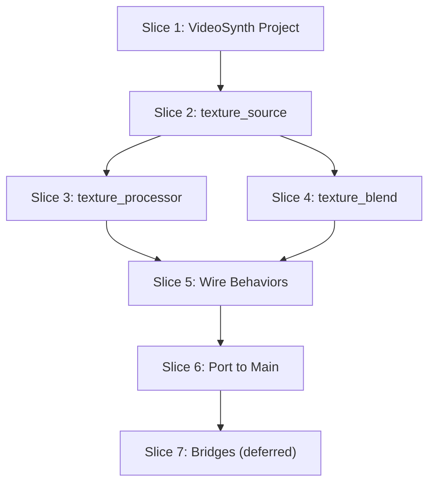

# Texture Rack Modules — Vertical Slices

**Date:** 2026-04-21
**Source:** User discussion + analysis of WebcamViewer, Main, and existing rack module system
**Author:** Agent

**Layers identified:**
1. C++ / Primitives — Video capture, GPU shader pipeline, custom surface providers
2. Rack Module Host — Module registry, deps wiring, slot management
3. DSP / Texture Modules — Source, processor, blend implementations
4. Parameter Binding — Path routing, schema registration
5. UI — Rack layout, module panels, preview widgets
6. Project Manifest — New VideoSynth project from WebcamViewer template

---

## Context

Manifold has a mature **audio rack module system** in the Main project (oscillator, sample, filter, fx, eq, blend_simple). It also has a working **video pipeline** in the WebcamViewer project (webcam capture, GPU shader effects, compositing). These two systems are currently separate.

The goal is to bring the video/texture system into the rack module paradigm, creating three new module types:

- `texture_source` — webcam or procedural generator
- `texture_processor` — GPU shader effects (glitch, datamosh, etc.)
- `texture_blend` — composite two textures with blend modes

**Key constraint:** We are NOT building a separate video rack. These modules go into the existing rack alongside audio modules. Audio↔texture bridges are acknowledged as interesting but deferred.

---

## Slice 1: New VideoSynth Project from WebcamViewer Template

**Goal:** Create a standalone project that copies WebcamViewer's UI layout but is wired for rack modules.

**Layers:**
- **Project Manifest:** New `UserScripts/projects/VideoSynth/manifold.project.json5`
- **UI:** Copy `ui/main.ui.lua` and `ui/behaviors/main.lua` from WebcamViewer
- **State:** Reuse `.webcam_viewer.state` persistence pattern

**Checklist:**
- [ ] Copy `UserScripts/projects/WebcamViewer/` → `UserScripts/projects/VideoSynth/`
- [ ] Update `manifold.project.json5` name/description
- [ ] Strip direct `shaders.*` API calls from behavior (stub them out)
- [ ] Verify project loads and renders same layout as WebcamViewer
- [ ] Add placeholder rack module references in behavior (no-op for now)

**Done when:** Launch VideoSynth standalone and see the same A/B stack + composite layout as WebcamViewer, but with stubbed video output.

**Depends on:** None

---

## Slice 2: Scaffold texture_source Rack Module

**Goal:** A rack module that can select between webcam capture and procedural generators, producing a texture output.

**Layers:**
- **Rack Module Host:** Add `texture_source` to `MODULE_DEFS`
- **DSP Module:** Create `lib/rack_modules/texture_source.lua`
- **Parameter Binding:** Add path patterns for source type, device, mode, generator params
- **C++ Primitives:** Wire to existing `VideoCaptureManager` and `GeneratedSourceProvider`

**Checklist:**
- [ ] Create `UserScripts/projects/VideoSynth/lib/rack_modules/texture_source.lua`
- [ ] Implement `createSlot()` — builds texture output node
- [ ] Implement `applyPath()` — handles:
  - `sourceType` (webcam / generator)
  - `deviceIndex`, `modeIndex` (webcam)
  - `generatorId`, generator params (generator)
- [ ] Add `texture_source` to VideoSynth's local module registry
- [ ] Wire module output to `setCustomSurface("video_input", ...)` on preview panel
- [ ] Test: select webcam → see live feed; select generator → see procedural texture

**Done when:** In VideoSynth, add a `texture_source` rack module, pick "webcam", select device/mode, and see live video in the preview.

**Depends on:** Slice 1

---

## Slice 3: Scaffold texture_processor Rack Module

**Goal:** A rack module that applies GPU shader effects to a texture input, with selectable effect and mix control.

**Layers:**
- **Rack Module Host:** Add `texture_processor` to module registry
- **DSP Module:** Create `lib/rack_modules/texture_processor.lua`
- **Parameter Binding:** Add path patterns for effect type, mix, and up to 9 effect params
- **C++ Primitives:** Connect to `VideoSynthPrimitive` and `ShaderEffectRegistry`

**Checklist:**
- [ ] Create `UserScripts/projects/VideoSynth/lib/rack_modules/texture_processor.lua`
- [ ] Implement `createSlot()` — input passthrough, effect pipeline, output
- [ ] Implement `applyPath()` — handles:
  - `effectId` — select from `VideoSynthPrimitive.effects()`
  - `mix` — dry/wet blend
  - `param0`..`param8` — effect parameters
- [ ] Use `shaders.buildPipeline()` internally (same as WebcamViewer)
- [ ] Wire input from upstream texture_source output
- [ ] Test: chain texture_source → texture_processor, select "glitch", adjust params

**Done when:** Chain `texture_source` → `texture_processor`, select "glitch" effect, and see glitched video in preview.

**Depends on:** Slice 2

---

## Slice 4: Scaffold texture_blend Rack Module

**Goal:** A rack module that composites two texture inputs with a blend mode and opacity.

**Layers:**
- **Rack Module Host:** Add `texture_blend` to module registry
- **DSP Module:** Create `lib/rack_modules/texture_blend.lua`
- **Parameter Binding:** Add path patterns for bottom/top inputs, blendOp, opacity, blend params
- **C++ Primitives:** Connect to `CompositeSurfaceProvider` (`gpu_composite`)

**Checklist:**
- [ ] Create `UserScripts/projects/VideoSynth/lib/rack_modules/texture_blend.lua`
- [ ] Implement `createSlot()` — two inputs (A/B), composite output
- [ ] Implement `applyPath()` — handles:
  - `bottomSource` / `topSource` — node references or rack module IDs
  - `blendOpId` — select from `shaders.listBlendOps()`
  - `opacity` — top layer opacity
  - `param0`..`param3` — blend-specific params
- [ ] Use `setCustomSurface("gpu_composite", payload)` for output
- [ ] Test: two texture_source modules → texture_blend → preview

**Done when:** Two `texture_source` modules feed into `texture_blend`, select "difference" blend, adjust opacity, and see composited output.

**Depends on:** Slice 2 (can parallel with Slice 3)

---

## Slice 5: Wire VideoSynth Behaviors to Use Rack Modules

**Goal:** Replace stubbed behavior with real rack module instantiation and control.

**Layers:**
- **UI Behavior:** Update `ui/behaviors/main.lua` to instantiate rack modules
- **State Management:** Persist rack module state (same pattern as `.webcam_viewer.state`)
- **Layout:** Position rack modules in the A/B stack layout

**Checklist:**
- [ ] In behavior `init()`: instantiate `texture_source` for Stack A and Stack B
- [ ] In behavior `init()`: instantiate `texture_processor` for each stack's FX chain
- [ ] In behavior `init()`: instantiate `texture_blend` for composite output
- [ ] Replace direct `shaders.buildPipeline()` calls with rack module `applyPath()` calls
- [ ] Replace direct `shaders.listEffects()` with module registry queries
- [ ] Persist module state to `.videosynth.state`
- [ ] Verify: full A/B stack + composite works end-to-end

**Done when:** VideoSynth behaves identically to WebcamViewer but all video processing goes through rack modules.

**Depends on:** Slice 3, Slice 4

---

## Slice 6: Port Texture Rack Modules to Main Project

**Goal:** Move the three texture modules into the Main project's rack system.

**Layers:**
- **Rack Module Host:** Add modules to `UserScripts/projects/Main/lib/rack_module_host_runtime.lua`
- **DSP Modules:** Copy `texture_*.lua` to `UserScripts/projects/Main/lib/rack_modules/`
- **Parameter Binding:** Add texture path patterns to `parameter_binder.lua`
- **UI Factory:** Add texture modules to `rack_module_factory.lua`
- **Audio Router:** Add texture routing to `rack_audio_router.lua`

**Checklist:**
- [ ] Copy `texture_source.lua` → `Main/lib/rack_modules/texture_source.lua`
- [ ] Copy `texture_processor.lua` → `Main/lib/rack_modules/texture_processor.lua`
- [ ] Copy `texture_blend.lua` → `Main/lib/rack_modules/texture_blend.lua`
- [ ] Add entries to `MODULE_DEFS` in `rack_module_host_runtime.lua`
- [ ] Add `matchDynamicTextureSourcePath()`, `matchDynamicTextureProcessorPath()`, `matchDynamicTextureBlendPath()` to `parameter_binder.lua`
- [ ] Add texture module entries to `DYNAMIC_MODULES` in `rack_module_factory.lua`
- [ ] Add texture routing edges to `rack_audio_router.lua` (or create `rack_texture_router.lua`)
- [ ] Test in Main: add texture_source to rack, verify webcam feed appears
- [ ] Test in Main: add texture_processor, verify effects work
- [ ] Test in Main: add texture_blend, verify composite works

**Done when:** In the Main project, user can add `texture_source`, `texture_processor`, and `texture_blend` modules to the rack alongside audio modules.

**Depends on:** Slice 5

---

## Slice 7: (Deferred) Audio↔Texture Bridges

**Goal:** Convert audio signals to textures (visualization) and textures to audio.

**Note:** This is explicitly deferred. Texture→audio is not a real-time operation in general. Audio→texture (oscilloscope, spectrum) is feasible but requires careful design.

**Layers:**
- **DSP:** New bridge modules
- **C++ Primitives:** FFT analysis for spectrum, waveform extraction
- **Parameter Binding:** Bridge-specific paths

**Checklist:**
- [ ] Design `audio_to_texture` module (spectrum analyzer, oscilloscope)
- [ ] Design `texture_to_audio` module (granular resynthesis, spectral processing)
- [ ] Verify real-time constraints
- [ ] Implement if feasible

**Depends on:** Slice 6

---

## Dependency Graph

```text
Slice 1 (VideoSynth project) ─────────────────────────────────────────────→ Slice 5 (Wire behaviors)
     │                                                                            ↑
     ↓                                                                            │
Slice 2 (texture_source) ──────────→ Slice 3 (texture_processor) ────────────────┤
     │                                                                            │
     └──────────────────────────────→ Slice 4 (texture_blend) ────────────────────┘
                                                                                  │
                                                                                  ↓
                                                                          Slice 6 (Port to Main)
                                                                                  │
                                                                                  ↓
                                                                          Slice 7 (Bridges — deferred)
```

Or in Mermaid:



---

## Structured Output

```yaml
slices:
  - id: 1
    name: "VideoSynth Project"
    goal: "Create standalone project from WebcamViewer template"
    layers: ["Project Manifest", "UI", "State"]
    depends_on: []
    parallel_group: 1
    effort: "small"

  - id: 2
    name: "texture_source"
    goal: "Rack module for webcam or generator texture output"
    layers: ["Rack Module Host", "DSP Module", "Parameter Binding", "C++ Primitives"]
    depends_on: [1]
    parallel_group: 2
    effort: "medium"

  - id: 3
    name: "texture_processor"
    goal: "Rack module for GPU shader effects with mix"
    layers: ["Rack Module Host", "DSP Module", "Parameter Binding", "C++ Primitives"]
    depends_on: [2]
    parallel_group: 3
    effort: "medium"

  - id: 4
    name: "texture_blend"
    goal: "Rack module for compositing two textures"
    layers: ["Rack Module Host", "DSP Module", "Parameter Binding", "C++ Primitives"]
    depends_on: [2]
    parallel_group: 3
    effort: "medium"

  - id: 5
    name: "Wire Behaviors"
    goal: "Replace stubbed behavior with real rack module control"
    layers: ["UI Behavior", "State Management", "Layout"]
    depends_on: [3, 4]
    parallel_group: 4
    effort: "medium"

  - id: 6
    name: "Port to Main"
    goal: "Move texture modules into Main project's rack system"
    layers: ["Rack Module Host", "DSP Modules", "Parameter Binding", "UI Factory", "Audio Router"]
    depends_on: [5]
    parallel_group: 5
    effort: "medium"

  - id: 7
    name: "Audio-Texture Bridges"
    goal: "Convert audio to textures and vice versa"
    layers: ["DSP", "C++ Primitives", "Parameter Binding"]
    depends_on: [6]
    parallel_group: 6
    effort: "large"
    status: "deferred"
```

---

## Structured Output

```yaml
slices:
  - id: 1
    name: "VideoSynth Project"
    goal: "Create standalone project from WebcamViewer template"
    layers: ["Project Manifest", "UI", "State"]
    depends_on: []
    parallel_group: 1
    effort: "small"

  - id: 2
    name: "texture_source"
    goal: "Rack module for webcam or generator texture output"
    layers: ["Rack Module Host", "DSP Module", "Parameter Binding", "C++ Primitives"]
    depends_on: [1]
    parallel_group: 2
    effort: "medium"

  - id: 3
    name: "texture_processor"
    goal: "Rack module for GPU shader effects with mix"
    layers: ["Rack Module Host", "DSP Module", "Parameter Binding", "C++ Primitives"]
    depends_on: [2]
    parallel_group: 3
    effort: "medium"

  - id: 4
    name: "texture_blend"
    goal: "Rack module for compositing two textures"
    layers: ["Rack Module Host", "DSP Module", "Parameter Binding", "C++ Primitives"]
    depends_on: [2]
    parallel_group: 3
    effort: "medium"

  - id: 5
    name: "Wire Behaviors"
    goal: "Replace stubbed behavior with real rack module control"
    layers: ["UI Behavior", "State Management", "Layout"]
    depends_on: [3, 4]
    parallel_group: 4
    effort: "medium"

  - id: 6
    name: "Port to Main"
    goal: "Move texture modules into Main project's rack system"
    layers: ["Rack Module Host", "DSP Modules", "Parameter Binding", "UI Factory", "Audio Router"]
    depends_on: [5]
    parallel_group: 5
    effort: "medium"

  - id: 7
    name: "Audio-Texture Bridges"
    goal: "Convert audio to textures and vice versa"
    layers: ["DSP", "C++ Primitives", "Parameter Binding"]
    depends_on: [6]
    parallel_group: 6
    effort: "large"
    status: "deferred"
```

---

## Design Notes

### Module Kinds

| Module | Kind | Inputs | Outputs | Notes |
|--------|------|--------|---------|-------|
| `texture_source` | `source` | 0 | 1 texture | webcam or generator |
| `texture_processor` | `processor` | 1 texture | 1 texture | effect + mix |
| `texture_blend` | `processor_dual` | 2 textures | 1 texture | composite A over B |

### Path Patterns

```
/midi/synth/rack/texture_source/{slot}/type          → webcam | generator
/midi/synth/rack/texture_source/{slot}/device        → device index
/midi/synth/rack/texture_source/{slot}/mode          → mode index
/midi/synth/rack/texture_source/{slot}/generator     → generator id
/midi/synth/rack/texture_source/{slot}/param/{id}    → generator param

/midi/synth/rack/texture_processor/{slot}/effect     → effect id
/midi/synth/rack/texture_processor/{slot}/mix        → dry/wet
/midi/synth/rack/texture_processor/{slot}/param/{i}  → effect param 0-8

/midi/synth/rack/texture_blend/{slot}/bottom         → bottom source node id
/midi/synth/rack/texture_blend/{slot}/top            → top source node id
/midi/synth/rack/texture_blend/{slot}/blendOp        → blend operation id
/midi/synth/rack/texture_blend/{slot}/opacity        → top layer opacity
/midi/synth/rack/texture_blend/{slot}/param/{i}      → blend param 0-3
```

### Reuse Strategy

- **WebcamViewer behavior** → copy as starting point for VideoSynth behavior
- **VideoSynthPrimitive** → reuse for effect definitions (no C++ changes needed)
- **ShaderEffectRegistry** → reuse for runtime effect loading
- **VideoCaptureManager** → reuse for webcam capture
- **GeneratedSourceProvider** → reuse for procedural generators
- **CompositeSurfaceProvider** → reuse for texture blending
- **FxSlot pattern** → model texture_processor after audio fx.lua
- **blend_simple pattern** → model texture_blend after audio blend_simple.lua

---

## Acceptance Criteria Summary

| Slice | Acceptance Test |
|-------|----------------|
| 1 | `Manifold` standalone loads VideoSynth project, shows A/B layout |
| 2 | Add `texture_source`, select webcam, see live video |
| 3 | Chain `texture_source` → `texture_processor`, select glitch, see effect |
| 4 | Two sources → `texture_blend`, select difference, see composite |
| 5 | Full VideoSynth behaves like WebcamViewer via rack modules |
| 6 | Main project can add all three texture modules to rack |
| 7 | (Deferred) Audio→texture and texture→audio conversion |
