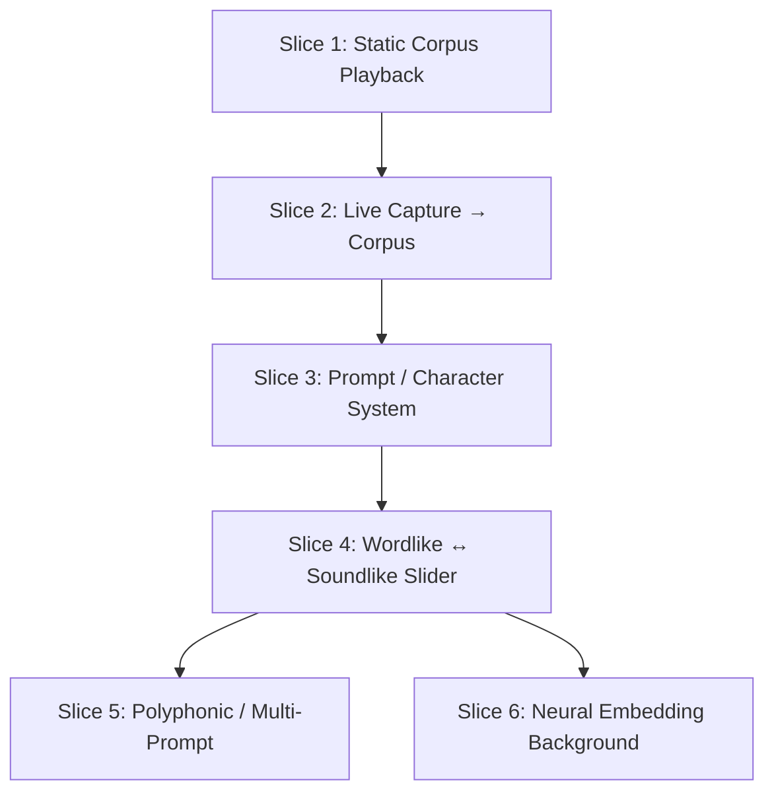

# Concatenative Synthesis Primitives for Manifold

**Date:** 2026-04-24
**Source:** Deep research report on concatenative synthesis (see `research/` at repo root) + user ideation session
**Author:** Agent
**Status:** Ideation / architecture — NOT YET IMPLEMENTED

---

## Table of Contents

1. [Research Foundation](#1-research-foundation)
2. [User Intent Summary](#2-user-intent-summary)
3. [What Manifold Already Has](#3-what-manifold-already-has)
4. [The 6 Primitives](#4-the-6-primitives)
5. [Threading Model](#5-threading-model)
6. [DSP Script Composition](#6-dsp-script-composition)
7. [The Wordlike ↔ Soundlike Continuum](#7-the-wordlike--soundlike-continuum)
8. [Speech as Corpus Input](#8-speech-as-corpus-input)
9. [Characters / Promptable Navigation](#9-characters--promptable-navigation)
10. [Incremental Build Plan (Vertical Slices)](#10-incremental-build-plan-vertical-slices)
11. [Key Design Decisions](#11-key-design-decisions)
12. [Open Questions](#12-open-questions)
13. [Files to Reference](#13-files-to-reference)

---

## 1. Research Foundation

The research at repo root (`research/concat_synth_*.md`, `concat_synth.agent.final.md`) covers the full state of concatenative synthesis from 1948 (Musique Concrète) through 2025. Key findings relevant to this plan:

- **Concatenative synthesis and neural audio are converging, not competing.** Hybrid architectures (CoSaRef, The Concatenator, kNN-SVC) represent the dominant research frontier.
- **CLAP embeddings resolve the 20-year perceptual-mathematical descriptor gap.** Classical descriptors (centroid, flux, MFCC) don't map to verbal descriptors ("bright", "warm"). CLAP achieves 71.9% human perceptual agreement for music similarity by learning from natural language.
- **The "corpus-as-instrument" paradigm:** The corpus topology itself becomes the instrument. Virtuosity is navigational knowledge.
- **Copyright law is the primary bottleneck for commercialization, not technology.** Concatenative synthesis inherently requires pre-existing recordings. User-loaded corpora sidestep this (The Concatenator model, $149 VST).
- **The temporal blind spot:** All canonical descriptor sets are timbre-centric. No standard metric or rhythmic descriptors exist. Concatenative synthesis excels at texture/color but struggles with metrically precise output.
- **Speech synthesis is a rich source of techniques:** Neural vocoders (HiFi-GAN), phoneme-aware segmentation, prosodic control, emotional embeddings — all transfer to musical concatenative synthesis even when the goal is NOT making the synth speak.
- **Live performance has driven more technical innovation than composition.** CataRT was explicitly designed as a Digital Musical Instrument (NIME 2012). Real-time requirements forced fast NN search, efficient buffer management, gestural control.

**Reference report:** `concat_synth.agent.final.md` — full 14,500-word technical report with 50+ citations, 8 chapters, 14 research dimensions.

---

## 2. User Intent Summary

The user wants to build **concatenative synthesis primitives into Manifold** — not a single product, but the underlying infrastructure that enables ANY concatenative synthesis experience to be scripted on top.

Key requirements:
- **Synth, not effect.** Output is generated from the corpus, not processed input.
- **Live recording → playable corpus within ~1 second.** Record/upload audio, segment, analyze, index, play.
- **Minutes-scale corpora** (not hours/days). 1–10 minutes = ~600–12,000 units. Flat linear scan is sufficient.
- **Promptable / semantic navigation.** Text prompts reshape the navigable space. "Bright", "breathy", "punchy" find units in the corpus. The prompt is relative to the corpus ("bright" in a beatbox corpus means different things than in a voice corpus).
- **Wordlike ↔ Soundlike continuum.** The performer navigates between semantic/embedding space and pure acoustic/descriptor space. Not a toggle — a continuous morph.
- **Speech is valuable input, not the product.** Speech phonemes, prosody, emotional embeddings are rich segmentation/organization material. The synth does NOT speak.
- **Character-like personalities** for how the corpus is explored (but promptable, not hardcoded).

---

## 3. What Manifold Already Has

| Component | Location | How It Helps |
|-----------|----------|--------------|
| `RetrospectiveCaptureNode` | `dsp/core/nodes/RetrospectiveCaptureNode.h/cpp` | Live recording into circular buffer — the capture primitive |
| `GranulatorNode` | `dsp/core/nodes/GranulatorNode.h/cpp` | Grain playback engine: envelopes (Hann/Blackman/Tukey), pitch shift, ring buffer read, source file loading, 64 grains. Becomes the **unit playback engine** |
| `PhaseVocoderNode` | `dsp/core/nodes/PhaseVocoderNode.h/cpp` | Transition smoothing — pitch/time matching between units |
| `CrossfaderNode` | `dsp/core/nodes/CrossfaderNode.h/cpp` | Crossfade at unit boundaries |
| `LoopPlaybackNode` / `SampleRegionPlaybackNode` | `dsp/core/nodes/LoopPlaybackNode.h/cpp` | Sample buffer management, region playback |
| `GraphRuntime` | `manifold/primitives/scripting/PrimitiveGraph.cpp` | Lock-free node graph compilation and atomic swapping |
| `IPrimitiveNode` | `dsp/core/graph/PrimitiveNode.h` | Node interface: `prepare`, `process`, `getNodeType` |
| `SPSCQueue` / `AtomicState` / `EventRing` | `manifold/core/BehaviorCoreProcessor.cpp` | Lock-free audio↔control communication |
| `Canvas` + Lua UI | `manifold/ui/` | 2D scene graph for corpus visualization, XY navigation widgets |
| `OSCServer` / `OSCQuery` | `manifold/primitives/control/OSCServer.cpp` | External control — map MIDI controllers/phones to corpus position |
| `TempoInference` / `Quantizer` | `manifold/primitives/dsp/TempoInference.h`, `QuantizerNode` | Beat detection and quantization |
| Lua DSP scripting | `manifold/dsp/`, `DSPPluginScriptHost` | `buildPlugin(ctx)` defines node graphs at runtime |

**What is NOT in Manifold (the gap):**
- Audio descriptor extraction (MFCC, spectral centroid, flux, rolloff, RMS, ZCR, pitch)
- Corpus segmentation (beyond simple onset detection)
- Search data structures (k-d tree, flat index, HNSW)
- Unit selection algorithms (target cost, concatenation cost, greedy NN, etc.)
- Content-based matching (descriptor-space nearest neighbor)
- Embedding integration (CLAP, MuQ, MERT, or any neural audio representation)
- Corpus visualization UI (2D scatter plot of descriptor space)

---

## 4. The 6 Primitives

Every concatenative pipeline has the same lifecycle. Manifold needs a primitive for each stage, with clean thread separation:

```
[Capture] → [Segment] → [Analyze] → [Index] → [Select] → [Render]
  msg        msg/work    msg/work    msg        audio      audio
```

### 4.1 `CorpusSource` — "Where did the audio come from?"

Interface, not implementation:

```cpp
class CorpusSource {
public:
    virtual juce::AudioBuffer<float> getAudio() = 0;
    virtual double getSampleRate() = 0;
};
```

**Implementations you already have:**
- `FileCorpusSource` — loads WAV/AIFF (reuse `GranulatorNode::loadFile`)
- `CaptureCorpusSource` — wraps `RetrospectiveCaptureNode` output
- `LiveAccumulatingSource` — append-only buffer that grows during performance (live corpus building)

**Lua exposure:**
```lua
local corpus = ctx.corpus.fromFile("/path/to/drums.wav")
local corpus = ctx.corpus.fromCapture("capture_node_id")
local corpus = ctx.corpus.empty()  -- start empty, append later
corpus:append(buffer)  -- live corpus building
```

### 4.2 `CorpusSegmenter` — "How do we chop it into units?"

Pure function: `AudioBuffer → vector<UnitBounds>`. Runs on message thread or worker.

```cpp
struct UnitBounds {
    int startSample;
    int lengthSamples;
    std::optional<std::string> label;  // e.g., phoneme, onset type
};

class CorpusSegmenter {
public:
    virtual std::vector<UnitBounds> segment(const juce::AudioBuffer<float>& audio,
                                            double sampleRate) = 0;
};
```

**Implementations:**
- `UniformSegmenter` — fixed window + hop (the baseline)
- `OnsetSegmenter` — energy/flux gate, min unit length, adaptive threshold
- `SilenceSegmenter` — split on silence gaps, keep non-silent regions
- `BeatSegmenter` — uses existing `TempoInference` + `Quantizer` to align to grid
- `ExternalSegmenter` — load pre-computed boundaries from file (e.g., Whisper phoneme timestamps)

**Lua exposure:**
```lua
local segmenter = ctx.segmenters.uniform({ windowMs = 100, hopMs = 50 })
local segmenter = ctx.segmenters.onset({ threshold = 0.3, minLengthMs = 50 })
local segmenter = ctx.segmenters.beat({ tempo = 128, beatsPerUnit = 0.5 })
```

### 4.3 `DescriptorExtractor` — "What do we measure about each unit?"

Pure function: `AudioBuffer + UnitBounds → DescriptorVector`. Runs on message thread or worker.

```cpp
struct DescriptorVector {
    std::vector<float> values;  // e.g., 7 classical descriptors or 512 CLAP dims
    std::string space;          // "classical", "clap", "muq", "custom"
};

class DescriptorExtractor {
public:
    virtual DescriptorVector extract(const juce::AudioBuffer<float>& audio,
                                     const UnitBounds& unit,
                                     double sampleRate) = 0;
};
```

**Implementations:**
- `ClassicalDescriptorExtractor` — STFT-based: centroid, flux, rolloff, RMS, ZCR, flatness, pitch (YIN). Fast, CPU-only, ~1ms per unit. This is the **instant tier** (50–200ms total for a 3-minute corpus).
- `EmbeddingDescriptorExtractor` — loads ONNX model, runs inference. Slow on CPU, fast on GPU. The **rich tier** (5–30s for 3 minutes on GPU).
- `CompositeExtractor` — runs multiple extractors, concatenates results.

**Critical design:** The `DescriptorVector` is tagged with which space it lives in. A corpus can have multiple descriptor spaces simultaneously. The selector picks which space to query.

**Hybrid approach (recommended):**
- Start with classical descriptors for instant gratification (playable within 200ms of recording stop).
- Run neural embedding in a background thread.
- When embedding finishes, atomic-swap the index.
- The instrument "deepens" after a few seconds — same corpus, richer navigation.

**Lua exposure:**
```lua
local classical = ctx.extractors.classical({ dimensions = { "centroid", "flux", "rms", "pitch" } })
local clap = ctx.extractors.embedding({ model = "clap-small", onnxPath = "..." })
local combined = ctx.extractors.composite({ classical, clap })
```

### 4.4 `CorpusIndex` — "How do we find units fast?"

Data structure lives on message thread. Audio thread gets a lock-free snapshot.

```cpp
class CorpusIndex {
public:
    virtual void build(const std::vector<UnitBounds>& units,
                       const std::vector<DescriptorVector>& descriptors) = 0;

    virtual std::vector<int> query(const DescriptorVector& target,
                                   const std::string& descriptorSpace,
                                   int k = 5) = 0;

    virtual void append(const UnitBounds& unit, const DescriptorVector& descriptor) = 0;
};
```

**Implementations:**
- `FlatIndex` — linear scan. For <10K units this is faster than trees due to cache locality. **The default for minutes-scale corpora.**
- `KDTreeIndex` — exact search with branch-and-bound. For 10K–100K units.
- `HNSWIndex` — approximate search. For 100K+ units or high-dim embeddings.
- `PromptIndex` — wrapper that pre-computes text prompt embeddings and builds a lookup table. Query by text string instead of descriptor vector.

**Why flat array wins at small scale:**
- 600 units × 7 descriptors × 4 bytes = ~17KB (L1 cache resident)
- Linear scan = ~600 iterations of cheap arithmetic
- At 48kHz/128-sample blocks = ~2.6ms per block budget
- The scan takes microseconds — negligible compared to audio processing

**Lua exposure:**
```lua
local index = ctx.index.flat()
local index = ctx.index.kdtree({ maxLeafSize = 32 })
local index = ctx.index.hnsw({ ef = 200, M = 16 })
```

### 4.5 `UnitSelector` — "Which unit do I play next?"

The **policy**, not the data structure. Consumes query results and picks one unit, considering history and constraints.

```cpp
class UnitSelector {
public:
    virtual int select(const std::vector<int>& candidates,
                       const CorpusIndex& index,
                       const PlayHistory& history) = 0;
};
```

**Implementations:**
- `NearestSelector` — always pick closest. Boring but predictable.
- `RandomTopKSelector` — pick randomly from top-k. Adds variation.
- `NoRepeatSelector` — penalize recently played units (Schwarz distance mapping, SMC 2011).
- `SoftmaxSelector` — temperature-controlled probabilistic selection.
- `SequenceBiasedSelector` — prefer units that were contiguous in original recording.
- `PromptBiasedSelector` — weight candidates by pre-computed prompt similarity.

**Lua exposure:**
```lua
local selector = ctx.selectors.nearest()
local selector = ctx.selectors.randomTopK({ k = 5 })
local selector = ctx.selectors.softmax({ temperature = 0.8, k = 10 })
local selector = ctx.selectors.noRepeat({ memorySize = 8, penalty = 2.0 })
```

### 4.6 `ConcatenativeNode` — The audio thread workhorse

An `IPrimitiveNode` that owns a `Corpus` (via lock-free `shared_ptr`), queries it per block, and renders units.

```cpp
class ConcatenativeNode : public IPrimitiveNode {
public:
    // Target input: descriptor vector stream (for "mimic" character following live input)
    // OR no input, navigated via parameter path
    // Output: synthesized audio

    // Parameters (atomic, set via OSC/Lua):
    // /concatenative/target/x, /concatenative/target/y
    // /concatenative/descriptorSpace ("classical" | "clap" | ...)
    // /concatenative/selector ("nearest" | "randomTopK" | ...)

    void setCorpus(std::shared_ptr<Corpus> corpus);  // lock-free swap
    void process(...) override;
};
```

**Rendering options (configurable per node instance):**
- Envelope window: Hann, Blackman, Tukey, rectangular (reuse `GranulatorNode` envelope logic)
- Crossfade length: 0–50ms at unit boundaries
- Pitch transposition: via `PhaseVocoderNode` integration or simple resampling
- Polyphony: how many units can overlap

---

## 5. Threading Model

Manifold's existing lock-free architecture handles this cleanly:

```
Message Thread:
  User triggers "analyze" →
    capture.getAudio() →
    segmenter.segment() →
    extractor.extract() [parallelizable] →
    index.build() →
    corpus = make_shared<Corpus>(units, descriptors, index) →
    concatNode.setCorpus(corpus)  // atomic shared_ptr swap

Audio Thread (per block):
  concatNode.process():
    read targetX, targetY from atomics
    build DescriptorVector from targetX/Y + descriptorSpace
    candidates = corpus.index.query(target, k)
    selected = selector.select(candidates, history)
    render selected unit(s) with envelope + crossfade
```

**Key constraints:**
- `shared_ptr<Corpus>` swap is lock-free. Audio thread never blocks.
- Old corpus destroyed when refcount hits zero (deferred to message thread if paranoid about allocation).
- Analysis (segment + extract + index build) runs on message thread or worker thread — never audio thread.
- For live corpus building: `append()` adds units incrementally; audio thread sees them on next index snapshot swap.

---

## 6. DSP Script Composition

The user writes a Lua script that wires primitives into a graph:

```lua
function buildPlugin(ctx)
  -- 1. Capture / load source
  local capture = ctx.nodes.retrospectiveCapture({ seconds = 30 })
  local corpusSource = ctx.corpus.fromCapture(capture)

  -- 2. Configure analysis (message thread, deferred)
  local segmenter = ctx.segmenters.onset({ threshold = 0.2, minLengthMs = 50 })
  local extractor = ctx.extractors.classical({
    dimensions = { "centroid", "flux", "rolloff", "rms", "zcr" }
  })
  local index = ctx.index.flat()

  -- 3. Build concatenative node (audio thread)
  local concat = ctx.nodes.concatenative({
    segmenter = segmenter,
    extractor = extractor,
    index = index,
    selector = ctx.selectors.randomTopK({ k = 5 }),
    envelope = "hann",
    crossfadeMs = 10,
    polyphony = 4
  })

  -- 4. Trigger analysis on demand
  concat:analyze(corpusSource)  -- msg thread: segment → extract → index → atomic swap

  -- 5. Navigation controls
  concat:setParameter("targetX", 0.5)
  concat:setParameter("targetY", 0.5)
  concat:setParameter("descriptorSpace", "classical")

  -- 6. Graph wiring
  return {
    nodes = {
      { type = "retrospective_capture", id = "capture", params = {} },
      { type = "concatenative", id = "concat", params = {} },
      { type = "filter", id = "filter", params = { cutoff = 8000 } },
      { type = "reverb", id = "verb", params = { mix = 0.3 } }
    },
    connections = {
      { from = "concat", to = "filter", fromOutput = 0, toInput = 0 },
      { from = "filter", to = "verb", fromOutput = 0, toInput = 0 },
      { from = "verb", to = "output", fromOutput = 0, toInput = 0 }
    },
    parameters = {
      ["/concat/target/x"] = { default = 0.5, min = 0, max = 1 },
      ["/concat/target/y"] = { default = 0.5, min = 0, max = 1 },
      ["/concat/analyze"] = {
        type = "trigger",
        onTrigger = function() concat:analyze(corpusSource) end
      }
    }
  }
end
```

This is the power of primitives: the same 6 building blocks compose into beatbox explorers, speech texture synths, field recording navigators, each with different segmenters, extractors, selectors, and blend policies.

---

## 7. The Wordlike ↔ Soundlike Continuum

This is the core creative concept. The user does NOT hardcode this — it's exposed as a **selector policy parameter** or a node-level blend control.

### Concept

**"Wordlike"** = corpus organized by what it *means* or *is*. Embeddings cluster by semantic category: "this is plosive-ish", "this is breathy", "this sounds like a door slam". Navigate by description, by naming, by concept.

**"Soundlike"** = corpus organized by what it *does acoustically*. Pure timbre space: spectral centroid vs. flux vs. noisiness. No meaning, just morphology. Navigate by feel, by ear, by spatial intuition.

**The magic is traversing between them.** Same corpus, same units, but the *axis of organization* shifts under the performer's feet.

### Implementation as Blend

```lua
concat:setCorpus(corpus, {
  indices = { classical = classicalIndex, clap = clapIndex },
  blend = 0.3  -- 30% semantic (wordlike), 70% acoustic (soundlike)
})
```

The `ConcatenativeNode` accepts multiple `CorpusIndex` instances and blends distances:
- Distance = `blend * d_semantic + (1 - blend) * d_acoustic`
- `blend = 0` = pure classical descriptors (soundlike)
- `blend = 1` = pure CLAP embeddings (wordlike)
- In between = both influence selection

### What It Feels Like

Load a 3-minute recording of someone talking in a kitchen — pots clanging, water running, speech, chair scraping.

**At wordlike (blend = 1.0):**
- Prompt "speech" → isolates the talking
- Prompt "metal" → isolates the pots
- Prompt "water" → isolates the tap
- Prompt "silence" → isolates the gaps

**At soundlike (blend = 0.0):**
- X-axis: spectral centroid (dark → bright)
- Y-axis: RMS energy (quiet → loud)
- Upper-right = bright and loud (metal clanging)
- Lower-left = dark and quiet (background hum)

**In between (blend = 0.3):**
- Prompt "kick" + cursor in bright-loud region = find the *brightest, loudest kick-like unit*
- No prompt + cursor in "kick" semantic neighborhood = units that aren't kicks but share acoustic space with kicks

The performer decides, in real time, how much meaning vs. how much pure sound guides the selection.

---

## 8. Speech as Corpus Input

The user explicitly wants speech as a rich input source, NOT to make the synth speak.

### Why Speech is Valuable

A voice corpus has dimensions no instrument corpus has:

| Speech Phenomenon | Musical Quality | Prompt Target |
|-------------------|-----------------|---------------|
| Fricatives (s, sh, f, z) | White noise / hi-hat surrogate | "sibilant", "airy", "hiss" |
| Plosives (p, t, k, b, d, g) | Percussive attacks | "click", "pop", "thump" |
| Voiced vs. unvoiced transitions | Morphing timbre | "gravel", "crackle", "smooth" |
| Breath noise | Noise texture / wind | "breath", "whisper", "gasp" |
| Glottal stops | Stutter / gate effect | "choked", "cut", "staccato" |
| Nasals (m, n, ng) | Resonant drones | "hum", "buzz", "droning" |
| Vowel formant shifts | Filter sweeps | "bright", "dark", "hollow" |

### Techniques to Steal from Speech Synthesis

1. **Neural Vocoders for Transition Smoothing**
   - HiFi-GAN, BigVGAN, VALL-E decoder — trained to make discontinuous frame sequences sound continuous
   - Apply to concatenative output: unit selection produces fragments → vocoder learns the "glue"
   - **kNN-SVC** (ICASSP 2025): WavLM SSL features + HiFi-GAN + temporal concatenation cost
   - **SelectTTS** (2024): Frame selection + SSL + HiFi-GAN, 8× fewer params than XTTS-v2

2. **Phoneme-Aware Segmentation**
   - Beatboxing IS phonemic percussion: "boots and cats" = /b/, /u/, /t/, /s/, /æ/, /k/, /t/, /s/
   - Whisper / wav2vec 2.0 segments into phoneme-labeled units
   - Prompt "give me the /t/ sounds" isolates all hi-hat surrogates
   - **HuBERT/wav2vec discrete units** = learned "acoustic phonemes" for ANY sound

3. **Prosody as Musical Control**
   - Pitch variance: high = animated, low = monotone
   - Speaking rate: fast = tense, slow = spacious
   - Energy contour: crescendo = building, decrescendo = falling
   - Prompt "urgent whisper" = low energy + fast rate + high pitch variance + breathy

4. **Emotional Speech Embeddings**
   - "Angry" = wide pitch swings, harsh spectral energy
   - "Sad" = slow rate, falling pitch, breathy phonation
   - "Fearful" = rapid micro-perturbations, high pitch
   - "Disgusted" = creaky voice, low pitch, constricted

5. **Cross-Lingual Vocal Timbres**
   - Arabic /ayin/ and /ghayn/: pharyngeal fricatives — deep, rattling
   - Korean tense consonants: tightly constricted stops — sharp, explosive
   - Xhosa clicks: literal percussive clicks as phonemes
   - Tonal languages: pitch is phonemic — built-in melodic contours
   - Japanese moraic rhythm: strict timing patterns — useful for metric output

### The Killer App

**The human voice as an infinite drum machine.**

Record "boots and cats" for 30 seconds. Segment out every /b/, /t/, /k/, /s/. Each becomes a drum-like unit with human irregularity. Prompt "tight" → crisp plosives. Prompt "loose" → sloppy ones. Prompt "breathy" → aspirated /k/s.

Swap corpus: record a metal door being hit with a wrench. Same segmentation, same embedding, same prompt logic. "Tight" now means short ringing impacts. "Loose" means rattling clangs.

**The prompt vocabulary transfers across corpora** because embeddings were trained on universal acoustic concepts.

---

## 9. Characters / Promptable Navigation

The user initially said "characters" then refined to **promptable**. Both are valid — the primitive should support both.

### Prompt as Corpus Filter

A prompt is NOT a generative instruction ("synthesize a kick drum"). It's a **retrieval filter** ("find me the kick-drum-like units in THIS corpus").

- "Bright" in a beatbox corpus = rimshots, hi-hat chokes
- "Bright" in a vocal corpus = falsetto, head voice
- "Bright" in a field recording = glass breaking, metal scraping

The prompt is **grounded to the corpus.**

### Prompt Targets (Examples)

| Prompt Type | What It Finds |
|-------------|---------------|
| Text: "bright" | Units near CLAP text embedding of "bright" |
| Text: "in-between sounds" | Micro-articulations, breaths, mouth noise |
| Text: "transitions" | High flux, low steady-state energy |
| Text: "slow and heavy" | Low centroid, high RMS, long attack |
| Phoneme: "/s/" | All sibilant segments |
| Phoneme: "voiced stops" | /b/, /d/, /g/ segments |
| Emotion: "angry" | Wide pitch swings, harsh energy |
| Prosody: "fast" | High speaking rate regions |

### The Prompt Sequencer

A step sequencer where each step is a prompt, not a note:
- Step 1: "kick"
- Step 2: "snare"
- Step 3: "hat"
- Step 4: "breath"

The synth searches the corpus for each prompt independently and concatenates results. This is algorithmic composition with natural language.

### Characters as Distance Warping (Still Valid)

Even with prompts, "characters" are useful as **search personalities** — how the selection behaves:

| Character | Behavior |
|-----------|----------|
| **Grazer** | Small steps, smooth transitions, prefers units close to last played. High concatenation cost weight; long crossfades. |
| **Jumper** | Large leaps, contrasting textures, jarring cuts. Zero concatenation cost; short/no crossfade. |
| **Mimic** | Follows live input's descriptor trajectory. Target = descriptor vector from incoming audio. |
| **Stochastic** | Probabilistic selection from top-K. Temperature controls randomness. |
| **Looper** | Biased toward recently played regions. Emergent grooves from repetition. |
| **Wanderer** | Drifting target with momentum. Never repeats same spot. |
| **Scrambler** | Random permutation. Baseline "is this working?" character. |

Characters are `UnitSelector` policy implementations. The user switches via OSC: `/concatenative/character "jumper"`.

---

## 10. Incremental Build Plan (Vertical Slices)

### Slice 1: Static Corpus Playback
**Goal:** Load a WAV file, segment uniformly (100ms), compute 2 descriptors (centroid + RMS), navigate with XY pad.

- [ ] Build `CorpusBuilder` worker (message thread, no real-time pressure)
- [ ] Build `CorpusIndex` with flat linear scan
- [ ] Build `ConcatenativeSynthNode` with one selector: `RandomTopK`
- [ ] UI: Canvas widget with XY pad, show unit dots in 2D space
- [ ] Test: Load drum loop, move XY pad, hear unit selection change

**Reuse:** `GranulatorNode`'s envelope and playback logic. `LoopPlaybackNode`'s buffer management.

**Done when:** A standalone DSP script loads a WAV, shows a 2D corpus map, and XY navigation changes the sound.

### Slice 2: Live Capture → Corpus
**Goal:** Record beatboxing/speech/anything for 30 seconds, auto-segment, analyze, play back within 2 seconds of stopping record.

- [ ] Wire `RetrospectiveCaptureNode` → `CorpusBuilder`
- [ ] Add onset-based segmentation (energy gate + minimum unit length)
- [ ] Async analysis: worker thread runs STFT + descriptors while audio thread keeps playing previous corpus
- [ ] Atomic `corpusIndex` swap when analysis completes
- [ ] UI: "Record" button, visual feedback ("Analyzing..."), corpus appears as dots

**This is the 2006 LAM moment.** George Lewis + Evan Parker live corpus building, but in a VST.

**Done when:** Hit record, make noise, hit stop, play the resulting corpus within 2 seconds.

**Depends on:** Slice 1

### Slice 3: Prompt / Character System
**Goal:** Text prompt navigation + 3 selectors (Grazer, Jumper, Mimic).

- [ ] Extract `UnitSelector` interface
- [ ] Implement `PromptIndex` (pre-computes CLAP text embeddings for corpus)
- [ ] Implement `NearestSelector`, `RandomTopK`, `SoftmaxSelector`
- [ ] Add prompt parameter path: `/concatenative/prompt`
- [ ] Add selector parameter path: `/concatenative/selector`
- [ ] UI: Text input for prompt, character selector dropdown
- [ ] Test: Same corpus, different prompts, hear exploration style change

**Done when:** Load a voice recording, type "plosives", hear percussive speech sounds.

**Depends on:** Slice 2

### Slice 4: Wordlike ↔ Soundlike Slider
**Goal:** Blend between classical descriptor navigation and CLAP embedding navigation.

- [ ] `ConcatenativeNode` accepts multiple `CorpusIndex` instances
- [ ] Blend parameter: `/concatenative/blend` (0 = classical, 1 = CLAP)
- [ ] Distance = `blend * d_clap + (1 - blend) * d_classical`
- [ ] UI: Horizontal slider labeled "Acoustic → Semantic"
- [ ] Test: Drag slider while playing, hear the instrument shift from timbre-based to meaning-based

**Done when:** Playing a corpus, dragging the slider audibly changes the selection criterion.

**Depends on:** Slice 3

### Slice 5: Polyphonic / Multi-Prompt
**Goal:** Multiple prompts simultaneously, MIDI note mapping.

- [ ] Per-voice independent search in `ConcatenativeNode`
- [ ] MIDI note = pitch transposition (if pitched) or trigger (if unpitched)
- [ ] Prompt-per-voice or prompt-per-MIDI-channel
- [ ] Velocity = intensity of prompt match (soft = close to prompt, hard = more variation)
- [ ] UI: Virtual keyboard with prompt assignment per key

**Done when:** Press C3 with prompt "kick", hear kick-like unit. Press D3 with prompt "snare", hear snare-like unit.

**Depends on:** Slice 4

### Slice 6: Neural Embedding Background Thread
**Goal:** Start with classical descriptors (instant), CLAP embeddings arrive later.

- [ ] `CorpusBuilder` runs classical analysis synchronously (message thread)
- [ ] Spawns worker thread for CLAP/ONNX inference
- [ ] When CLAP finishes, builds `clapIndex`, atomic-swaps into corpus
- [ ] UI: Indicator shows "Classical" → "Classical + CLAP" when ready
- [ ] The instrument "deepens" automatically

**Done when:** Record audio, start playing immediately (classical), after ~10s the CLAP indicator lights up and prompts become richer.

**Depends on:** Slice 4

---

## Dependency Graph



---

## Structured Output

```yaml
slices:
  - id: 1
    name: "Static Corpus Playback"
    goal: "Load WAV, segment uniformly, compute 2 descriptors, navigate with XY pad"
    layers: ["CorpusBuilder", "CorpusIndex", "ConcatenativeNode", "Canvas UI"]
    depends_on: []
    parallel_group: 1
    effort: "medium"

  - id: 2
    name: "Live Capture → Corpus"
    goal: "Record 30s, auto-segment, analyze, playable within 2s of stop"
    layers: ["RetrospectiveCaptureNode", "OnsetSegmenter", "Async Analysis", "Atomic Swap"]
    depends_on: [1]
    parallel_group: 2
    effort: "medium"

  - id: 3
    name: "Prompt / Character System"
    goal: "Text prompt navigation + multiple selector policies"
    layers: ["PromptIndex", "UnitSelector", "CLAP Integration", "UI Text Input"]
    depends_on: [2]
    parallel_group: 3
    effort: "large"

  - id: 4
    name: "Wordlike ↔ Soundlike Slider"
    goal: "Blend between classical descriptor and CLAP embedding navigation"
    layers: ["Multi-Index Corpus", "Blend Distance", "UI Slider"]
    depends_on: [3]
    parallel_group: 4
    effort: "medium"

  - id: 5
    name: "Polyphonic / Multi-Prompt"
    goal: "Multiple prompts simultaneously, MIDI note mapping"
    layers: ["Multi-Voice Search", "MIDI Integration", "Virtual Keyboard UI"]
    depends_on: [4]
    parallel_group: 5
    effort: "large"

  - id: 6
    name: "Neural Embedding Background Thread"
    goal: "Classical instant, CLAP arrives later via background worker"
    layers: ["Worker Thread", "ONNX Runtime", "Progressive Corpus Enrichment"]
    depends_on: [4]
    parallel_group: 5
    effort: "large"
```

---

## 11. Key Design Decisions

### 11.1 Flat Index, Not KD-Tree, for Minutes-Scale Corpora

At <10K units, flat linear scan beats k-d trees due to cache locality. The k-d tree overhead (branch prediction misses, pointer chasing) outweighs the O(log N) theoretical advantage.

**Decision:** `FlatIndex` is the default. `KDTreeIndex` exists for when corpora grow. `HNSWIndex` is deferred until needed.

### 11.2 Classical Descriptors First, Neural Embeddings Later

CLAP inference on CPU is ~0.1x real-time (3 min audio = 30s processing). On GPU it's ~10x real-time (3 min = 18s). Neither is "within 1 second."

**Decision:** Classical descriptors (centroid, flux, RMS, ZCR, pitch) compute in milliseconds via STFT. These are the **instant tier** — playable immediately. Neural embeddings run in a background thread and enrich the corpus when ready.

### 11.3 Envelope Windows, Not Phase Vocoder, for Prototype

Phase vocoder transition smoothing is speech-synthesis-grade engineering. For musical units with envelope windows (Hann/Blackman/Tukey), crossfading is sufficient and what CataRT actually does.

**Decision:** Prototype uses envelope windows + short crossfades (5–20ms). Phase vocoder integration is a later optimization for pitch-shifted transitions.

### 11.4 Prompt Is Corpus-Relative

"Bright" means different things in different corpora. The CLAP embedding model grounds the prompt to the specific acoustic material.

**Decision:** Prompts are NOT absolute synthesizer presets. They are queries into a specific corpus. The same prompt on a different corpus produces different but acoustically analogous results.

### 11.5 User-Loaded Corpora Only

To sidestep copyright barriers identified in the research report, Manifold does NOT ship with bundled corpora. The user provides all audio.

**Decision:** All `CorpusSource` implementations are user-provided (file, live capture, live accumulation). No bundled samples.

### 11.6 Primitives, Not Products

The user explicitly said: "build the primitives into manifold to be able to make and build concatenative synthesis experiences, not necessarily one way or another."

**Decision:** Implement the 6 primitives as composable C++ interfaces + Lua bindings. The specific instrument (beatbox explorer, speech texture synth, field navigator) is defined in user DSP scripts.

---

## 12. Open Questions

These are unresolved and should be discussed before implementation begins:

1. **How many prompts per corpus?** One global prompt that filters everything? Per-note prompt assignment? Prompt sequencer? All of the above?

2. **Prompt drift:** If "bright" matches only 3 units, what happens on the 4th query? Reuse? Fallback to nearest? Generate an error?

3. **Polyphony search cost:** Per-voice independent search at N voices = N × query cost. At small corpora this is fine. At what corpus size does this become a problem?

4. **Temporal structure within the prompt:** Can "fast alternation between bright and dark" drive sequence selection? This starts to touch the "temporal blind spot" from the research report.

5. **Feedback loop:** Can the user record the synth's output as a new corpus? Recursive concatenative synthesis?

6. **ONNX Runtime dependency:** CLAP/MuQ/MERT inference requires an ONNX runtime. Add as external dependency? Use a lightweight custom inference engine? Load pre-computed embeddings from file?

7. **Descriptor space normalization:** Mahalanobis distance (normalize by corpus std dev) prevents range distortion. Should this be automatic per corpus or configurable?

8. **Live corpus building during performance:** If the performer is recording into the corpus WHILE playing from it, how does the index update without audio glitches? Incremental `append()` + periodic re-index?

9. **Crossfade vs. neural vocoder:** At what quality threshold does envelope-window crossfading fail and neural vocoder smoothing become necessary? What's the latency trade-off?

10. **The speech segmentation question:** Use Whisper for phoneme boundaries? Use wav2vec 2.0 discrete units? Both? Neither — stick to onset detection for generality?

---

## 13. Files to Reference

### Research (repo root)
- `concat_synth.agent.final.md` — Full 14,500-word report
- `concat_synth.agent.outline.md` — Chapter structure and dependencies
- `research/concat_synth_dim09.md` — Neural concatenative synthesis hybrids
- `research/concat_synth_dim10.md` — Audio embeddings & semantic corpus retrieval
- `research/concat_synth_dim11.md` — Speech synthesis cross-domain learning
- `research/concat_synth_insight.md` — 8 cross-dimensional insights

### Manifold Existing Code
- `dsp/core/nodes/GranulatorNode.h/cpp` — Grain playback engine (envelope, pitch, ring buffer)
- `dsp/core/nodes/PhaseVocoderNode.h/cpp` — Transition smoothing
- `dsp/core/nodes/RetrospectiveCaptureNode.h/cpp` — Live capture
- `dsp/core/nodes/CrossfaderNode.h/cpp` — Crossfade
- `dsp/core/graph/PrimitiveNode.h` — `IPrimitiveNode` interface
- `manifold/primitives/scripting/PrimitiveGraph.cpp` — `GraphRuntime` compilation
- `manifold/core/BehaviorCoreProcessor.cpp` — Lock-free audio↔control architecture
- `manifold/primitives/dsp/TempoInference.h` — Beat detection
- `manifold/primitives/dsp/Quantizer.h` — Tempo quantization
- `GrainFreeze_Prototype/GranularEngine.h` — Prior granular engine (voice-based, MIDI-triggered)

### External References from Research
- **The Concatenator** (Tralie & Cantil, ISMIR 2024): `research/concat_synth_dim05.md` — Bayesian particle filter, corpus-size-independent complexity
- **CoSaRef** (Take & Akama, Sony CSL, 2024): `research/concat_synth_dim09.md` — Concatenative + diffusion refinement
- **kNN-SVC** (Shao et al., ICASSP 2025): `research/concat_synth_dim09.md` — SSL embedding retrieval + HiFi-GAN
- **CataRT** (Schwarz, IRCAM, 2006): `concat_synth.agent.final.md` §2.4, §4.2 — The canonical real-time CBCS system
- **CLAP** (LAION, 2022): `concat_synth.agent.final.md` §5.1.1 — 71.9% perceptual agreement
- **Hunt & Black** (1996): `concat_synth.agent.final.md` §2.3, §3.3 — Target cost + concatenation cost framework

---

*This document captures the full ideation state as of 2026-04-24. Future agents should treat this as the source of truth for concatenative synthesis architecture in Manifold. Any implementation should reference this doc before making structural decisions.*
