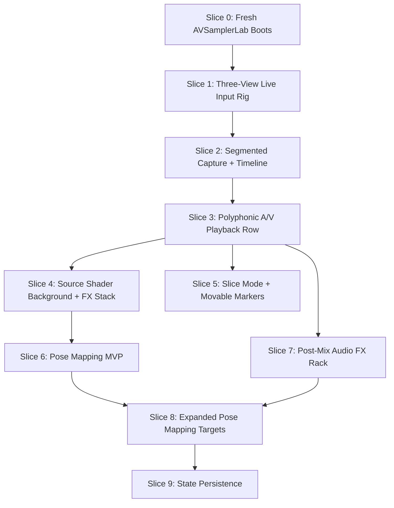

# A/V Sampler Lab — Vertical Slices

**Date:** 2026-04-26
**Companion doc:** `agent-docs/260426_av_sampler_lab_ideation.md`
**Status:** DRAFT — vertical-slice planning companion

This document decomposes the A/V Sampler Lab into independently testable vertical slices. Each slice should ship one observable behavior end to end. This is not an implementation plan yet; it is the feature-by-feature slicing reference to approve before detailed per-slice planning.

---

## Layers Identified

- **Project shell:** new `UserScripts/projects/AVSamplerLab/` project, manifest, DSP script, UI script.
- **Live input views:** raw webcam view, segmented/composited view, pose/skeleton view.
- **ML / segmentation:** selfie segmentation model loading, `ml_composite`, segmented frame generation for capture.
- **Pose:** MoveNet model loading, 17-keypoint parsing, skeleton overlay, normalized value publishing.
- **C++ media plumbing:** segmented `FrameData` ingest path into `VideoRetrospectiveCapture::ingestFrame()`.
- **Video sampler:** retrospective ring, committed `VideoSampler`, source/sampler rendering surfaces.
- **DSP graph:** retrospective audio capture, poly voices, slice lanes, mode logic, post-mix FX chain.
- **Sample timeline:** `WaveformView`, playheads, committed audio visualization, movable slice markers.
- **Lua behavior/state:** capture control, sampler state, mode state, active voices/slices, mappings, shader/source state, FX state.
- **Shader/source/composite:** source shader or source texture selection, shader effect stack, output background, playback row overlay.
- **UI layout:** input monitor area, timeline area, output/composite area, controls, mappings, FX.
- **MIDI/control routing:** poly note handling, slice root-major mapping, mode-aware behavior.
- **Pose mapping:** source registry, target registry, mapping UI, value scaling/routing.
- **State persistence:** source/effect settings, FX, mappings, slice markers, segmentation params, mode/root note.
- **Verification / IPC introspection:** backend/test observability for frame counts, mode, active voices/slices, mapping values, shader/FX state.

---

## Slicing Principles

- Start a **fresh AVSamplerLab project** and steal focused patterns from all relevant labs. Do not scaffold from one existing lab wholesale.
- Do not build horizontal layers such as “all DSP first” or “all UI first.”
- The first user-visible playback slice should use the **poly-capable architecture**, not a throwaway mono-only path.
- The input rig must represent the originally described multiple views: raw input, segmented composite, pose/skeleton.
- The output shader system must include **source shaders/source textures plus effects**, not only effect shaders.
- The waveform/timeline is a shared committed-sample view for all modes, not slice-mode-only UI.
- Slice markers may initialize equally spaced, but the feature is **8 movable slices**.
- Capture/memory/performance observability is useful for IPC/testing, but not a standalone user-facing feature slice.

---

## Slice 0: Fresh AVSamplerLab Boots

**Goal:** New AVSamplerLab project opens with a stable UI shell and minimal DSP graph.

**Layers:**
- Project shell: create new project directory and manifest.
- DSP: minimal graph that safely loads and outputs/monitors silence or passthrough.
- UI: root layout regions for the full instrument.
- Verification: visible UI/DSP loaded status.

**Checklist:**
- [ ] Create `UserScripts/projects/AVSamplerLab/manifold.project.json5`.
- [ ] Create `UserScripts/projects/AVSamplerLab/dsp/default_dsp.lua`.
- [ ] Create `UserScripts/projects/AVSamplerLab/ui/main.ui.lua`.
- [ ] Create `UserScripts/projects/AVSamplerLab/ui/behaviors/main.lua`.
- [ ] Add layout regions for input monitor, sample/timeline, output/composite, mode/control, pose mapping, FX, and developer status.
- [ ] Register at least one harmless `/avlab/...` DSP param to prove DSP param plumbing.
- [ ] Show UI loaded, DSP loaded, renderer mode, and clock/status text.

**Done when:** AVSamplerLab opens without errors and shows the new UI with UI/DSP loaded status.

**Depends on:** None.

---

## Slice 1: Three-View Live Input Rig

**Goal:** Webcam opens into three live input views: raw input, segmented composite, and pose/skeleton view.

**Layers:**
- Live input views: raw, segmented, pose/skeleton.
- ML / segmentation: load segmentation model and render `ml_composite`.
- Pose: load MoveNet, parse keypoints, draw skeleton.
- OSC/control: publish initial normalized pose values.
- UI behavior: webcam controls and live status.

**Checklist:**
- [ ] Add webcam device refresh/open/close controls in `UserScripts/projects/AVSamplerLab/ui/behaviors/main.lua`.
- [ ] Add raw viewport using `video_input` with `source="live"`.
- [ ] Add segmented viewport using `ml_composite` with `background = 0`.
- [ ] Add pose/skeleton viewport or dedicated skeleton overlay panel using the same live frame.
- [ ] Load `selfie_segmentation.onnx` from the project or copied model location.
- [ ] Load `movenet_singlepose_lightning.onnx` from the project or copied model location.
- [ ] Reuse MLLab’s MoveNet parsing for 17 keypoints.
- [ ] Reuse MLLab’s retained display-list skeleton overlay.
- [ ] Register and publish a minimal initial pose endpoint set such as `/avlab/pose/nose/x`, `/avlab/pose/nose/y`, `/avlab/pose/left_wrist/x`, `/avlab/pose/left_wrist/y`.
- [ ] Show visible keypoint count and last published values in status text.

**Done when:** Opening the webcam shows raw input, segmented foreground, and pose/skeleton view simultaneously, with at least one pose value visibly changing in status/OSC as the user moves.

**Depends on:** Slice 0.

---

## Slice 2: Segmented Capture into Video Ring + Committed Sample Timeline

**Goal:** The segmented/composited input, not raw webcam, enters the retrospective video ring and commits to the shared sampler.

**Layers:**
- C++ media plumbing: segmented `FrameData` ingest path.
- ML / segmentation: reuse segmentation postprocess for capturable RGBA.
- Video sampler: `VideoRetrospectiveCapture::ingestFrame()` and committed `VideoSampler`.
- DSP: audio retrospective capture synchronized with video commit.
- Sample timeline: committed sample `WaveformView` appears here, not only in slice mode.
- UI behavior: capture button, commit status, sampler preview.

**Checklist:**
- [ ] Add a C++/Lua path that ingests the latest segmented frame into `VideoRetrospectiveCapture::ingestFrame()`.
- [ ] Reuse segmentation logic consistent with `MLMaskSurfaceProvider` so `background = 0` produces alpha-cut RGBA.
- [ ] Avoid Lua-side full-frame RGBA table transfer.
- [ ] Add capture button and capture seconds control.
- [ ] Use the same `samplesBack` for audio capture commit and video capture commit.
- [ ] Commit video to one shared `VideoSampler`.
- [ ] Commit audio to the playback authority used by the first playback path.
- [ ] Add `WaveformView` showing the committed audio sample.
- [ ] Add committed video preview showing the segmented/cut-out clip.
- [ ] Add playhead/position display on the waveform/timeline.

**Done when:** User opens webcam, captures, and sees/hears a committed A/V sample where the video is already background-removed; the waveform/timeline shows the committed audio.

**Depends on:** Slice 1.

---

## Slice 3: Polyphonic A/V Playback with Horizontal Row

**Goal:** The committed A/V sample plays polyphonically, with active voices shown as video panels in one horizontal row.

**Layers:**
- DSP: adapt 8-voice poly playback from `VideoPolySamplerLab`.
- Video sampler: one shared committed clip rendered at per-voice positions.
- MIDI/control routing: trigger poly voices.
- UI layout: horizontal active row with preserved aspect ratio.
- Sample timeline: voice playheads where supported.

**Checklist:**
- [ ] Adapt the 8-voice poly DSP pattern from `UserScripts/projects/VideoPolySamplerLab/dsp/default_dsp.lua`.
- [ ] Copy captured audio into all voice `SampleRegionPlaybackNode`s on capture.
- [ ] Use one committed `VideoSampler` shared by all voices.
- [ ] Query per-voice loop-aware audio positions from named voice sample paths.
- [ ] Determine active voices with `isSampleRegionPlaybackPlaying(path)`.
- [ ] Render one child video panel per active voice using `video_input` source `sampler`.
- [ ] Lay active panels in a single horizontal row.
- [ ] Preserve aspect ratio: panel width is row width divided by active count; panel height derives from source aspect.
- [ ] Add active voice labels with note/velocity/position where available.
- [ ] Add waveform voice playheads if supported by existing `WaveformView` APIs.

**Done when:** A chord produces multiple audio voices, multiple segmented video panels side-by-side in one row, and playback positions follow each voice’s audio timing.

**Depends on:** Slice 2.

---

## Slice 4: Source Shader Background + Effect Stack Behind Playback Row

**Goal:** Output view renders a source shader/source texture with effect layers applied, and active video panels appear over it.

**Layers:**
- Shader/source/composite: source shader or source texture selection plus shader effect stack.
- UI layout: output viewport parent and playback row overlay.
- Lua behavior/state: source/effect layer state and pipeline rebuilds.
- Verification: visible animated/processed background under active panels.

**Pipeline model:**

```text
source shader / source texture
    → shader effect stack
    → output background
    → active sample row overlaid on top
```

**Checklist:**
- [ ] Add output viewport parent in `UserScripts/projects/AVSamplerLab/ui/main.ui.lua`.
- [ ] Add source selector for generated source shader, webcam/source texture if desired, and passthrough/none.
- [ ] Reuse WebcamViewer/source-registry patterns for source selection and source params.
- [ ] Add shader effect stack controls: layer enabled, effect select, parameter sliders.
- [ ] Build shader pipeline with `shaders.buildPipeline(layers, "contain", source)`.
- [ ] Render the shader result as output background.
- [ ] Render active poly/slice video panels as child panels over that background.
- [ ] Preserve horizontal row aspect-ratio behavior from Slice 3.
- [ ] Show selected source/effect status.

**Done when:** User chooses a source shader/source, adds an effect such as glitch/ripple, sees it as the output background, and active sample panels continue playing over it.

**Depends on:** Slice 3.

---

## Slice 5: Slice Mode with Movable 8-Slice Markers

**Goal:** Switching to slice mode gives eight triggerable slices over the committed sample, with movable markers on the waveform.

**Layers:**
- DSP: adapt slice lanes from `VideoSliceRackLab`.
- Mode logic: poly/slice toggle.
- Sample timeline: shared waveform markers and selected-slice highlight.
- MIDI/control routing: root-major slice triggering.
- UI layout: active slice panels in the same horizontal row system.

**Checklist:**
- [ ] Add `/avlab/mode` or equivalent poly/slice mode param.
- [ ] Add 8 slice `SampleRegionPlaybackNode`s in DSP.
- [ ] Initialize 8 slice starts equally as default state only.
- [ ] Display 8 movable slice markers on the shared `WaveformView`.
- [ ] Drag nearest marker to update slice start.
- [ ] Recompute slice end from next marker or sample end.
- [ ] Trigger slices using root-major mapping: root, root+2, root+4, root+5, root+7, root+9, root+11, root+12.
- [ ] Render active slices in the same horizontal row system.
- [ ] Add selected-slice highlighting.
- [ ] Add audition selected slice button.

**Done when:** User captures once, switches to slice mode, drags slice markers, triggers notes, and hears/sees slices start from edited positions.

**Depends on:** Slice 3.

---

## Slice 6: Pose Mapping MVP Built Into UI

**Goal:** User can map one pose source to one target parameter from the UI and see/hear it change live.

**Layers:**
- Pose mapping: source registry and target registry.
- UI: mapping row/editor with live source and target values.
- Lua behavior: scaling/inversion/routing.
- Shader/source/playback target: at least one real target changes.

**Checklist:**
- [ ] Add pose source registry for keypoint properties such as `left_wrist.y`, `nose.x`, confidence, and any first derived source chosen.
- [ ] Add initial target registry for one thin target category, preferably a visible source/effect shader parameter after Slice 4, or playback speed after Slice 3.
- [ ] Add mapping row UI with source keypoint dropdown, source property dropdown, target type dropdown, target param dropdown, min/max controls, invert toggle, and enable toggle.
- [ ] Show live source value and mapped target value.
- [ ] Route mapped value to the selected target.
- [ ] Keep OSC pose publishing active in parallel.
- [ ] Add status for disabled or invalid mapping.

**Done when:** User maps `left_wrist_y` to a visible shader/source/effect parameter or playback parameter, moves their wrist, and sees/hears the target change while the mapping row shows live values.

**Depends on:** Slice 4 for shader/source target, or Slice 3 if the MVP target is playback speed.

---

## Slice 7: Post-Mix Audio FX Rack

**Goal:** Poly/slice audio output runs through selectable post-mix FX slots.

**Layers:**
- DSP: post-mix FX slot chain.
- FX system: reuse `fx_definitions.lua` and `fx_slot.lua`.
- Params: FX type, mix, and normalized effect params.
- UI: FX slot controls and labels.
- Mode integration: both poly and slice feed the same post-mix chain.

**Checklist:**
- [ ] Reuse `UserScripts/projects/Main/lib/fx_definitions.lua`.
- [ ] Reuse `UserScripts/projects/Main/lib/fx_slot.lua`.
- [ ] Add/borrow helper context for `connectMixerInput` if needed.
- [ ] Wire `poly/slice mixer → FX slot chain → output`.
- [ ] Add at least 2 FX slots.
- [ ] Register `/avlab/fx/{slot}/type`, `/avlab/fx/{slot}/mix`, and `/avlab/fx/{slot}/param/{n}` params.
- [ ] Add FX UI with effect dropdown, mix slider, and param sliders.
- [ ] Update param labels based on selected effect.
- [ ] Verify both poly mode and slice mode feed the same FX chain.

**Done when:** User captures, plays poly or slice mode, selects an FX effect such as delay/filter/bitcrusher, and hears the effect while video remains synced.

**Depends on:** Slice 3.

---

## Slice 8: Pose Mapping Expanded to Shader, Source Shader, FX, and Sampler Targets

**Goal:** Pose mappings can target meaningful live controls across source shaders, effect layers, FX, and sampler/playback controls.

**Layers:**
- Pose mapping: expanded target registry.
- Shader/source/composite: source shader params and effect layer params.
- DSP/FX params: FX mix/params and sampler/playback params.
- UI: multiple mapping rows and target-specific controls.
- Lua behavior: smoothing/deadzone/depth and invalid-target handling.

**Target categories:**
- Source shader params.
- Shader effect layer params.
- Composite/blend params if relevant.
- FX slot mix/params.
- Sampler speed.
- Loop start/end.
- Slice selected/start or slice-specific params if useful.

**Checklist:**
- [ ] Build target registry from current source shader/source texture state.
- [ ] Include source shader params.
- [ ] Include shader effect layer params.
- [ ] Include FX slot params and mix values.
- [ ] Include sampler/playback params.
- [ ] Add multiple mapping rows.
- [ ] Add smoothing, deadzone, depth, and invert controls.
- [ ] Show invalid target warnings when selected source/effect/FX changes.
- [ ] Ensure mappings update when selected source/effect changes.

**Done when:** User maps one wrist to a source shader param, another to FX mix, and a derived gesture such as hand spread to playback speed or loop region, all updating live.

**Depends on:** Slice 6 and Slice 7.

---

## Slice 9: State Persistence

**Goal:** Instrument configuration survives project reload.

**Layers:**
- Persistence: project-local state file.
- UI state: load/save on init/change.
- Shader/source state: selected source, source params, effects, blend/composite params.
- FX state: slot selections, mix, params.
- Pose mapping state: mapping rows and scaling controls.
- Sampler/slice state: mode, root note, slice markers.

**Checklist:**
- [ ] Add `.av_sampler_lab.state` or equivalent project-local state file.
- [ ] Persist selected source shader/source texture.
- [ ] Persist source shader params.
- [ ] Persist shader effect layers and params.
- [ ] Persist FX selections, mixes, and params.
- [ ] Persist pose mappings.
- [ ] Persist segmentation params.
- [ ] Persist slice marker positions.
- [ ] Persist mode and root note.
- [ ] Load persisted state on init and reapply source/effect/FX/mapping state.
- [ ] Add reset-state button.

**Done when:** User configures source shader, effect stack, FX, mappings, mode, and slice markers; reloads the project; and sees the same configuration restored.

**Depends on:** Slice 8.

---

## Not a User-Facing Slice: IPC / Debug Introspection

This is deliberately not a product slice. Add backend/test observability as needed inside the implementation plan for the slice that needs it.

Useful IPC/test introspection may include:

- segmented ingest frame count
- raw vs segmented ingest source flag
- video ring frame count
- sampler frame count
- active voice list
- active slice list
- current mode
- mapping source/target live values
- shader source/effect state
- FX slot state

These are for verification and control through IPC/CLI. They should not become a user-facing performance dashboard unless the product direction changes.

---

## Dependency Graph

```text
0 → none
1 → 0
2 → 1
3 → 2
4 → 3
5 → 3
6 → 4 or 3 depending MVP target
7 → 3
8 → 6, 7
9 → 8
```

Parallel opportunities after Slice 3:

```text
Slice 4: source shader background + effect stack
Slice 5: slice mode with movable markers
Slice 7: post-mix FX rack
```

Then:

```text
Slice 6: pose mapping MVP
Slice 8: expanded mappings
Slice 9: persistence
```

Mermaid view:



---

## Quality Checks

- **Independence:** Each slice can merge independently and leaves the project in a usable state.
- **Observability:** Each slice has visible/audible behavior or a concrete testable state.
- **No horizontal layers:** No slice is only “write infrastructure” or “build all UI.”
- **Complete coverage:** Input views, segmentation, pose, capture, poly playback, slice playback, waveform, source shaders, effect stack, FX rack, mappings, and persistence are represented.
- **Acyclic dependencies:** The dependency graph is a DAG.
- **Concrete acceptance:** Every slice has a “done when” tied to visible/audible behavior.
- **IPC/debug scope:** Backend observability is acknowledged, but not treated as user-facing product work.

---

## Structured Slice Schema

```yaml
slices:
  - id: 0
    name: "Fresh AVSamplerLab Boots"
    goal: "New AVSamplerLab project opens with a stable UI shell and minimal DSP graph."
    layers: ["Project Shell", "DSP", "UI", "Verification"]
    depends_on: []
    parallel_group: 0
    effort: "small"

  - id: 1
    name: "Three-View Live Input Rig"
    goal: "Webcam opens into raw, segmented, and pose/skeleton live views."
    layers: ["Live Input", "ML", "Pose", "OSC", "UI Behavior"]
    depends_on: [0]
    parallel_group: 1
    effort: "medium"

  - id: 2
    name: "Segmented Capture into Video Ring + Committed Sample Timeline"
    goal: "Segmented/composited input enters the video ring and commits to the shared sampler with waveform timeline."
    layers: ["C++ Media Plumbing", "ML", "Video Sampler", "DSP", "Waveform UI", "Lua Behavior"]
    depends_on: [1]
    parallel_group: 2
    effort: "medium-large"

  - id: 3
    name: "Polyphonic A/V Playback with Horizontal Row"
    goal: "Committed A/V sample plays polyphonically with active voices shown as a horizontal video row."
    layers: ["DSP", "Video Sampler", "MIDI", "UI Layout", "Timeline"]
    depends_on: [2]
    parallel_group: 3
    effort: "large"

  - id: 4
    name: "Source Shader Background + Effect Stack Behind Playback Row"
    goal: "Output view renders a selected source shader/source texture with effect layers behind active sample panels."
    layers: ["Source Shader", "Shader Effects", "Composite", "UI", "Lua Behavior"]
    depends_on: [3]
    parallel_group: 4
    effort: "medium"

  - id: 5
    name: "Slice Mode with Movable 8-Slice Markers"
    goal: "Slice mode provides eight triggerable slices with movable waveform markers."
    layers: ["DSP", "Mode Logic", "Waveform UI", "MIDI", "UI Layout"]
    depends_on: [3]
    parallel_group: 4
    effort: "medium-large"

  - id: 6
    name: "Pose Mapping MVP Built Into UI"
    goal: "One pose source maps to one target parameter through the UI and changes live output."
    layers: ["Pose Mapping", "UI", "Lua Behavior", "Shader or Playback Target"]
    depends_on: [4]
    parallel_group: 5
    effort: "medium"

  - id: 7
    name: "Post-Mix Audio FX Rack"
    goal: "Poly/slice audio output runs through selectable post-mix FX slots."
    layers: ["DSP", "FX", "Params", "UI", "Mode Integration"]
    depends_on: [3]
    parallel_group: 4
    effort: "medium-large"

  - id: 8
    name: "Pose Mapping Expanded to Shader, Source Shader, FX, and Sampler Targets"
    goal: "Pose mappings target source shader params, effect params, FX params, and sampler/playback controls."
    layers: ["Pose Mapping", "Source Shader", "Shader Effects", "FX", "DSP Params", "UI"]
    depends_on: [6, 7]
    parallel_group: 6
    effort: "medium-large"

  - id: 9
    name: "State Persistence"
    goal: "Instrument configuration survives project reload."
    layers: ["Persistence", "UI State", "Shader State", "FX State", "Mapping State", "Slice State"]
    depends_on: [8]
    parallel_group: 7
    effort: "medium"
```
