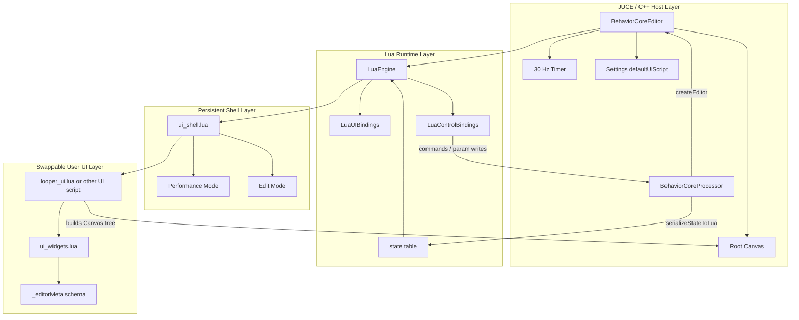
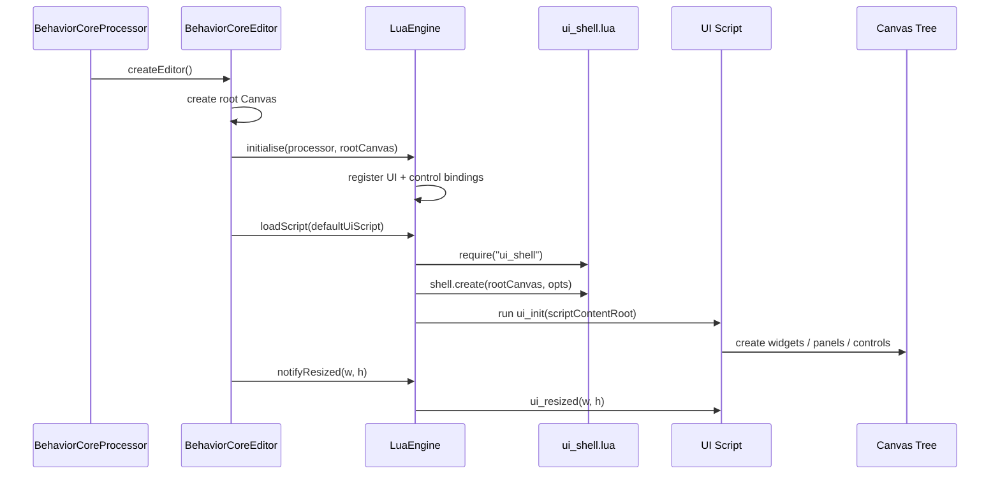
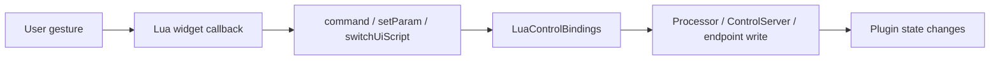

# Editor System Overview

High-level map of how the Manifold editor works, what the moving pieces are, and what the system enables.

## TL;DR

The editor is **not** a traditional hardcoded JUCE UI.

It is a layered system:

- **JUCE/C++** owns the plugin window, timer, state serialization, bindings, and integration with the processor.
- **Canvas** provides the scene graph and input/render substrate.
- **LuaEngine** hosts the UI runtime and bridges Lua to C++.
- **`ui_shell.lua`** is the persistent editor shell.
- **User UI scripts** like `manifold/ui/looper_ui.lua` are mounted inside that shell and can be swapped live.

That means the same runtime can act as:

- a normal performance UI
- a visual editor
- a script authoring environment
- a control/debug surface

---

## Mental Model

```text
┌──────────────────────────────────────────────────────────────┐
│ BehaviorCoreProcessor                                       │
│  - looper / transport / DSP state                           │
│  - ControlServer / OSC / endpoints                          │
│  - serializeStateToLua()                                    │
└──────────────────────────────┬───────────────────────────────┘
                               │
                               ▼
┌──────────────────────────────────────────────────────────────┐
│ BehaviorCoreEditor (JUCE AudioProcessorEditor)              │
│  - owns root Canvas                                          │
│  - owns LuaEngine                                            │
│  - runs 30 Hz timer                                           │
└──────────────────────────────┬───────────────────────────────┘
                               │
                               ▼
┌──────────────────────────────────────────────────────────────┐
│ LuaEngine                                                   │
│  - registers UI bindings                                    │
│  - registers control bindings                               │
│  - loads/switches UI scripts                                │
│  - pushes state -> Lua                                       │
│  - calls ui_update() / ui_resized()                         │
└──────────────────────────────┬───────────────────────────────┘
                               │ mounts
                               ▼
┌──────────────────────────────────────────────────────────────┐
│ ui_shell.lua  (persistent shell, never swapped)             │
│  - header / mode switch / zoom / settings                   │
│  - edit workspace                                            │
│  - hierarchy / inspector / scripts views                    │
└──────────────────────────────┬───────────────────────────────┘
                               │ contains
                               ▼
┌──────────────────────────────────────────────────────────────┐
│ current UI script (looper_ui.lua, etc.)                     │
│  - builds widgets                                            │
│  - handles interaction                                        │
│  - reads state                                                │
│  - emits commands / param writes                              │
└──────────────────────────────────────────────────────────────┘
```

---

## Architecture Layers



### Layer responsibilities

#### 1. Host layer (`BehaviorCoreEditor`, processor, settings)
Responsible for:

- creating the editor window
- creating the root `Canvas`
- initializing the Lua runtime
- loading the configured UI script
- ticking updates on the message thread
- handing plugin state to Lua
- wiring Lua back to the processor/control system

#### 2. Runtime layer (`LuaEngine` + bindings)
Responsible for:

- Lua VM lifecycle
- script loading / switching / reload
- binding `Canvas`, `gfx`, OpenGL hooks, constants
- binding commands, params, DSP script helpers, OSC, file helpers, clipboard, settings
- pushing live plugin state into Lua
- invoking `ui_init`, `ui_resized`, `ui_update`

#### 3. Shell layer (`ui_shell.lua`)
Responsible for:

- owning the persistent top-level editor chrome
- routing between performance and edit modes
- laying out preview / hierarchy / inspector / script areas
- keeping editor state alive across UI script swaps

#### 4. User UI layer (`looper_ui.lua`, other scripts)
Responsible for:

- building the actual plugin controls
- updating visuals from `state`
- turning user gestures into commands and param writes
- defining script-specific layout and behavior

---

## Boot Flow

When the plugin editor opens, the flow is roughly this:



### Important architectural rule

The shell is the parent and stays alive.

The content UI script is a child mounted underneath it.

That is the whole trick that makes mode switching and hot-swapping sane instead of a total mess.

---

## Runtime Update Loop

The editor updates on a **30 Hz message-thread timer**.

```mermaid
flowchart TD
  Tick[Timer tick] --> Switch[Process pending UI switch]
  Switch --> Eval[Process queued eval + OSC work]
  Eval --> Push[serializeStateToLua -> state]
  Push --> ShellUpdate[shell.updateFromState(state)]
  ShellUpdate --> UiUpdate[ui_update(state)]
  UiUpdate --> Repaint[rootCanvas.repaint()]
```

### What actually happens each tick

1. pending UI script switches are handled
2. queued Lua eval requests are processed
3. deferred OSC callbacks are processed on the message thread
4. processor state is serialized into a Lua `state` table
5. shell updates its editor chrome from that state
6. the current UI script updates its widgets from that same state
7. the Canvas tree repaints

So the UI behaves like a state-driven surface even though it is not using a web framework.

---

## State Flow

The processor is the source of truth.

It serializes plugin state into Lua each tick via `serializeStateToLua()`.

That state includes things like:

- params
- layer/voice data
- transport state
- Link state
- spectrum data

```text
Processor state
   -> serializeStateToLua()
      -> Lua global: state
         -> shell.updateFromState(state)
         -> ui_update(state)
            -> widget values / labels / colors / waveform state
```

### Why this matters

This keeps the UI script mostly declarative at the frame level:

- read current state
- derive visible UI state
- update widgets

That is way cleaner than scattering lots of imperative push callbacks all over the place.

---

## Control Flow Back Out of the UI

The reverse path is:



Examples:

- a button can call `command("TRIGGER", "/core/behavior/rec")`
- a knob can call `command("SET", "/core/behavior/tempo", value)`
- a script tool can call `switchUiScript(path)`
- a debug tool can call `EVAL ...` through the control server

So the editor is not just a renderer.
It is a live control surface.

---

## Shell Modes

The shell supports two top-level modes.

### Performance mode

```text
┌─────────────────────────────────────────────────────────────┐
│ shell header                                                │
├─────────────────────────────────────────────────────────────┤
│                                                             │
│      user UI fills the available runtime area               │
│                                                             │
└─────────────────────────────────────────────────────────────┘
```

Properties:

- tree hidden
- inspector hidden
- no preview scaling wrapper
- user UI shown as the main surface

### Edit mode

```text
┌─────────────────────────────────────────────────────────────┐
│ shell header                                                │
├──────────────┬─────────────────────────┬────────────────────┤
│ left panel   │ preview of current UI   │ inspector / tools  │
│ hierarchy or │ scaled / panned / live  │ properties/scripts │
│ scripts      │                         │                    │
└──────────────┴─────────────────────────┴────────────────────┘
```

Properties:

- left panel can show hierarchy or scripts-oriented tools
- center area previews the live UI with transform/zoom/pan
- right panel shows inspector/runtime/script information
- same UI script remains active, just wrapped differently

---

## Why the Canvas + Metadata Model Matters

Widgets are Lua classes backed by `Canvas` nodes.

Examples:

- `Button`
- `Label`
- `Panel`
- `Slider`
- `Knob`
- `Toggle`
- `Dropdown`
- `WaveformView`
- `Meter`
- `SegmentedControl`
- `NumberBox`

The crucial bit is that widgets store editor metadata on the backing Canvas node.

That metadata includes things like:

- widget type
- widget name
- config
- schema
- callback references

Conceptually:

```text
Canvas node
  userData["_editorMeta"] = {
    type = "Knob",
    config = {...},
    schema = {...},
    widget = <lua object>,
    callbacks = {...}
  }
```

### What that enables

Because the shell can walk the live Canvas tree and inspect `_editorMeta`, it can build:

- hierarchy tree views
- selection model
- inspector rows
- typed property editors
- preview transforms and selection handles
- eventually stronger visual authoring / round-trip tooling

Without metadata, the editor would just be guessing.
With metadata, it has something like a lightweight runtime UI model.

---

## Script Switching Model

UI scripts are hot-swappable.

The high-level behavior is:

```mermaid
flowchart TD
  Request[Switch request] --> Defer[Store pending switch path]
  Defer --> Tick[Next notifyUpdate tick]
  Tick --> Cleanup[Run outgoing ui_cleanup if present]
  Cleanup --> Clear[Clear current Canvas children]
  Clear --> Policy[Unload transient DSP slots / clear non-persistent callbacks]
  Policy --> Load[loadScript(newFile)]
  Load --> Resize[notifyResized(lastWidth,lastHeight)]
```

### Why it is deferred

Switching immediately from inside arbitrary Lua/UI callbacks is a good way to shoot yourself in the foot with lifetime problems.

So the switch is deferred to the regular update loop.
That is the correct non-stupid move.

---

## Editor System Boundaries

This is the cleanest way to think about ownership:

```text
C++ owns:
- window/editor lifetime
- processor integration
- timer/update scheduling
- state serialization
- Lua binding registration
- Canvas implementation
- thread safety boundaries

Lua shell owns:
- editor chrome
- mode switching
- preview workspace
- hierarchy/inspector/scripts UX

Lua UI script owns:
- actual plugin surface layout
- control behavior
- widget arrangement
- state-to-visual mapping

Processor/control layer owns:
- audio/transport/looper state
- command handling
- endpoint registry
- DSP runtime behavior
```

---

## What the System Enables

### 1. Runtime-swappable UIs
You can replace the UI script without recompiling C++.

### 2. One runtime for both playing and editing
The same system supports:

- performance UI
- edit workspace
- live preview
- script tools

### 3. Visual editor foundations
Because widgets expose metadata and schema, the shell can inspect and edit real live widgets.

### 4. Live scripting workflows
With eval, file helpers, clipboard, script lists, and DSP script helpers, the editor can double as a development surface.

### 5. Rich control surfaces
Lua UIs are not limited to “plugin controls.” They can become:

- debugging panels
- authoring tools
- alternate control layouts
- diagnostics surfaces
- script-driven dashboards

### 6. Future round-trip authoring potential
The current architecture is already pointing toward:

- stronger visual authoring
- persistence/save-load
- code generation or round-trip edits
- better mapping/wiring tools

Not all of that is complete, but the shape is there.

---

## Core File Map

### Host / integration
- `manifold/core/BehaviorCoreEditor.cpp`
- `manifold/core/BehaviorCoreEditor.h`
- `manifold/core/BehaviorCoreProcessor.cpp`

### Lua runtime
- `manifold/primitives/scripting/LuaEngine.cpp`
- `manifold/primitives/scripting/LuaEngine.h`
- `manifold/primitives/scripting/IStateSerializer.h`

### Lua bindings
- `manifold/primitives/scripting/bindings/LuaUIBindings.cpp`
- `manifold/primitives/scripting/bindings/LuaControlBindings.cpp`

### Scene graph
- `manifold/primitives/ui/Canvas.h`
- `manifold/primitives/ui/Canvas.cpp`

### Shell/editor UX
- `manifold/ui/ui_shell.lua`
- `manifold/ui/shell/methods_layout.lua`
- `manifold/ui/shell/methods_core.lua`
- `manifold/ui/shell/bindings.lua`

### User UI + widgets
- `manifold/ui/looper_ui.lua`
- `manifold/ui/ui_widgets.lua`
- `manifold/ui/widgets/base.lua`
- `manifold/ui/widgets/schema.lua`
- `manifold/ui/widgets/*.lua`

---

## Final Summary

If you want the shortest correct description:

> The editor is a **Lua-driven UI platform embedded inside a JUCE plugin editor**.
> C++ hosts it, Canvas renders it, Lua scripts define it, the shell edits it, and the processor feeds it live state.

That architecture enables Manifold to be both:

- a playable instrument/control surface
- and a live authoring/debugging environment

using the same runtime.
