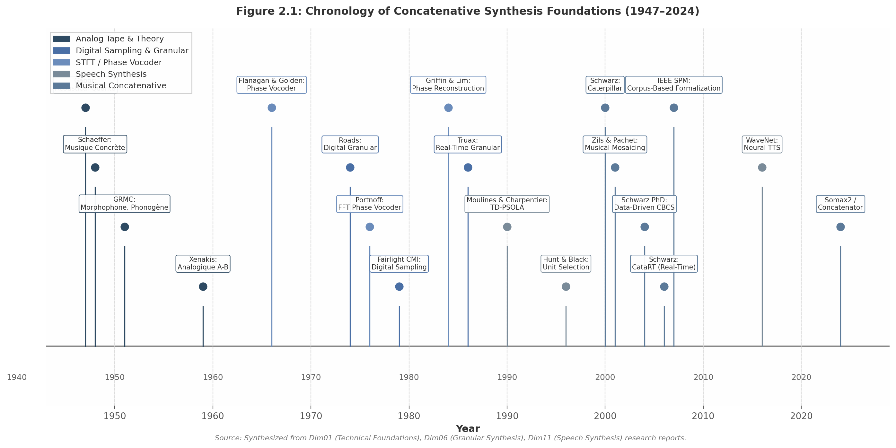

## 2. Foundations and Historical Lineage

### 2.1 Analog Precursors: Musique Concrète and Tape Splicing

The conceptual foundation of concatenative synthesis—building new sounds by assembling fragments of existing recordings—predates digital computation by more than two decades. On October 5, 1948, Pierre Schaeffer broadcast the "Concert de bruits" from the Studio d'Essai at RTF Paris, presenting *Étude aux chemins de fer* and four other noise studies composed from recorded "found sounds"[^1^]. Schaeffer termed this approach *musique concrète* to signal a philosophical reversal: rather than notating abstract musical ideas for instrumental realization, the composer began with concrete recorded sound and "abstracted the musical values it potentially contained"[^2^]. This shift—from notation-first to recording-first—established the epistemological precedent for all corpus-based synthesis: the sonic material itself serves as the primary compositional resource.

In 1951, Schaeffer, Pierre Henry, and engineer Jacques Poullin founded the Groupe de Recherche de Musique Concrète (GRMC) and developed dedicated tape-manipulation hardware: the morphophone (ten-head delay/loop machine), the phonogène (keyboard-controlled variable-speed tape replay), and a three-track tape recorder[^3^]. These instruments represent the first purpose-built concatenative devices—physical embodiments of unit selection, where discrete tape segments were chosen, reordered, and joined to construct new sequences. The morphophone's multiple playback heads anticipated the later digital concept of selecting from overlapping segment candidates.

Schaeffer formalized this practice in the *Traité des objets musicaux* (1966), introducing the *objet sonore*—the sound object—as a perceptual unit freed from causal origin through acousmatic listening[^805^]. Defined by intrinsic morphological properties (attack, sustain, spectral envelope, temporal evolution) rather than by source identity, the sound object directly prefigures the descriptor-based unit definitions of modern corpus-based synthesis[^29^].

In 1947, Dennis Gabor proposed that sounds could be represented as elementary "grains" or "acoustical quanta"—short pulses containing both temporal and frequency information[^5^]. Iannis Xenakis extended this into compositional practice with *Analogique A-B* (1959), realized by recording sine tones on analog tape, cutting them into thousands of pieces, and recombining via manual splicing according to stochastic scores[^4^]. Bernard Parmegiani executed the physical splicing—a procedure anticipating automated segmentation by four decades[^4^].

### 2.2 Digital Foundations: Phase Vocoder and STFT

The analog tape paradigm provided the conceptual model; digital signal processing provided the analytical infrastructure. The Short-Time Fourier Transform (STFT) and its musical application, the phase vocoder, created the spectral continuity necessary for seamless concatenation of heterogeneous units.

James L. Flanagan and Richard M. Golden introduced the phase vocoder at Bell Labs in 1966, representing speech by short-time phase and amplitude spectra and enabling independent time compression/expansion and pitch shifting[^9^]. The canonical STFT pipeline—segment, window, FFT, modify, inverse FFT, overlap-add—became the foundational DSP architecture for all subsequent concatenative systems[^10^]. Michael R. Portnoff demonstrated FFT-based digital implementation in 1976[^11^] and formalized time-frequency representation theory in 1980[^12^]. Ronald E. Crochiere's Weighted Overlap-Add (WOLA) established the constant-overlap-add constraint for artifact-free concatenation[^13^]; Griffin and Lim (1984) provided iterative phase reconstruction for magnitude-only pipelines[^14^]. Mark Dolson's 1986 *Computer Music Journal* tutorial translated these techniques for musicians[^15^], and Laroche and Dolson's 1999 scaled phase-locking addressed spectral "phasiness" in time-scale modification[^16^]. The phase vocoder thus served as transition infrastructure: spectral continuity between concatenated units via frequency-domain pitch and duration matching, smoothing joins that would otherwise produce transients at boundaries.

While spectral analysis tools matured in laboratories, the first digital concatenative instrument entered commercial production. The Fairlight CMI, developed by Kim Ryrie and Peter Vogel and released in 1979, pivoted from digital synthesis to digital recording of natural sounds[^6^]. The Fairlight's "Page R" sequencer (1982) enabled graphic pattern-based arrangement of sampled segments. At £12,000–£60,000, the Fairlight remained prohibitively expensive; the E-mu Emulator (1981), Ensoniq Mirage (1984, $1,695), and Akai S-series (from 1985) democratized sampling, normalizing the practice of segmenting and concatenating recorded audio[^8^].

### 2.3 Speech Synthesis Lineage and the Unit Selection Framework

The most rigorous formalization of concatenative selection emerged from text-to-speech (TTS) research, where intelligibility provided a quantifiable optimization target. Moulines and Charpentier's 1990 TD-PSOLA concatenated diphone units at pitch-synchronous boundaries marked by glottal closure instants, with Hanning windows extending two pitch periods for smooth spectral transitions[^17^][^18^].

The watershed advance came in 1996. Hunt and Black at ATR Japan proposed treating the synthesis database as a fully connected state transition network decoded by Viterbi search[^22^]. Their canonical dual-cost framework comprises: (1) a **target cost** measuring mismatch between target and candidate features, implemented as a weighted sum of $p = 20$–$30$ sub-costs; and (2) a **concatenation cost** estimating join quality, typically $q = 3$ sub-costs (cepstral distance, log power difference, pitch difference)[^22^][^24^]. Automated weight training via linear regression reduced training time by up to 100×[^23^], and pruned Viterbi with beam width 10–20 achieved near real-time selection on 100,000-unit databases[^22^].

This framework migrated to deployment through Festival (CSTR Edinburgh), an open-source diphone and unit-selection system[^47^]; CHATR (ATR/NICT), extending unit selection to emotional speech[^29^]; and MBROLA (TCTS Lab, Mons), a lightweight diphone engine. Together, these established the toolchain—segmentation, descriptor extraction, cost optimization, Viterbi decoding—that prefigured musical concatenative systems.

The speech-music divergence is critical to understanding the current field. Neural TTS (WaveNet 2016, Tacotron 2017, VALL-E 2023) has effectively replaced concatenative TTS for new voice-AI deployments[^107^]. Amazon Polly still offers Standard (concatenative) alongside Neural and Generative engines, but market trajectory favors neural approaches[^108^]. Yet concatenative synthesis retains advantages: Cohn and Zellou's Interspeech 2020 study demonstrated that listeners were less accurate at keyword identification for neural TTS than concatenative TTS in noise at $-3$ dB and $-6$ dB SNR[^124^]. Neural TTS reproduces casual speech reductions, improving naturalness but reducing intelligibility in adverse conditions; concatenative TTS produces hyper-articulated "clear speech"[^124^].

**Insight 1: The Speech-Music Inversion.** Speech synthesis and musical synthesis are diverging in opposite directions. Speech moved from concatenative to neural because the target is well-defined (intelligible, natural-sounding speech). Music synthesis has no such single target—musicians want idiosyncrasy, timbral identity, and surprise. Neural generative models produce plausible but generic music. Researchers now use concatenative methods to *constrain* neural generation to specific timbres (CoSaRef, kNN-SVC). Speech went neural to escape corpus limitations; music is returning to corpuses to escape neural genericism.

### 2.4 The IRCAM School: From Caterpillar to CataRT

The adaptation of speech synthesis unit selection to musical sound—heterogeneous corpora, perceptual descriptors, real-time interaction—was accomplished primarily by Diemo Schwarz at IRCAM in Paris, establishing the IRCAM school of corpus-based concatenative synthesis.

**Caterpillar (2000–2004).** Schwarz introduced data-driven concatenative sound synthesis at DAFx-2000 with the Caterpillar system, developed during his PhD at Université Paris 6[^29^][^32^]. Caterpillar performed offline Viterbi path-search for musical unit selection from large heterogeneous databases, using Hunt and Black's dual-cost framework: target cost and concatenation cost[^29^]. For instrument corpora, units were segmented by automatic score alignment via Dynamic Time Warping (DTW) and Hidden Markov Models (HMM)[^32^]; for free sounds, blind segmentation was applied. Descriptors included MPEG-7 low-level descriptors plus pitch, brilliance, noisiness, and spectral flux[^29^].

**Schwarz PhD Thesis (2004).** The dissertation *Data-Driven Concatenative Sound Synthesis* provided the field's theoretical foundation, establishing automatic alignment as feasible for building musical unit databases at scale[^32^]. The thesis demonstrated that corpus-based synthesis achieves naturalness by using actual recordings—"it is very difficult to build a model that would preserve all the fine details of sound"[^52^].

**CataRT (2006).** The critical architectural shift came with CataRT, released at DAFx-2006 as Max/MSP patches using the FTM library and Gabor framework[^29^][^30^]. CataRT abandoned Caterpillar's globally optimal Viterbi search in favor of real-time **greedy nearest-neighbor selection**: "Because of the real-time orientation of CataRT, we cannot use the globally optimal path-search style unit selection based on dynamic programming, but use a greedy nearest-neighbour selection"[^29^].

The CataRT model organizes units in a multi-dimensional descriptor space. The user controls a target point in a 2D projection, and the algorithm retrieves nearest units using Mahalanobis distance (Euclidean distance normalized over the corpus) to avoid distortions between descriptors with different ranges[^30^]. CataRT computes descriptors including fundamental frequency (YIN), aperiodicity, loudness, spectral centroid, flatness, sharpness, and MPEG-7 descriptors, condensing time-varying values to scalar characteristics per unit[^30^].

The FTM/Gabor infrastructure enabled this architecture. The Gabor sub-library—named explicitly after Dennis Gabor's "acoustical quanta"[^34^]—provides a unified framework for granular synthesis, PSOLA, phase vocoder, additive synthesis, and STFT techniques, processing "atomic sound particles" at arbitrary rates within Max's event processing model[^33^].

**Formalization and Canonization (2006–2007).** Schwarz's 2006 survey "Concatenative Sound Synthesis: The Early Years" in *Journal of New Music Research* provided the canonical historical review, documenting Caterpillar, Musical Mosaicing, Mosievius, Audio Analogies, and MATConcat[^31^]. The 2007 IEEE *Signal Processing Magazine* article "Corpus-Based Concatenative Synthesis" formalized the field for the broader signal processing community, establishing "corpus-based concatenative synthesis" (CBCS) as the standard term.

### 2.5 Adjacent Fields and Conceptual Boundaries

Three adjacent fields share technical infrastructure with concatenative synthesis while differing in objectives and methods: audio mosaicing, sound texture synthesis, and granular synthesis.

**Audio mosaicing** reformulates concatenative synthesis as resynthesis of a target sound by tiling with corpus units. Zils and Pachet's "Musical Mosaicing" (2001) at Sony CSL Paris treated unit selection as a constraint satisfaction problem (CSP), scaling to 100,000+ samples via adaptive local search[^35^]. Aucouturier and Pachet's Ringomatic (2005) adapted mosaicing to real-time drum accompaniment using four descriptors (energy, onset density, drum presence, cymbal presence)[^37^]. Mosaicing systems optimize for global target similarity rather than interactive descriptor-space exploration—a complementary objective to CataRT's navigational paradigm.

**Sound texture synthesis** pursues statistical resynthesis rather than unit concatenation. McDermott and Simoncelli (2011) demonstrated that textures—rain, fire, applause—can be resynthesized from time-averaged statistics of an auditory model (cochlear filters, envelope extraction, modulation filters)[^804^]. Synthesis quality improved as marginal moments, cross-channel correlations, and modulation power were added[^804^]. Unlike concatenative synthesis, which preserves specific timbral identity, texture synthesis generates novel signals matching only statistical properties—a non-concatenative alternative for homogeneous textures.

**Granular synthesis** occupies the closest technical proximity. Curtis Roads implemented the first computer-based granular synthesis in 1974 at UCSD using Music V; his 1981 MIT experiments conducted the first granular sampling from recorded files[^39^]. Barry Truax achieved the first real-time granular synthesis in 1986 on the DMX-1000, with his composition *Riverrun* realized entirely in real time[^40^]. Roads' 2001 book *Microsound* (MIT Press) remains the definitive theoretical survey[^201^].

Schwarz positions corpus-based concatenative synthesis as "a natural extension of granular synthesis, augmented by content-based selection and control"[^41^]. Granular synthesis selects by temporal position within a single file, with arbitrary unit sizes and no pre-analysis[^41^]. Concatenative synthesis adds: (1) multi-source heterogeneous corpora, (2) automated segmentation and descriptor analysis, and (3) content-based selection in a formalized descriptor space[^41^]. As grain durations extend toward tenths of a second, the perceptual boundary between granular texture and concatenative sampling blurs—a continuum now dissolving further with neural latent-space methods[^203^].

---

**Table 2.1: Chronology of Key Developments in Concatenative Synthesis (1947–2024)**

| Year | Development | Domain | Significance |
|------|-------------|--------|------------|
| 1947 | Gabor: "Acoustical quanta" theory[^5^] | Theory | Foundation for time-frequency grain representation |
| 1948 | Schaeffer: *Musique concrète*, "Concert de bruits"[^1^] | Analog | First composition from recorded sound fragments |
| 1951 | GRMC: morphophone, phonogène, 3-track recorder[^3^] | Analog | First dedicated concatenative hardware instruments |
| 1959 | Xenakis: *Analogique A-B* (manual tape splicing)[^4^] | Analog | First granular composition; stochastic unit assembly |
| 1966 | Flanagan & Golden: phase vocoder (Bell Labs)[^9^] | DSP | STFT analysis/synthesis for spectral continuity |
| 1976 | Portnoff: FFT-based digital phase vocoder[^11^] | DSP | Computational feasibility for real-time systems |
| 1979 | Fairlight CMI: first digital sampling instrument[^6^] | Commercial | Recorded segments as compositional building blocks |
| 1986 | Truax: first real-time granular synthesis[^40^] | Digital | Interactive grain-based performance |
| 1990 | Moulines & Charpentier: TD-PSOLA[^17^] | Speech | Pitch-synchronous diphone concatenation |
| 1996 | Hunt & Black: unit selection framework[^22^] | Speech | Dual-cost Viterbi: target cost + concatenation cost |
| 2000 | Schwarz: Caterpillar at IRCAM[^29^] | Music | Offline Viterbi musical unit selection |
| 2001 | Zils & Pachet: Musical Mosaicing (CSP)[^35^] | Music | Constraint-satisfaction unit selection |
| 2004 | Schwarz PhD: *Data-Driven CBCS*[^32^] | Music | Theoretical foundation; automatic score alignment |
| 2006 | Schwarz: CataRT (real-time CBCS)[^29^] | Music | Greedy nearest-neighbor; Max/MSP implementation |
| 2006 | Schwarz: "Concatenative Sound Synthesis: The Early Years"[^31^] | Survey | Canonical historical review (JNMR) |
| 2016 | DeepMind: WaveNet neural TTS[^107^] | Speech | Neural raw-waveform generation surpasses concatenative |
| 2024 | Tralie & Cantil: The Concatenator (Bayesian real-time) | Music | Probabilistic unit selection; commercial plugin debut |
| 2024 | IRCAM: Somax2 (machine-learned co-improvisation)[^49^] | Music | ML-guided corpus navigation retaining concatenative rendering |

The timeline reveals two parallel threads. The speech thread progressed from diphones (1990) through unit selection (1996) to neural TTS (2016), prioritizing intelligibility via ever-larger corpora. The musical thread progressed from analog tape (1948) through digital sampling (1979) and granular synthesis (1974–1986) to descriptor-based corpus navigation (2000–2006), prioritizing interactivity and timbral exploration. These divergent optimizations explain why the fields evolved distinct communities with different conferences, evaluation criteria, and opposite trajectories regarding neural versus corpus-based methods.

**Table 2.2: Key Concatenative and Precursor Systems**

| System | Institution | Year | Selection Method | Corpus Size | Real-Time | Status |
|--------|-------------|------|------------------|-------------|-----------|--------|
| GRMC (morphophone/phonogène) | RTF Paris | 1951 | Manual tape splicing | N/A | No | Historical |
| Fairlight CMI | Fairlight | 1979 | Manual pattern sequencing | ~8 MB | No (sequenced) | Historical |
| TD-PSOLA (diphone) | CNET France | 1990 | Diphone inventory | ~400 diphones | Yes | Historical |
| Festival | CSTR Edinburgh | 1998+ | Diphone + unit selection | Voice-dependent | Yes | Open-source active |
| CHATR | ATR Japan | 1996+ | Unit selection (Viterbi) | 100,000 units | Near | Research |
| Caterpillar | IRCAM | 2000 | Viterbi path-search | Instrument corpora | No | Research |
| Musical Mosaicing | Sony CSL | 2001 | Constraint satisfaction | 100,000+ samples | No | Research |
| CataRT | IRCAM | 2006 | Greedy nearest-neighbor | Heterogeneous, open | Yes | Open-source (GPL) |
| The Concatenator | DataMind Audio | 2024 | Bayesian particle filter | User-provided | Yes | Commercial ($149) |
| Somax2 | IRCAM | 2024 | ML-guided similar to CBCS | Musical corpora | Yes | Research/Max |

The systems table illustrates the central trade-off shaping the field: global optimality versus real-time interactivity. Offline systems (Caterpillar, Musical Mosaicing) apply Viterbi or constraint satisfaction for globally optimal sequences but require pre-computed targets. Real-time systems (CataRT, The Concatenator, Somax2) sacrifice global optimality for interactivity, using greedy or probabilistic selection. The speech community largely accepted this trade-off by moving to neural generation; the musical community continues exploring the design space, with recent hybrid approaches (neural embeddings for target costs, concatenative rendering) attempting to preserve both qualities.

*Figure 2.1.* Timeline of concatenative synthesis foundations, color-coded by domain. Two developmental threads—speech processing and musical composition—converge in the modern hybrid period. Source: Synthesized from Dim01, Dim06, and Dim11 research reports.
