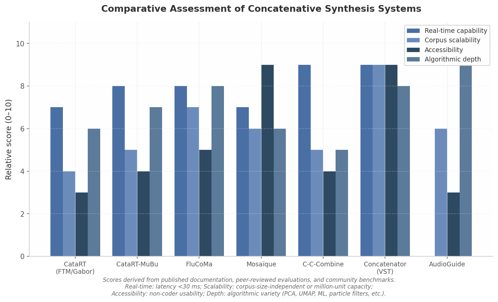

## 4. Real-Time Systems and Software Architectures

The algorithmic foundations from Chapter 3—descriptor extraction, distance metrics, unit selection, and search structures—are necessary but not sufficient for musical practice. A concatenative synthesizer must realize those algorithms within hard real-time constraints while remaining responsive to gestural input and robust across hours-long performances. This chapter examines the engineering decisions that transform theory into playable instruments, from IRCAM's research patches to contemporary commercial plugins.

### 4.1 Latency, Throughput, and Real-Time Constraints

#### 4.1.1 Defining Real-Time for Interactive Music

The perceptual thresholds for digital musical instrument latency have been quantified across multiple empirical studies. Wessel and Wright's foundational 2002 recommendation that digital instruments should aim for action-to-sound latency below 10 ms remains the most widely cited benchmark [^250^]. Subsequent research refines this by context: percussive interactions exhibit natural variation around 4 ms, with asynchronies of 6 ms detectable by listeners [^251^]; continuous gestural control tolerates 20–30 ms [^251^]; networked ensemble playing accepts up to 50 ms, though synchronization degrades above 30 ms [^252^]. Schmid et al. (2024, n=37) found mean just-noticeable-difference for audio latency of 49 ms at 0 ms base latency, improving to 27 ms at 64 ms base latency [^250^].

For concatenative synthesis, these thresholds partition the design space. Systems targeting tight rhythmic interaction must maintain end-to-end latency below 10 ms, inclusive of buffering, analysis, search, and grain scheduling. Gestural navigation tolerates 20–30 ms, while ambient applications may accept 50 ms. Rodrigo Constanzo's C-C-Combine uses a 512-sample (~11.6 ms at 44.1 kHz) post-onset window with FluCoMa's `@blocking 2` scheduler-priority mode to balance descriptor accuracy against retrieval speed [^9^].

#### 4.1.2 CPU Load and Memory Management

Concatenative synthesis imposes a bimodal computational load: descriptor computation (analysis) and grain retrieval with overlap-add resynthesis (synthesis). In CataRT's architecture, analysis is performed once per corpus unit during ingestion, producing an (N,D) descriptor matrix that resides in RAM [^1^]. At performance time, the CPU cost shifts to nearest-neighbor search and grain scheduling. For corpora of 10^4–10^5 units, exact kd-tree search provides O(log N) average-case complexity, degrading toward O(N) as descriptor dimensionality exceeds 20 [^1^]. The synthesis thread must additionally perform windowed overlap-add, pitch transposition, and amplitude normalization without dropping audio callbacks.

Modern concatenative plugins—including DataMind Audio's Concatenator—load entire corpora into RAM, with the manufacturer stating that "the only limitation on how many samples can be loaded... is how much RAM is available," implying no disk-streaming architecture [^90^]. This eliminates disk-I/O jitter but bounds corpus size: a one-hour stereo corpus at 44.1 kHz/16-bit occupies ~635 MB uncompressed, and with descriptors and search indices, practical limits emerge around 4–16 GB.

#### 4.1.3 Threading Models and Audio Callback Safety

Real-time audio systems must separate audio rendering (callback thread) from UI and analysis tasks (lower-priority threads), communicating via lock-free data structures to prevent priority inversion [^114^]. Concatenative synthesis adds the challenge that corpus queries—kd-tree traversals, SQLite lookups, or particle-filter updates—may exceed the audio callback budget. Strategies include pre-computing descriptors offline, deferring queries to worker threads, and using approximate nearest-neighbor methods that trade recall for predictable query time. The JUCE framework, used by Catecophony and many commercial plugins, provides built-in thread-safe parameter handling, but the developer remains responsible for guaranteeing no allocation or blocking on the audio thread [^142^].

A distinctive concept from live performance is the "shared symbolic instrument." When a laptop performer records an acoustic improviser in real time, segments the audio, extracts descriptors, and adds units to the corpus, both performers share the same sound space. As Schwarz describes it, the coupling "takes place in a concrete sound space, since the very timbral variation of the acoustic performer directly constitutes the instrument from which the digital performer creates music," a situation that "could even be seen as an improvisation with two brains and four hands controlling one shared symbolic instrument" [^61^]. The threading implications are substantial: the analysis thread must ingest, segment, and describe live audio without disrupting the synthesis thread's real-time guarantees.

### 4.2 The CataRT Ecosystem: Architecture and Data Flow

#### 4.2.1 Model-View-Controller Architecture

CataRT's architecture follows an explicit Model-View-Controller (MVC) pattern. The Model comprises the multidimensional descriptor space populated by sound units. The View provides two-dimensional projections of that space for performer navigation, typically using PCA or user-selected descriptor pairs. The Controller encompasses the selection algorithm, trigger modes, and gestural input mapping [^1^].

The data flow is: (1) audio input feeds the corpus via segmentation; (2) analysis extracts descriptors, populating an (N,D) matrix; (3) synthesis performs nearest-neighbor search, applies transformations, and concatenates grains via overlap-add. The distance measure is Euclidean distance normalized per-descriptor by the corpus standard deviation—i.e., Mahalanobis distance—to prevent range distortion [^1^]. Write access is centralized in `catart.data`; read access is via `catart.data.proxy`, enabling multiple synthesis modules to operate on shared corpora [^1^].

For persistent storage, CataRT wraps an SQLite relational database tracking soundfiles, segments, and descriptors, allowing corpora to be saved without re-analysis [^1^]. The 2D projection view has become the canonical interaction paradigm: performers navigate a visualized timbre space using XY controllers or graphics tablets, selecting regions that determine which units enter the synthesis stream.

#### 4.2.2 FTM and Gabor Libraries for Max/MSP

The underlying infrastructure for classic CataRT consists of three IRCAM libraries: FTM, Gabor, and MnM. FTM provides the `fmat` class for sample vectors, Fourier spectra, and descriptor frames, enabling matrix operations within Max's message-passing environment [^1^]. The Gabor library processes grains, wave periods, and STFT frames at arbitrary rates using Max's event processing model rather than block-wise MSP signal streaming [^88^]. By scheduling grains via messages, Gabor enables pitch-synchronous and granular synthesis within a unified modular framework, allowing descriptor-driven selection to operate at whatever temporal resolution the controller provides [^89^]. An overlap-add buffer reconstructs continuous audio from the resulting grain streams.

#### 4.2.3 CataRT-MuBu: The Modern Successor

CataRT-MuBu supersedes the classic FTM-based CataRT and is distributed freely through the Max Package Manager and IRCAM Forum [^120^]. It requires Max 7+ and the MuBu package. MuBu provides generic containers for multimodal data—audio, descriptors, motion, MIDI, markers—and includes PiPo for descriptor computation [^118^]. Replacing FTM's specialized matrices with MuBu's generic containers allows CataRT-MuBu to incorporate non-audio corpora alongside audio descriptors. CataRT-MuBu reached release 1.7.0 by September 2025 [^115^]. The MuBu package uses a proprietary "Forum" license, in contrast to FTM's LGPL [^95^].

#### 4.2.4 Live Corpus Building: The LAM 2006 Performance

CataRT's live corpus building capability was first demonstrated in concert at the Live Algorithms for Music (LAM) conference in 2006, featuring George Lewis on trombone and Evan Parker on saxophone improvising with CataRT [^145^]. The instrumental audio was recorded, segmented, and analyzed in real time, with the last several minutes retained in a rolling corpus from which the laptop performer selected units via a fader box, navigating the emergent descriptor space [^145^].

This performance exemplifies the "shared symbolic instrument": the corpus did not exist before the performance began; it was co-created by the acoustic improvisers and consumed by the digital performer. A second LAM 2006 performance, *Rien du tout* by Sam Britton and Diemo Schwarz, extended the principle to environmental sound, building a corpus from concert hall ambience and audience sounds [^145^].

### 4.3 Expanded Ecosystem: FluCoMa, Mosaïque, and New Tools

#### 4.3.1 FluCoMa: De Facto Standard Infrastructure

The Fluid Corpus Manipulation (FluCoMa) toolkit has become the de facto standard for corpus manipulation across Max, SuperCollider, and Pure Data [^70^]. Developed at the University of Huddersfield's CeReNeM from approximately 2017, with public release 1.0.0 in May 2020, it received ERC funding under Horizon 2020 (grant agreement No 725899) [^254^]. FluCoMa provides signal decomposition (slicing, HPSS, NMF, descriptors) and corpus exploration tools (datasets, KDTree, PCA, UMAP, MLP) [^176^], all with real-time and non-real-time variants [^148^].

For concatenative synthesis, FluCoMa's `FluidKDTree` enables k-nearest-neighbor lookup in real time, with the `@blocking 2` parameter placing Max object processing into the scheduler thread for lowest latency [^9^]. Buffer utilities allow descriptor data to flow through buffer-based pipelines [^176^]. Community ports including ReaCoMa (for REAPER) demonstrate ecosystem growth without central control [^177^].

#### 4.3.2 Mosaïque: Democratization for Non-Coders

Mosaïque, developed at LFO-lab (Université de Montréal), addresses the programming expertise barrier that has historically limited CBCS adoption. Available as a standalone Max patch and a Max for Live device (Ableton Live 11/12, Max 8.6.0+), it uses FluCoMa for all machine listening processes [^68^]. Its distinctive feature is a 3D environment for visualizing audio corpora, alongside MIDI, OSC, and algorithmic navigation tools [^11^]. Version 0.2 was published on Zenodo in August 2025 [^14^]. The project is funded by FRQSC and OICRM [^11^].

#### 4.3.3 AudioGuide and Symbolic Extensions

AudioGuide is a Python-based, non-real-time framework developed by Benjamin Hackbarth during his IRCAM residency (2010) [^64^]. It uses csound for rendering and supports output to Logic, Pro Tools, Reaper, and bach.roll. Being non-real-time, AudioGuide can layer sounds more densely than real-time systems and permits more flexible descriptor mapping [^72^]. Its subtractive spectral algorithm enables simultaneous selection of vertically stratified and horizontally overlapping corpus units, which real-time systems cannot achieve within callback constraints [^64^].

The dada library for Max extends CataRT's principles into the symbolic domain. Developed by Daniele Ghisi, it implements score segmentation and concatenative sequencing within Max's bach computer-aided composition environment [^56^], generating notated sequences of corpus-derived events rather than triggered grains [^91^].

#### 4.3.4 The 2024–2025 "Concatenative Renaissance"

The period 2024–2025 marks an inflection point in concatenative synthesis tooling. Table 4.1 compares ten current systems across platform, licensing, real-time capability, corpus access model, key algorithms, and distribution channel.

**Table 4.1: Concatenative Synthesis Systems—Comparative Overview**

| System | Platform | License/Cost | Real-Time | Corpus Access | Key Algorithms | Distribution |
|--------|----------|-------------|-----------|---------------|----------------|--------------|
| CataRT (classic) | Max/MSP + FTM/Gabor | GPL (free) | Yes | Pre-loaded + live recording | Mahalanobis NN, 2D projection | IRCAM [^1^] |
| CataRT-MuBu | Max + MuBu/PiPo | Forum (free) | Yes | Pre-loaded + live recording | PiPo descriptors, multimodal | Max Package Manager [^120^] |
| FluCoMa | Max/SC/Pd/CLI | Open-source | Yes/No variants | Dataset/KDTree | KDTree, PCA, UMAP, MLP | flucoma.org [^70^] |
| Mosaïque | Max for Live / standalone | Free (FRQSC funded) | Yes | 3D visualization + MIDI/OSC | FluCoMa-based | Zenodo, maxforlive.com [^14^] |
| C-C-Combine | Max/MSP | Free | Yes | Onset-triggered mosaicing | Loudness/pitch/centroid/flatness | rodrigoconstanzo.com [^8^] |
| Concatenator | VST/AU/AAX | $149 commercial | Yes | RAM-loaded corpus | Bayesian particle filter, ML matching | Native Instruments [^90^] |
| Catecophony | VST3/AU (JUCE) | Open-source (alpha) | Yes | k-d tree grain search | Essentia + FFTW3 descriptors | GitHub [^169^] |
| SKataRT | Max for Live | ~€200/year Forum | Yes | 8 sub-corpora, 16 channels | CataRT + mosaicing | IRCAM Forum [^172^] |
| AudioGuide | Python + csound | Open-source | No (offline) | Batch composition | Subtractive spectral, dense layering | GitHub [^72^] |

The table reveals three axes of differentiation: real-time versus offline, open-source versus commercial, and coder-centric versus non-coder accessibility. Only two systems (Concatenator, SKataRT) are commercial; every real-time system except Concatenator requires Max, SuperCollider, or Pure Data literacy, confirming that concatenative synthesis remains embedded in the creative-coding ecosystem.

### 4.4 Cross-Platform and Deployment Considerations

#### 4.4.1 Desktop Integration

The rarity of plugin-format concatenative synthesizers is striking. As of 2025, DataMind Audio's Concatenator ($149, VST/AU/AAX) is the only commercial plugin explicitly implementing real-time concatenative synthesis [^90^] [^2^]. Granular synthesis plugins abound—Output Portal ($149), Arturia Pigments (~$99–199), UVI Falcon ($349+), Spectrasonics Omnisphere ($479+)—but none employ descriptor-driven unit selection from heterogeneous corpora. Catecophony provides an open-source VST3/AU alternative (JUCE/Essentia) at alpha release [^169^]. SKataRT is a Max for Live device available through IRCAM Forum subscription (~€200/year), combining CataRT techniques with mosaicing [^172^].

The ISMIR 2024 Concatenator paper demonstrated real-time corpus-size-independent concatenative synthesis using a Bayesian particle filter [^179^]; the algorithm's Python prototype is open-source, while the VST wrapper is proprietary. DataMind Audio also markets the Combobulator (neural texture synthesis) and Refractalizer (granular synthesis), suggesting a portfolio strategy around AI-driven sound manipulation [^5^] [^6^].

#### 4.4.2 Embedded DSP and Hardware Constraints

No hardware instrument currently implements true descriptor-driven concatenative synthesis. The hardware granular synthesizer market has expanded—Waldorf Iridium/Quantum, 1010music lemondrop, Torso S-4, Intellijel Multigrain, Make Noise Morphagene, Qu-Bit Nebulae v2—but all are position-based granular engines [^34^]. Real-time descriptor extraction and nearest-neighbor search exceed typical embedded DSP capabilities, and hours-long corpora with per-unit descriptors exceed the 4–8 GB capacities of current hardware. The Qu-Bit Nebulae's open-source DSP platform could theoretically host a concatenative engine, but no such firmware exists [^34^].

#### 4.4.3 Web Audio and Browser-Based Architectures

Browser-based concatenative synthesis remains largely theoretical, though enabling infrastructure has matured. SuperSonic (2025) reworks SuperCollider's scsynth to run as a Web Audio AudioWorklet via WebAssembly, with full OSC compatibility and zero-allocation audio paths [^253^]. Because FluCoMa objects compile for SuperCollider, a SuperSonic-hosted concatenative synthesizer is technically feasible. Practical barriers remain: HTTP corpus streaming introduces unpredictable latency; Web Audio's 128-sample quantum imposes a ~3 ms lower bound; and persistent local storage for multi-gigabyte corpora is unavailable. For lightweight corpora, a WebAssembly-based engine using HNSW-indexed embeddings and AudioWorklet grain scheduling represents a plausible near-term architecture.

*Figure 4.1: Relative assessment of concatenative synthesis systems across four dimensions. Scores derived from published documentation and community benchmarks.*

The figure quantifies a central ecosystem tension: systems with highest algorithmic depth (FluCoMa, AudioGuide) do not always score highest on accessibility. The Concatenator alone scores uniformly high across real-time, scalability, and accessibility, reflecting its commercial investment in interface polish and the corpus-size-independent particle filter [^179^].
