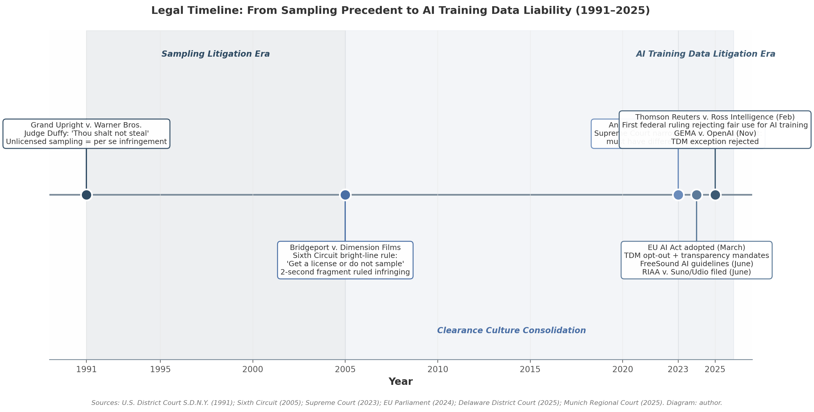

## 7. Markets, Law, and the Adoption Paradox

### 7.1 The Commercial Landscape: A Near-Empty Market

Despite more than two decades of mature corpus-based concatenative sound synthesis (CBCS) research, the commercial market is almost empty. The DSP foundations—real-time nearest-neighbor search, descriptor extraction, unit selection—have been documented since CataRT's debut at DAFx 2006. Yet as of early 2026, exactly one commercial plugin implements the method as its primary paradigm.

**The single commercial plugin.** In April 2025, DataMind Audio released *Concatenator*, a VST/AU/AAX plugin priced at $149, built on the Bayesian particle-filter architecture published at ISMIR 2024 [^3^]. The algorithm treats corpus window indices as hidden states and the incoming target audio as an observation; a critical claim is that computational complexity is independent of corpus size, enabling scaling to corpora measured in hours [^3^]. Coverage described the tool as an "audio mosaicking" instrument reconstructing live input from user-loaded fragments [^1^][^2^]. DataMind's "Artist Brains" licensing framework allocates 50 percent of revenue to training artists, signaling awareness that corpus provenance is a commercial liability [^5^][^6^].

**The open-source ecosystem.** Table 1 summarizes the status of principal non-commercial tools. CataRT remains active through the MuBu extension for Max; standalone CataRT and SKataRT require an IRCAM Forum subscription at ~€200/year [^11^][^12^]. Mosaïque, developed at Université de Montréal, released v0.2 in 2025 as a free instrument aimed at "democratizing" CBCS for non-coding musicians [^7^][^8^][^10^]. AudioGuide, the Python framework by Hackbarth, Schnell, Esling, and Schwarz, is static—functional but without active development [^14^]. The ERC-funded FluCoMa toolkit provides KDTree-based real-time concatenative primitives for Max, SuperCollider, and Pure Data, with active community examples but uncertain long-term sustainability.

| Tool | Platform | Price | CBCS Type | Maintenance Status | Citation |
|:---|:---|:---|:---|:---|:---|
| Concatenator | VST/AU/AAX (Win/Mac) | $149 | Bayesian real-time mosaicing | Active (commercial) | [^1^][^3^] |
| Mosaïque | Max for Live / Standalone | Free | Descriptor-based corpus navigation | Active (v0.2, 2025) | [^7^][^10^] |
| CataRT-Mubu | Max patches | Free (needs Max) | Real-time timbre space | Active (MuBu branch) | [^11^] |
| SKataRT | Max for Live | ~€200/yr (IRCAM Forum) | Mosaicing + XY timbre space | Active | [^12^] |
| AudioGuide | Python / CLI | Free | Non-real-time dense layering | Static | [^14^] |
| FluCoMa | Max / SC / Pd | Free | KDTree unit selection | Active (ERC-funded) | — |
| C-C-Combine | SuperCollider | Free | Corpus concatenation | Unmaintained | — |

*Table 1. Maintenance status of major concatenative synthesis tools as of early 2026. "Active" denotes updates or community support within 18 months; "Static" denotes no active development; "Unmaintained" denotes deprecated.*

For musicians seeking a turnkey concatenative instrument without coding or Max literacy, Concatenator is the only option.

**Granular synthesis as de facto commercial alternative.** The market contrast is stark. Output Portal ($149), Arturia Pigments 7 (~$99–199), UVI Falcon ($349+), and Ableton's bundled Granulator III all provide granular engines [^16^][^18^]. Hardware granular instruments have proliferated, yet none implements descriptor-driven unit selection from heterogeneous corpora. The sonic results of granular synthesis often overlap perceptually with concatenative output, reducing commercial incentive to engineer the more complex CBCS pipeline. A practitioner on the VI-Control forum summarized the experience: "A lot of solutions seem to be written from an academic Proof-of-Concept point of view and not so much with actual musicians in mind" [^47^].

**Game audio middleware: an untapped billion-dollar market.** The global audio middleware for games market reached USD 1.47 billion in 2024, with Wwise and FMOD commanding an estimated 67 percent combined share among AAA studios [^34^]. Neither platform offers corpus-based concatenative synthesis, despite CBCS aligning with game audio's core constraints: memory limitations favor small corpora with algorithmic variation, interactivity demands real-time response, and timbral identity must be preserved across dynamic contexts.

### 7.2 Copyright Law and the Clearance Culture

The near-empty commercial market is not explained by technical immaturity. The constraint is legal risk. Concatenative synthesis inherently requires a corpus of pre-existing recordings; every unit selection raises the question of whether the source was licensed. This section traces the arc from sampling precedent to AI training data liability.

*Figure 1. Legal timeline of landmark cases governing reuse of copyrighted sound recordings, from the sampling litigation era through the AI training data liability era. Diagram: author; sources annotated in figure.*

**Grand Upright v. Warner Bros. (1991): the sampling precedent.** In *Grand Upright Music, Ltd. v. Warner Bros. Records, Inc.*, the U.S. District Court for the Southern District of New York addressed Biz Markie's unauthorized use of a piano riff from Gilbert O'Sullivan. Judge Kevin Thomas Duffy opened his opinion with "Thou shalt not steal," treated unlicensed sampling as *per se* copyright infringement regardless of duration or transformative intent, and suggested criminal prosecution [^1^]. The ruling terminated the "Wild West" era of unlicensed sampling and initiated the modern clearance culture. For concatenative synthesis, the decision established that recombination of copyrighted recordings without license is presumptively infringing.

**Bridgeport v. Dimension Films (2005): the bright-line rule.** The Sixth Circuit hardened the standard further. A two-second guitar chord from Funkadelic's "Get Off," looped to sixteen seconds in the film *I Spy*, was ruled infringing. The court articulated a bright-line rule: "Get a license or do not sample" [^2^]. The decision eliminated the *de minimis* defense and cemented the economic reality that dense sample-based production would be financially unviable. Legal scholars have estimated that re-creating the Beastie Boys' *Paul's Boutique* today could require clearance budgets exceeding $20 million [^2^].

**The AI litigation era.** The 2024–2025 period transformed training data liability from speculative risk to enforceable doctrine. On June 24, 2024, the RIAA—representing Universal Music Group, Sony Music, and Warner Music—filed coordinated lawsuits against Suno and Udio, alleging "mass infringement of copyrighted sound recordings on an almost unimaginable scale" and seeking statutory damages of up to $150,000 per infringed work [^3^][^4^]. Suno conceded that its model was trained on copyrighted music from "the open internet" while defending the practice as fair use: "Learning is not infringing" [^5^].

In February 2025, the U.S. District Court for Delaware issued the first federal ruling rejecting a fair use defense for AI training. *Thomson Reuters Enterprise Centre GmbH v. Ross Intelligence Inc.* found that Ross's use of Thomson Reuters' headnotes to train a competing tool was not transformative under the Supreme Court's 2023 *Andy Warhol Foundation v. Goldsmith* framework, and harmed the market for training data licenses [^6^]. On November 11, 2025, the Munich Regional Court ruled in *GEMA v. OpenAI* that LLMs store reproducible copies of copyrighted lyrics, rejected the EU TDM exception defense, and held OpenAI liable for user-generated infringing outputs [^26^].

**Schwarz's prescient warning.** In 2006, Diemo Schwarz observed that "concatenative synthesis from existing song material evokes tough legal questions of intellectual property, sampling and citation practices." No subsequent court decision has relaxed the standard; the *Bridgeport* bright-line rule and the 2024–2025 AI litigation wave have only amplified the risk. The concatenative pipeline—segmenting, matching, and concatenating units from corpora—maps directly onto the sampling conduct that *Grand Upright* and *Bridgeport* declared infringing absent a license.

### 7.3 Pathways Forward: Attribution, Licensing, and Open Corpora

If copyright law is the primary bottleneck, the field's commercial viability depends on legal engineering as much as DSP engineering. Three pathways are emerging: open-licensed corpora, technical attribution systems, and regulatory frameworks that mandate transparency.

**FreeSound and Creative Commons.** Launched in 2005 by the Music Technology Group at Universitat Pompeu Fabra, FreeSound hosts over 670,000 sounds with 94.2 million cumulative downloads [^7^]. Sounds are licensed under CC0, CC BY, or CC BY-NC. In June 2024, FreeSound published AI-specific guidelines: CC-BY sounds may be used for model training only if attribution is provided upon distribution, while CC-BY-NC sounds may not be used for commercial AI training [^8^]. For concatenative tools shipping with bundled corpora, this offers a legally navigable path—provided the corpus is restricted to CC0 or CC-BY material.

**Barnett et al. on training data attribution.** A 2024 study proposed a replicable methodology using CLMR and CLAP audio embeddings on VampNet (trained on 795,000 songs) [^9^]. By splitting outputs and training data into 3-second segments and computing embedding similarity, the framework identifies the most influential corpus materials. A human listening study established a cosine-similarity threshold of 0.875 (CLMR); above it, over 30 percent of outputs had at least one highly similar training source [^30^]. The methodology shifts practice from "ignorant appropriation to informed creation" [^9^]—directly relevant to concatenative synthesis, where the corpus-to-output linkage is more explicit than in latent models.

**The EU AI Act and emerging regulatory frameworks.** Adopted March 13, 2024, the EU AI Act mandates that general-purpose AI providers comply with EU copyright law, including the TDM opt-out provisions of the DSM Directive, and publish summaries of training data [^10^]. Article 50 requires synthetic audio outputs to be marked as artificially generated, with penalties up to €30 million or 7 percent of global turnover [^42^]. In the United States, the proposed NO FAKES Act (July 2024) aims to establish a federal right of publicity protecting voices from unauthorized AI replicas [^11^], while the TRAIN Act and CLEAR Act propose training data transparency mandates [^43^].

**Why concatenative synthesis faces a unique legal barrier.** Subtractive, FM, wavetable, and physical modeling synthesis require no pre-existing recordings; sound is generated from oscillators, modulation, or simulated acoustics. Concatenative synthesis, by definition, begins with a corpus of existing audio. Granular synthesis operates on single-source samples loaded by the user; the vendor avoids the liability chain. Concatenative tools that ship with bundled corpora—or algorithmically match user-loaded corpora in ways producing recognizable derivatives—step directly into the *Bridgeport* bright-line rule. The result is an adoption paradox: the DSP has been mature for twenty years, the open-source tools are freely available, yet the commercial market contains one plugin—because scaling concatenative synthesis requires solving a copyright clearance problem that no other paradigm faces.
