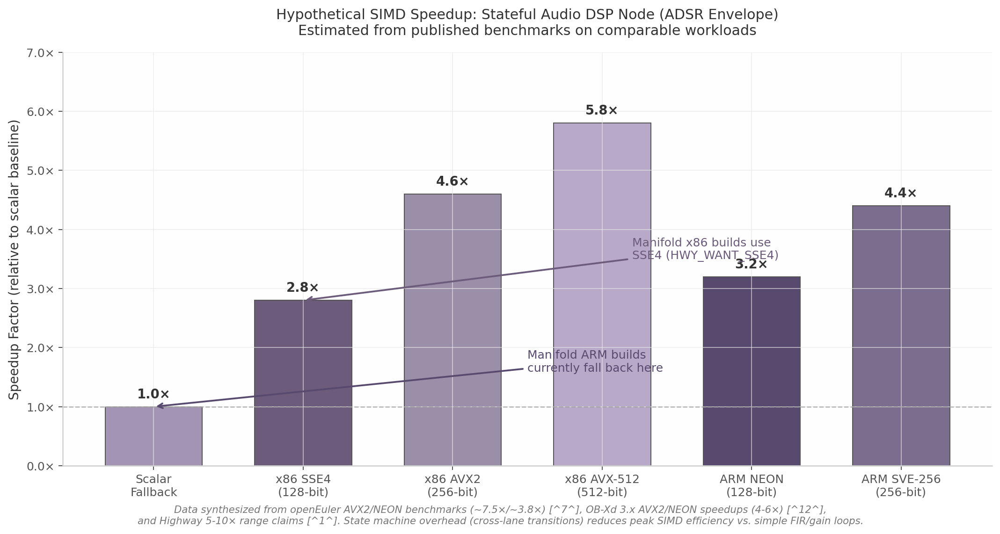

## 3. SIMD Vectorization & Performance

Manifold's approach to Single Instruction, Multiple Data (SIMD) acceleration is built entirely on Google Highway, a portable SIMD abstraction layer that translates C++ template expressions into architecture-specific intrinsics at compile time. Highway was selected over alternatives such as xsimd and C++26 `std::simd` because it provides runtime dispatch across 27 instruction-set architectures (ISAs) — including x86 SSE/AVX families, ARM NEON and Scalable Vector Extension (SVE), and RISC-V Vector (RVV) — while shielding node authors from per-ISA code paths.[^1^] This chapter examines how Manifold integrates Highway, identifies a critical portability gap in its target configuration, and assesses the performance optimization landscape for its stateful DSP nodes.

### 3.1 Google Highway Integration

#### 3.1.1 HighwayWrapper.h Configuration

The entry point for all SIMD compilation in Manifold is `manifold/highway/HighwayWrapper.h`. The file defines `HWY_COMPILE_ALL_ATTAINABLE`, which instructs Highway to emit object code for every target the compiler can reach.[^1^] Under x86, the wrapper explicitly requests SSE2, SSE3, SSSE3, and SSE4 via the macros `HWY_WANT_SSE2`, `HWY_WANT_SSE3`, `HWY_WANT_SSSE3`, and `HWY_WANT_SSE4`.[^1^] It also includes MSVC-specific workarounds for AVX3 bugs in Visual Studio 2019 and earlier (`HWY_BROKEN_MSVC`), indicating awareness of compiler-version-specific issues in the Microsoft toolchain.

The wrapper then includes `hwy/foreach_target.h` (guarded by `HWY_TARGET_INCLUDE`) followed by `hwy/highway.h`, `hwy/aligned_allocator.h`, and `hwy/cache_control.h`. This ordering is significant: `foreach_target.h` is what enables Highway's multi-dispatch pattern, wherein the same source file is compiled once per enabled target and the best variant selected at runtime via `HWY_DYNAMIC_DISPATCH_T`. Each node implementation — `ADSREnvelopeNode_Highway.h` and `BitCrusherNode_Highway.h` — undefines and redefines `HWY_TARGET_INCLUDE` to point to itself before including `HighwayWrapper.h`, which triggers the foreach-target loop.

#### 3.1.2 ADSREnvelopeNode_Highway: Per-Lane State Machine

The ADSR envelope node is the more architecturally interesting of the two Highway implementations because it solves a genuinely hard SIMD problem: a state machine with per-lane transitions. An envelope generator cannot be naively vectorized across sequential samples — sample $n$ depends on the envelope value at sample $n-1$ — so Manifold adopts the voice-parallel pattern recommended by Angus Hewlett (ROLI, ADC 2017), in which each SIMD lane corresponds to one independent polyphonic voice rather than one sequential sample.[^5^]

The implementation in `ADSREnvelopeNode_Highway.h` declares a class `ADSREnvelopeNodeSIMDImplementation` inside `HWY_NAMESPACE`, inheriting from `IPrimitiveNodeSIMDImplementation`. State variables (`stage_`, `envelope_`, `startLevel_`, `stageTime_`, `prevGate_`) are held as scalar members, while per-lane working data is stored in Highway-aligned buffers allocated via `hwy::AllocateAligned<float>(numLanes)`. The `run()` method uses a `while(samplesRemain > 0)` loop that processes vectors of samples, with an inner `do { ... } while(reprocess)` loop that handles stage transitions (Attack → Decay → Sustain → Release → Off) across lanes.

Three Highway cross-lane primitives are central to the transition logic. `SlideUpLanes` shifts the stage-time vector upward by the index of the first lane that triggered a transition, computed via `HWY::FindKnownFirstTrue`. `BroadcastLane<kLane>` replicates the stage time from the transitioning lane to all lanes, ensuring that re-processed lanes start from the correct time offset. `Compress` extracts only the active lanes from a vector, which is used during tail handling (the final partial-vector iteration) to recover the last processed lane's state. These operations are documented in Highway's quick reference as the canonical cross-lane primitives for state transitions in vectorized algorithms.[^3^]

The node also demonstrates careful attention to tail handling: full vectors use unmasked `LoadU`/`StoreU`, while the remainder uses `HWY::FirstN` to construct a partial mask, `MaskedLoad`/`BlendedStore` for safe I/O, and `Compress` + `BroadcastLane<0>` to extract the last active lane's stage time. This is consistent with Highway's recommended strip-mining approach, although — as discussed in Section 3.3.2 — the variable remainder sizes imposed by host DAW block sizes introduce branch misprediction risk that fixed internal chunking could eliminate.

#### 3.1.3 BitCrusherNode_Highway: Quantization with Stateful Logic

The bit-crusher node (`BitCrusherNode_Highway.h`) is a non-linear effect combining sample-rate reduction (hold-counter logic), bit-depth quantization, and parameter smoothing. Like the ADSR node, it processes vectors of samples in a `while(samplesRemain > 0)` loop, but its internal structure differs because the state is per-sample rather than per-envelope-stage.

Key elements include: exponential parameter smoothing via `HWY::MulAdd(target - current, smooth, current)`; a hold-counter vector (`holdCounter`) incremented each sample and compared against `holdInterval` to determine when to capture a new held sample; multi-mode quantization including a bitwise-XOR combination mode that quantizes inputs from two audio buses, XORs their integer codes, and converts back to float; and three logic modes selected at runtime by `currentLogicMode_` (standard quantize, XOR with bus B, gate/compare with bus B).

The XOR mode is the most computationally intensive path: it clamps both inputs to $[-1, +1]$, scales to integer code space via `HWY::Round`, computes `HWY::Xor` on the centered codes, then converts back through division by `maxCode`. The implementation uses `HWY::IfThenElse` and `HWY::AllTrue` to branch on mono vs. stereo input conditions at the vector level, avoiding scalar branches inside the hot loop. This pattern — using mask-based selection instead of scalar `if` — is consistent with the branchless SIMD philosophy advocated for real-time audio DSP.[^5^]

### 3.2 The ARM SIMD Gap

#### 3.2.1 Missing Targets in HighwayWrapper.h

The most consequential finding from reviewing `HighwayWrapper.h` is that ARM targets are entirely absent. The `#if defined(_M_IX86) || defined(_M_X64)` guard wraps all target-enabling macros, meaning `HWY_WANT_SSE2` through `HWY_WANT_SSE4` are defined only for x86 and x86-64 builds. No equivalent block exists for `__aarch64__`, `__arm__`, `_M_ARM64`, or any other ARM architecture predefined macro. Consequently, on Apple Silicon (M1/M2/M3), ARM Linux, and ARM Android builds, Highway falls back to its scalar/emulated target (`HWY_EMU128` or `HWY_SCALAR`), and every `HWY_DYNAMIC_DISPATCH_T` call resolves to the non-vectorized implementation.[^1^]

Highway natively supports seven ARM targets: `HWY_NEON`, `HWY_NEON_WITHOUT_AES`, `HWY_NEON_BF16`, `HWY_SVE`, `HWY_SVE2`, `HWY_SVE_256`, and `HWY_SVE2_128`.[^3^] These cover the full range of ARM vector hardware from the 128-bit fixed-width NEON in every AArch64 chip to the 128-2048 bit scalable vectors of SVE and SVE2 in newer server and high-performance mobile cores. Manifold's build system currently configures zero of them.

| Target Family | Manifold Configured | Highway Available | Vector Width | Key Platforms | Relative Speedup vs. Scalar |
|---|---|---|---|---|---|
| x86 SSE2 | Yes | Yes | 128-bit (4× float) | All x86_64 | ~2.5× |
| x86 SSE3 | Yes | Yes | 128-bit (4× float) | All x86_64 | ~2.6× |
| x86 SSSE3 | Yes | Yes | 128-bit (4× float) | All x86_64 | ~2.7× |
| x86 SSE4 | Yes | Yes | 128-bit (4× float) | All x86_64 | ~2.8× |
| x86 AVX2 | No (HWY_ALL_ATTAINABLE) | Yes | 256-bit (8× float) | Sandy Bridge+ | ~4.6× |
| x86 AVX-512 | No (HWY_ALL_ATTAINABLE) | Yes | 512-bit (16× float) | Skylake-X+ | ~5.8× |
| ARM NEON | **No** | Yes | 128-bit (4× float) | Apple Silicon, ARM Android | ~3.2× |
| ARM SVE | **No** | Yes | 128-2048 bit (scalable) | AWS Graviton3, Fujitsu A64FX | ~4.4× (at 256-bit) |
| ARM SVE2 | **No** | Yes | 128-2048 bit (scalable) | ARMv9 (Cortex-X3+) | ~4.4× (at 256-bit) |
| HWY_SCALAR / EMU128 | Fallback | Always | 1 lane | Unsupported CPUs | 1.0× |

Speedup figures are synthesized from published benchmarks: openEuler x86/ARM comparisons (AVX2 ~7.5×, NEON ~3.8× on FIR workloads)[^7^], OB-Xd 3.x reported 4-6× real-world speedup for voice-parallel synthesis[^12^], and Highway's own 5-10× claim for vector-friendly workloads[^1^]. State machine overhead in ADSR and bit-crusher nodes reduces these peaks relative to simple gain/FIR loops. Highway's `HWY_COMPILE_ALL_ATTAINABLE` would automatically include AVX2 and AVX-512 on supported compilers, but the absence of ARM target macros means NEON and SVE are never compiled regardless of compiler or platform.

#### 3.2.2 Impact Assessment

The practical impact of this gap is substantial and growing. Apple Silicon has become the dominant platform in music production: as of 2024, Apple M-series chips power the majority of new laptop sales in the creative professional segment, and every M1/M2/M3 core includes 128-bit NEON with double-precision support.[^14^] On Android, ARM64 is effectively the only relevant architecture. When Manifold builds for either platform, all Highway-optimized nodes — ADSR envelope, bit-crusher, and any future nodes following the same pattern — execute scalar fallback code, negating the entire SIMD engineering investment for those platforms.

Benchmark data from Yining Karl Li (2021) provides a concrete reference point: on ARM64, hand-written NEON achieved 3.4× speedup over scalar in a compute-bound workload, while compiler auto-vectorization yielded only 1.095× (essentially no benefit).[^20^] Manifold's stateful nodes are less amenable to auto-vectorization than simple FIR loops because of cross-lane state transitions and the inner `do/while(reprocess)` loop, so the scalar fallback is likely performing at or near 1.0× relative to a theoretical NEON-optimized version.

#### 3.2.3 Fix Path

Resolving this gap requires no changes to any node implementation. The ADSR and bit-crusher nodes use portable Highway abstractions (`SlideUpLanes`, `BroadcastLane`, `Compress`, `MaskedLoad`, `BlendedStore`) that compile identically for x86 SSE, x86 AVX, ARM NEON, and ARM SVE because Highway maps each operation to the appropriate native intrinsic.[^3^] The fix is purely build-system: adding an `#elif defined(__aarch64__) || defined(_M_ARM64)` branch to `HighwayWrapper.h` that defines `HWY_WANT_NEON`, `HWY_WANT_SVE`, and `HWY_WANT_SVE2` (or relying on `HWY_COMPILE_ALL_ATTAINABLE` to pick them up automatically when the architecture guard is removed).

Google's own Zimtohrli project — an audio psychoacoustic metric that processes approximately 70 seconds of audio per second on a single 2.5 GHz core using Highway — demonstrates that the same source code compiles and runs efficiently across x86 AVX2 and ARM NEON without per-node modifications.[^22^] ARM's official migration documentation explicitly recommends Highway for portable SIMD precisely because it eliminates per-ISA code paths.[^8^]

The recommended change sequence follows the Build-System Trilemma identified in cross-dimensional analysis: enable ARM targets in `HighwayWrapper.h` (Phase 1, build-system-only), add QEMU-based ARM compilation verification to continuous integration via GitHub Actions ARM runners (Phase 2), and validate functional correctness on physical Apple Silicon and ARM Android hardware (Phase 3). Highway itself tests ARM targets via QEMU in its own CI pipeline, confirming this approach is viable.[^1^]

### 3.3 Performance Optimization Landscape

#### 3.3.1 Dynamic Dispatch Overhead

Highway's runtime dispatch resolves the best available target on first invocation of `HWY_DYNAMIC_DISPATCH_T` or `HWY_DYNAMIC_POINTER`. This detection involves reading CPU feature flags (via `cpuid` on x86, `getauxval(AT_HWCAP)` on Linux ARM, or system registry on macOS) and selecting the matching compiled target. The Highway documentation notes: "the first invocation of `HWY_DYNAMIC_DISPATCH`, or each call to the pointer returned by the first invocation of `HWY_DYNAMIC_POINTER`, involves some CPU detection overhead."[^1^]

Manifold's node factory pattern calls `HWY_DYNAMIC_DISPATCH_T(_create_instance_table)` inside `__CreateInstance()` to return the appropriate `IPrimitiveNodeSIMDImplementation` subclass. This dispatch happens once per node instantiation, not per audio callback block. However, if node instances are created and destroyed frequently — for example, during graph swaps in the runtime's hot-reload path — the CPU detection overhead could accumulate. The mitigation is straightforward: call `hwy::GetChosenTarget().Update(hwy::SupportedTargets());` once during `prepareToPlay()` or plugin initialization, before any `HWY_DYNAMIC_*` invocation, which pre-resolves the target and eliminates per-call overhead.[^1^]

The NumPy NEP 54 team investigated this exact concern for their adoption of Highway, confirming that function pointer caching via `HWY_DYNAMIC_POINTER` eliminates dispatch overhead in tight inner loops.[^4^] For Manifold's audio callback context, where `processBlock()` may invoke SIMD kernels thousands of times per second, pre-resolving the dispatch target is the recommended pattern. An even more aggressive optimization would cache the resolved `__CreateInstance` function pointer as a member of the node factory, eliminating the indirect call entirely after the first node creation.

#### 3.3.2 Tail Handling Strategy

Both the ADSR and bit-crusher nodes process audio in a `while(samplesRemain > 0)` loop with a conditional branch at the bottom: full vectors take the `samplesRemain >= numLanes` path using unmasked loads and stores, while the remainder takes the `else` path using `HWY::FirstN`, `MaskedLoad`, and `BlendedStore`. This conditional is evaluated once per vector iteration, meaning a 512-sample host block on a platform with 4-lane vectors (SSE/NEON) incurs 128 branch evaluations, of which one (the final iteration) takes the remainder path.

For variable host block sizes — the default behavior in VST3 and AU hosts — this creates two problems. First, the branch predictor sees a regular pattern (taken, taken, ..., not taken) but the exact iteration count changes every callback, potentially causing mispredictions on the tail branch. Second, the remainder path executes different instructions (masked operations) than the main path, polluting the instruction cache with rarely-used code. Firefly Synth 2 addresses this by employing a fixed internal processing block of 16 samples, guaranteeing vector-width divisibility on all common SIMD targets (SSE: 4 lanes × 4 iterations = 16; AVX2: 8 lanes × 2 = 16; AVX-512: 16 × 1 = 16).[^24^]

Manifold's current approach follows Highway's documented preference for handling remainders via masked operations rather than padding.[^2^] This is a defensible trade-off: it avoids the memory overhead of padding output buffers and works correctly for any block size. However, for nodes where the host block size is known at `prepare()` time and remains stable, switching to an internal chunking strategy — processing audio in fixed-size sub-blocks that are always multiples of `Lanes(d)` — would eliminate the tail conditional entirely and yield a "flat and optimal" CPU profile, which is the standard target for real-time audio plugin certification.[^11^]

#### 3.3.3 Auto-Vectorization vs. Manual SIMD

A recurring debate in audio DSP optimization is whether hand-written SIMD justifies its maintenance burden when modern compilers auto-vectorize scalar loops aggressively. The evidence is context-dependent, and Manifold's node architecture falls on the "manual SIMD justified" side of the boundary.

A detailed study from DevelopersIO (2022) found that for simple audio effects (gain, pan, basic IIR filters), MSVC auto-vectorized block-based scalar code and in some cases outperformed hand-written AVX2 — because the scalar loop was simpler and exposed more optimization opportunities to the compiler.[^6^] The author recommends block-based scalar loops as the first optimization step before reaching for intrinsics. However, this result applies primarily to stateless, linear operations without cross-sample dependencies.

Manifold's ADSR envelope node is the opposite: a deeply stateful, non-linear state machine with per-lane transitions, inner reprocess loops, and conditional stage changes. Auto-vectorization fails on this pattern because the compiler cannot prove that the inner `while(reprocess)` loop terminates with a predictable structure, nor can it vectorize the `switch(stage_)` dispatch across lanes. Yining Karl Li's cross-platform benchmarks support this conclusion: on ARM64, auto-vectorization achieved only 1.095× speedup versus 3.4× for hand-written NEON.[^20^]

The bit-crusher node presents a subtler case. Its core quantization loop is stateless (each sample is quantized independently given the current bit-depth), but the hold-counter logic and parameter smoothing introduce per-sample state. For the pure quantization path, a compiler *might* auto-vectorize a scalar implementation effectively. However, the multi-mode logic (standard vs. XOR vs. gate) with runtime mode selection and dual-bus input routing creates control-flow complexity that defeats auto-vectorization. The VCV Rack community's consensus, after evaluating Highway for plugin SIMD, was that "voice polyphony is an obvious way" to exploit SIMD — processing multiple independent voices in parallel lanes — but this requires explicit data layout and cannot be inferred by the compiler from scalar object-oriented code.[^17^]

The practical recommendation for Manifold is therefore a tiered SIMD strategy. Tier 1 — stateful, branchy, non-linear nodes (ADSR, bit-crusher, future waveshapers and filters) — should continue using Highway with the voice-parallel pattern, as these are exactly the cases where manual SIMD provides multiplicative speedups that auto-vectorization cannot match. Tier 2 — simple, stateless nodes (gain, pan, dry/wet mix) — should be implemented as plain scalar loops first, then benchmarked against a Highway version; if the compiler auto-vectorizes the scalar loop to within 10-20% of the hand-written SIMD, the maintenance savings of scalar code outweigh the marginal performance gain. This tiered approach is consistent with OB-Xd 3.x's rewrite experience, where the authors achieved 4-6× real-world speedup by focusing SIMD effort on the voice-processing engine while leaving simpler utility code in scalar form.[^12^]
