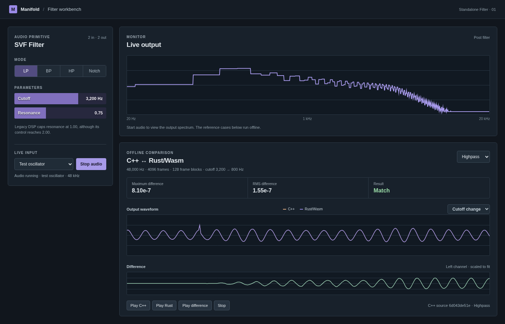
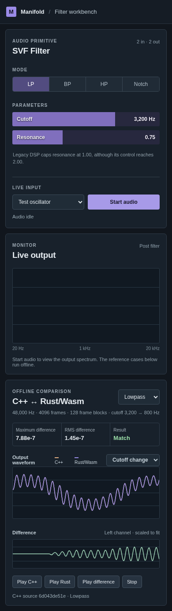

# Review checkpoint 00: SVF reference workbench

Date: 2026-09-26. Review this at [the local workbench](http://127.0.0.1:4173/) while its server is running, or rebuild and serve `web/dist` using the README.

## What works

- The Standalone Filter's historical C++ `SVFNode.cpp` produces six checked-in stereo float32 cases. The generator sets the defaults from `Standalone_Filter/dsp/main.lua`, including drive 1. It only reads the old checkout.
- Native Rust and browser Wasm independently process the same input. The workbench overlays C++ and Wasm output, plots the difference, reports maximum and RMS error, and offers C++/Rust/difference playback. The difference playback amplifies the residual for inspection.
- The live oscillator or microphone still runs through Rust/Wasm in an AudioWorklet. The scope is a lightweight Canvas 2D spectrum and stays outside the audio callback.
- Compact controls borrow the filled-slider, in-control value, and dense grouping ideas from the old Lua widgets. The legacy rack's explicitly temporary debug accent strips were not translated.

## Results

All cases: 48 kHz stereo, 4096 frames, cutoff 3200 → 800 Hz at frame 2048, resonance 0.75. The threshold is a maximum absolute sample difference of 0.0002.

| Case | Frames per block | Native Rust maximum error | Browser Wasm maximum error |
| --- | ---: | ---: | ---: |
| Lowpass | 128 | 7.9e-7 | 7.88e-7 |
| Bandpass | 128 | 8.0e-7 | 8.05e-7 |
| Highpass | 128 | 8.2e-7 | 8.10e-7 |
| Notch | 128 | 5.8e-7 | 5.85e-7 |
| Lowpass | 64 | 7.9e-7 | 7.88e-7 |
| Lowpass | 512 | 7.9e-7 | 7.88e-7 |

Verification: `cargo test --workspace`, `cargo fmt --all --check`, `python3 scripts/check-svf-parity.py`, and `npm run build`. Headless Chromium loaded all six Wasm cases with **Match**, started live audio, and produced no page errors. A 390px viewport had no horizontal overflow.

## Decisions and next work

The v2 UI maps frequency logarithmically, while the old widget uses a linear range; the DSP still receives cutoff in Hz. The old manifest exposes resonance through 2.0 but its DSP clamps at 1.0. The workbench names that limit beside the control. Neither is a claim of exact UI parity.

The C++ fixture cases cover modes, a parameter step, stereo, and three block sizes. Reset behavior, bypass/mix/drive sweeps, channel edge cases, and graph routing remain to be captured. Next, introduce a typed graph description and prepared execution plan around passthrough, gain, mixing, and SVF, then use the same comparison workbench for a small chain and branch.
