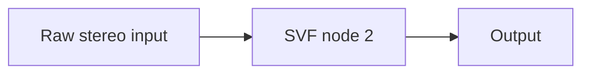

# Review checkpoint 01: Rust graph spine

Date: 2026-09-26. The [browser workbench](http://127.0.0.1:4173/) now runs the project descriptor's graph through Rust/Wasm. See the [graph contract](../../docs/graph-contract.md) for the data and ownership model.

The graph compiler has preallocated per-node stereo scratch, topological execution, unreachable-node pruning, cycle and port validation, and explicit silent output when disconnected. Rust tests cover chain output matching the standalone filter, branch sum and linear blend, monitor gain, silent disconnected input, invalid connections, and Gain smoothing. The browser sends node/edge data and parameter routes from `projects/standalone-filter/project.json` before connecting its input.

Browser verification: all six historical C++ SVF cases still report **Match** at the same sub-micro sample differences as checkpoint 00. Live oscillator audio starts with no page errors. Changing the running filter from lowpass to highpass at maximum cutoff reduced the 165 Hz bin by about **65 dB** in headless Chromium, confirming the new node-specific parameter route reaches the audible graph.

The graph is prepared once when the browser audio node starts. Live topology swaps, state continuity, sample-offset events, full legacy Mixer/Crossfader behavior, and C++ graph sample fixtures are next work. `Sum2` and `LinearBlend` are intentionally named as new simple routing primitives until the richer legacy nodes are ported and compared.
