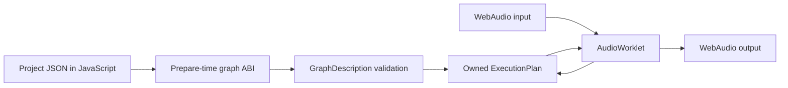

# Graph contract: first executable slice

The browser project descriptor now contains nodes, connections, and parameter targets. The AudioWorklet sends that description to the Wasm module **before** audio input is connected. Rust validates it and compiles an owned `ExecutionPlan`; the callback only copies planar stereo blocks and calls `process`. No Lua runs in v2. Legacy Lua remains a reference for behavior, parameters, and widget vocabulary.

`NodeId` is a stable integer. Each connection has a source node, destination node, and destination input port. The current ABI (version 3) accepts up to 64 nodes and 256 connections. Type codes currently cover raw input, monitor input, constant, Gain, two-input sum, linear blend, SVF, Crossfader, Mixer, VoiceSynth, MidiInput, MidiTranspose, MidiNoteFilter, Oscillator, ADSREnvelope, NoiseGenerator, Distortion, Compressor, Limiter, StereoDelay, Phaser, Chorus, EffectSlot, LoopCapture, SampleRegion, SampleInstrument, SpectrumAnalyzer, FftSpectrum, SlewAudio, SlewControl, AttenuverterBias, SampleHold, CvMix, EnvelopeFollower, EnvelopeControl, and output. JavaScript maps descriptor names to codes. Parameter descriptors retain public host IDs and point to a node and node-local parameter ID. The graph ABI can grow without putting a JSON parser in the audio callback. The additive `manifold_graph_initial_parameter` call sets supported authored node values before compilation, so an initial value does not incorrectly ramp from a default.

The editable graph project is a version-1 `manifold.project` JSON document. Its optional `assets` array stores up to four embedded stereo float32 PCM sources, each with `nodeId`, `sourceRate`, `frames`, `label`, and `pcmF32Base64`. Existing topology-only documents still open. Import validates the entire topology and every asset before replacing the open project: an asset must target a `SampleInstrument`, `SampleRegion`, `Granulator`, or `MainVoiceBank` node, node IDs must be unique, each source must fit the Rust 30-second and 1,440,000-frame bounds, and decoded PCM is limited to 32 MiB total. The JavaScript host transfers each reachable asset into the worklet before playback; Rust's sample upload ABI loads it into the compiled node. An asset on a disconnected node stays in project state but is not uploaded until its node reaches Output. Removing that node removes its asset. Removing an asset leaves the node and its routes in place. Neither file decoding nor base64 conversion runs in the audio callback. A sample region's note-on retriggers its one playhead; note-off does not stop it. The sample instrument has independent voices and note release instead. A granulator without an asset grains from its live input capture ring. Its ring size depends on prepared block capacity, so native/Wasm live-capture comparisons must prepare both at the same capacity.

Main voice bank nodes require two prepared partial targets in the optional `targets` array: target 0 for wave and target 1 for source. Each entry stores `nodeId`, `target`, `fundamental`, and flat `[frequency, amplitude, phase, decay]` values for 1–32 partials. Import rejects missing, duplicate, oversized, or non-finite targets before changing the open graph. The node offers all 20 standalone Main controls, a bounded stereo source, and stopped target editing. The node's “Open standalone Main bank state or project” input accepts Main v1–v3 states and version-1 Main project bundles, remaps their current source, targets, and parameters to the graph node, and leaves the existing graph routes intact. The two imported targets remain a prepared snapshot; source follow and its recipe are represented separately in the optional graph `temporal` array. [Checkpoint 149](../web/public/graph-main-bank-review.html) includes Normal and Add native/Wasm captures and browser save/reopen checks.

Replacing a Main bank audio file analyzes its stereo PCM in the background Rust/Wasm analysis worker and prepares a fresh source target before the editor swaps the source and target together. The authored wave target stays in place. If the new file cannot produce partials or analysis fails, both the prior source and its targets remain in the project. Source analysis never runs on the audio callback. [Checkpoint 150](../web/public/graph-main-source-review.html) covers the replacement and rejection paths.

The “Use built-in source” action replaces a sample asset in place for any sample-bearing graph node. For Main bank nodes it also restores the default built-in source target while retaining the authored wave target and every graph route. An editor revision invalidates asynchronous file analysis and import results after a newer graph edit; the latest source selection wins. [Checkpoint 151](../web/public/graph-source-roundtrip-review.html) covers built-in restoration and a delayed-worker browser case.

A graph `temporal` entry addresses one Main node and stores `mode`, `speed`, `smooth`, `contrast`, and an 11-value spectral recipe. It requires a bound source asset. When a standalone Main state has active source follow, import maps its target controls to this recipe. At playback start, a separate Rust/Wasm worker analyzes the saved stereo source and rebuilds at most 128 raw temporal frames; the worklet uploads them before reporting ready. Each Rust Main voice then follows its own sample playhead in Add or Morph mode. Motion speed can change live; turning follow off or removing the source removes the recipe. Frames are rebuilt on reopen rather than embedded in the project JSON. The graph exposes follow, live speed, and compact stopped controls for smoothing, contrast, stretch, tilt, driven Add waveform/pulse width, and Morph amount/depth/curve. Changing a shape control makes the worker rebuild frames at the next start. [Checkpoint 152](../web/public/graph-main-temporal-review.html) includes two native/Wasm graph captures and the Chromium import/reopen path. [Checkpoint 153](../web/public/graph-main-shape-review.html) adds the compact source-shape editor, preserves open panels across edits, and checks driven Add settings in Chromium and adds a native/Wasm driven Pulse capture.

Compilation checks IDs, node kinds, output count, port bounds, duplicate port occupation, cycles, and preparation bounds. It sorts the graph, prunes nodes that cannot reach Output, allocates each active node's stereo scratch buffer once, and creates the node's DSP state. Prepared source tables are sized per node, including all 32 Mixer input ports. An unconnected Output emits silence. `InputRaw` and `InputMonitor` are separate explicit source nodes; neither creates audible passthrough by itself. The browser has 52 interactive views, including the analyzer, follower, compressor, limiter, MIDI effects, Resonator, and manual Sine bank paths. The live two-input views use distinguishable audio signals; their deterministic C++ fixtures use fixed constant signals for later inputs.

Graph operations are deliberately named by semantics. `Gain` has the legacy 10 ms smoothing and mute behavior. `Crossfader` matches the original node's stereo position, equal-power/linear curve blend, dry/wet mix, and 10 ms parameter smoothing in four C++ fixture cases. `Mixer` matches the original scalar node's 1–32 stereo buses, equal-power pan, per-bus gain, master gain, and 10 ms smoothing in four C++ fixture cases. Parameter IDs are 0 for master, 1–32 for bus gains, and 33–64 for bus pans; bus numbers in this API are one-based like the C++ API. `Sum2` and `LinearBlend` remain simpler routing operators.

This slice prepares a graph at initialization. Graph editing while audio runs is still open: compile a replacement off the callback, publish it at a block boundary, and transfer state only where stable node IDs and explicit continuity rules permit. Parameter messages currently arrive at block granularity. Typed note events now have within-block offsets in the Rust graph and Wasm ABI; browser keyboard events enter at offset zero of the next callback, while hardware MIDI timestamps enter a bounded worklet queue and become within-block offsets. See the [event contract](event-contract.md) for the timing limits.

`ADSREnvelope` accepts one stereo audio input and exposes attack, decay, sustain, release, and gate as node parameters 0–4. The Rust node follows the C++ scalar curves in normal gate cycles and releases from the current level during attack or decay. A gate change reaches the worklet at the next audio block; sample-offset gate events are not yet exposed.

`NoiseGenerator` has no input port and emits seeded, independent stereo noise. Level and color are node parameters 0 and 1. Authored initial values are passed into graph preparation so the source does not ramp from defaults; later changes use the legacy 10 ms smoothing and lowpass color curve.

The authored `projects/synth-patch/project.json` shows a real multi-node instrument without Lua. Its deterministic cases compare native Rust with Wasm, because this exact composition is new and has no C++ project fixture. The workbench exposes oscillator/noise balance, ADSR gate and shape, filter cutoff/resonance, and output level.

Port types now distinguish `Audio`, `Control`, and `Midi`. `Lfo` emits a bipolar control signal; `ModulatedGain` takes audio on port 0 and control on port 1. `MidiInput`, `MidiTranspose`, and `MidiNoteFilter` emit MIDI events, and `VoiceSynth`, `SampleRegion`, and `SampleInstrument` accept them on optional port 0. Graph compilation rejects a source connected to a port of the wrong type. Control buffers are evaluated at sample rate inside the same prepared plan. MIDI events traverse the prepared graph at their sample offsets through a preallocated stack; effect parameter changes remap held notes to connected instruments between blocks. A fixed 32-entry trace records transform emissions or suppressed notes and is read by the browser outside `process`. The old Lua UI-loop LFO is a behavior reference, not an implementation imported into v2.

Optional audio inputs must preserve whether a bus is connected. The old `GraphRuntime` gives every declared input a view even when no edge supplies it. `RingModulatorNode` treats that empty second view as an external modulator and its old Standalone FX slot is silent at full depth/wet mix. Normal v2 Ring processing treats an unconnected modulation port as absent and runs its internal oscillator. The explicit FX host-comparison mode reproduces the old silent view so the C++ graph capture remains comparable. A future general graph importer must make this choice per optional port rather than silently turning an absent edge into a connected zero bus.

The old `GraphRuntime` clamps a connection's target bus into `0…activeBuses-1` during graph processing. Shrinking a mixer input count can therefore fold high-index routes onto its last active bus. The measured Standalone FX Delay → Reverb switch produces identical C++ audio with eight and 11 active mixer buses because the slot gives every bus uniform gain and pan. A general importer must preserve the clamp rule when per-bus controls make it audible.

`ModulatedSvf` takes audio on port 0 and bipolar control on port 1. Parameters 0–2 retain SVF mode, base cutoff, and resonance; parameter 3 is cutoff depth in Hz. Each sample requests `base + CV × depth`, clamped to 20–20,000 Hz before the original 20 ms cutoff smoother. With zero depth, the unmodulated path is sample-identical to `SVF`; the original C++ SVF cases still pass. The synth patch uses a separate LFO control edge into this node and displays the target range implied by the editable base and depth.

`Distortion` is a stereo audio node with drive, wet mix, and output gain as parameters 0–2. It follows the legacy scalar tanh shaping, 10 ms smoothing, dry/wet blend, and final ±1 clamp. Six C++ fixtures cover steady modes, parameter sweeps, clipping, stereo differences, and block sizes.

`Phaser` is a stereo audio node with sweep rate, depth, six/twelve-stage selection, feedback, and stereo phase spread as parameters 0–4. Its fixed twelve-stage arrays and LFO state are prepared once; the audio callback allocates nothing. Seven C++ fixtures cover stage changes, parameter sweeps, stereo separation, feedback polarity, and block sizes. See the [Phaser migration boundary](phaser-migration.md).

`Compressor` is a stereo audio node with eleven legacy parameter IDs and one gain-reduction meter. It preserves the original shared envelope, including left-before-right update order. Attack and release are effective only when set before graph preparation; five other exposed legacy controls do not affect audio. Eight C++ fixtures compare stereo samples and the signed dB meter. The [migration boundary](compressor-migration.md) records these limitations.

`Limiter` is a stereo audio node with threshold, release, makeup, soft clip, and wet mix as parameters 0–4. It uses a linked stereo peak, immediate gain clamp, smoothed release, and one block-averaged positive dB meter. Seven C++ fixtures compare audio and meter values. The worklet requests meter snapshots on a 100 ms timer independent of visual animation frames. See the [migration boundary](limiter-migration.md).

`StereoDelay` is one prepared stereo audio node with two five-second ring buffers allocated at graph compilation. Parameters 0–15 are left/right time in milliseconds, feedback, crossfeed, feedback filter enable/cutoff/resonance, wet mix, tap-time swap, stereo width, freeze, ducking, free/synced mode, left/right beat division, and tempo. The feedback filter is one pole in the original source, so the resonance control remains audible-inert for parity. Time changes smooth over 20 ms; other continuous controls smooth over 10 ms. Boolean and division changes take effect at the next process block. The Rust interpolation wraps both read position and index to prevent a legacy boundary spike. The eight C++ fixtures use fractional tap periods and match sample for sample. See [checkpoint 13](../artifacts/reviews/checkpoint-13.md).

The authored `projects/fx-chain/project.json` composes three existing audio kernels with a dry/wet branch around SVF. Four native Rust cases compare the same graph with Rust/Wasm, including parameter changes and a dry-to-wet transition. This chain is a composition test; the original Standalone FX is a single swappable slot with a separate [migration contract](standalone-fx-migration.md).

`projects/graph-workspace/project.json` is the first editable topology project. The browser palette exposes Gain, Distortion, SVF, Audio sum, Oscillator, Noise, LFO, and CV gain between fixed live input and output nodes. Edits and project import happen only while audio is stopped; the AudioWorklet then compiles the resulting typed graph through the existing Rust/Wasm ABI on the next start. The version-1 JSON stores graph nodes, connections, and initial parameters under project ID `manifold.graph-workspace`. Three native Rust captures (seed, distortion, CV gain) compare against the actual Wasm worklet within `0.000000060` peak sample difference over 8,192 stereo frames. A parameter the ABI cannot set before preparation is applied immediately after preparation; smoothing may therefore run from its constructor value. General live graph replacement and state migration remain separate from the prepared route editor. See the [review](../web/public/graph-workspace-review.html) and [patch editing contract](patch-editing-contract.md).

The graph workspace's node fields can now set reachable node parameters during playback. Each update has an AudioWorklet acknowledgement from `manifold_set_node_parameter`; the project records only accepted values. The browser rejects a value for a node pruned from the prepared plan and restores the field. Stopped topology edits still require recompilation. See [checkpoint 143](../web/public/graph-live-controls-review.html).

The [tone and noise study](../web/public/graph-tone-study-review.html) is an authored `manifold.graph-workspace` document with internal-source mode. Oscillator and Noise sum into SVF, then LFO drives ModulatedGain's Control port before Output. The fixed input node remains unconnected for schema compatibility and is marked parked in the editor. Source mode is optional in schema version 1: an older document without it keeps external input, while `none` suppresses the browser input connection. The native Rust/Wasm reference manifest includes this bit-exact 8,192-frame capture. The browser saves and reopens a live-edited oscillator frequency alongside the graph and source mode. The SVF editor's resonance maximum is now 1, matching the Rust filter's maximum rather than allowing values Rust would clamp.

The [note voice study](../web/public/graph-midi-voice-review.html) adds typed MIDI Input, Transpose, and Voice Synth nodes to the editable graph palette. One MIDI input per project is allowed; the browser keyboard sends events to the reachable input, or directly to a reachable voice if the input is removed. Rust compiles MIDI and Audio edges in the same plan. The authored route is MIDI Input → Transpose +7 → Voice Synth → SVF → Output. The native Rust and Wasm AudioWorklet 8,192-frame, two-note captures are bit-exact. The browser shows G4 from C4, accepts a live +12 transpose, then shows C5 and reopens the saved project with that parameter. The fixed input audio node is parked. This establishes v2 note routing; sample assets and old Main project parity remain separate.

`EffectSlot` exposes the old Standalone FX public contract as type ID 0, wet mix ID 1, and normalized `p/0`–`p/4` IDs 2–6. It accepts legacy type IDs 0 through 20 and keeps normalized values per type, restores them on selection, and runs only the selected kernel. The slot prepares its kernels ahead of time; a future off-callback plan replacement can avoid holding unselected delay buffers. A type switch resets the newly selected kernel and drops its prior tail. Delay reset uses generation tags to invalidate its buffer in constant time without writing across the full ring. The compressor is rebuilt on selection so its stored attack and release values reach its preparation-only coefficients. Seventy-nine native Rust cases compare the slot behavior with Rust/Wasm. Type 15 includes its old separate smoothed pre gain stage before linked peak detection. The browser can download and reopen a versioned v2 JSON state. The legacy slot uses a more elaborate gain/mixer layout; exact project-level C++ parity and old plug-in preset import remain open.

An opt-in `EffectSlotLegacy` graph kind reuses the same 21 prepared kernels and public parameters with [old gain routing](standalone-fx-routing.md). Each selected type becomes visited; visited kernels continue processing with closed output gates and retain state when reselected. All scratch is allocated before processing. Wasm node code `52` selects this mode; code `19` keeps selected-only behavior. The 32,768-frame Chorus/Delay switch matches an isolated old C++ route within `4.32e-7` maximum sample difference in Wasm. Full project graph mutation and plug-in output parity remain separate.

`LoopCapture` prepares a bounded stereo ring and accepts record, play, overdub, speed, reverse, wet mix, and overdub level as parameters 0–6. Recording starts a new take, stopping it leaves the take paused, and Play starts the loop. If recording exceeds capacity, the newest frames are kept. Playback uses linear interpolation and 10 ms smoothing for speed and mix. Reverse reads backward; overdub adds scaled input and clamps to ±1. Processing has no allocation or locks. Five native Rust/Wasm cases cover these state changes. After recording stops, `manifold_capture_length` and `manifold_capture_copy` expose the take oldest-to-newest in bounded interleaved stereo chunks through prepared output scratch. The worklet assembles and transfers one snapshot outside `process()`; a second graph can load it as a sample. Export during recording is rejected. This is a v2 study, not the old [Standalone Sample instrument](standalone-sample-migration.md).

`SampleRegion` has no audio input; it reads a stereo file decoded by the browser at 48 kHz. The worklet calls `manifold_sample_begin`, copies at most 1,440,000 interleaved stereo frames into reserved Wasm storage, and commits it before reporting ready. The kernel owns the storage and performs linear interpolation using the source/output rate ratio. Parameters 0–5 select speed, reverse, one-shot, play start, loop start, and loop end; parameter 7 or a note-on event retriggers playback. Parameter 6 can pause or resume it; parameter 8 sets an equal-power seam crossfade from 0 to half the loop region. Reverse playback fades at its active start seam, a deliberate change from the C++ condition. Meter bands 0 and 1 expose normalized playhead and playing state; the main thread requests these at 10 Hz. Files are replaced on restart so no storage allocation happens inside `process`. Seven native Rust/Wasm cases cover this slice. See the [Standalone Sample migration boundary](standalone-sample-migration.md) for remaining project behavior.

`SampleInstrument` is a separate eight-voice note node. Each note has one to four `SampleRegion` cursors, up to 32 prepared cursors total; all share one immutable decoded stereo buffer through `Arc`, so the PCM is moved once on load and never copied per note. Note on chooses an existing matching key, a free voice, a releasing voice, or the oldest voice; note off targets channel and note, and all-notes-off clears every voice. Root note, continuous key tracking, output level, and base speed are parameters 0–3; reverse, one-shot, play start, loop start, loop end, and crossfade are 4–9; parameter 10 sets a 0–200 ms note release; parameters 11–13 set unison count, detune cents, and stereo spread. Count is captured on note on, while detune and spread update active notes. Each subvoice offsets the classic resampling ratio and uses equal-power left/right gains with square-root voice normalization. The one-subvoice path keeps the earlier output unchanged. Band 0 reports active notes including release tails, and bands 1–8 report one tracked playhead per note or −1 when inactive; a nine-float snapshot is polled at 10 Hz. Ten native Rust/Wasm cases cover overlap, velocity, channel, stealing, one-shot, key-track changes, release, and unison behavior. A stopped Loop Capture take can be sent to this project through the browser host. This is an authored v2 slice; phase vocoder modes and full project preset parity remain open.

The source-analysis ABI is used by a separate browser worker, never by the audio worklet. `manifold_analysis_begin` reserves bounded stereo storage, `manifold_analysis_ptr` accepts PCM, `manifold_analysis_run` computes the summary, and metric/peak pointer reads expose peak, RMS, estimated pitch, confidence, and 256 stereo peak pairs. A high-confidence estimate may be applied as the sampler's root note only after an explicit browser action. Native Rust/Wasm verification covers a steady tone and a transient; this YIN-style estimator is not a port of the original C++ analyzer.

`SpectrumAnalyzer` preserves the old stereo passthrough and eight one-pole band estimates. Parameters 0–2 are sensitivity, smoothing, and floor dB. Its `manifold_get_node_meter(node_id, band)` readout returns a normalized value for bands 0–7 after a completed block, or NaN for an invalid meter. The readout does not allocate or alter audio. The worklet answers main-thread meter requests at about 10 Hz; no meter messages are sent from `process()`. Seven C++ fixtures compare each block's eight meter values and all passthrough samples. See the [analysis boundary](spectrum-analyzer-migration.md).

`FftSpectrum` is a separate authored analyzer with a prepared 2048-point Hann FFT, 1024-sample hop, 32 normalized logarithmic band meters, and one peak-frequency meter. It leaves stereo audio unchanged. Four native Rust/Wasm cases compare block snapshots. See the [analysis boundary](spectrum-analyzer-migration.md).

`Resonator` is the original stereo Direct Form I bandpass with gain, centre frequency, and Q on node parameters 0–2. It interpolates parameter targets across the next process block and retains independent channel history. For unchanged controls, Rust reuses one coefficient set per block. Seven C++ cases compare stereo output in native Rust, direct Wasm, and the AudioWorklet. See the [migration boundary](resonator-migration.md).

`SlewAudio` and `SlewControl` share the legacy rise/fall slide kernel. The first is stereo audio; the second accepts and emits typed CV and can sit between LFO and `ModulatedGain` without browser timing. Six C++ cases compare the audio form, and five native Rust/Wasm cases compare the authored CV patch. The [migration boundary](slew-limiter-migration.md) explains the sample-divisor rule and block-dependent parameter ramp.

`AttenuverterBias`, `SampleHold`, and `CvMix` carry typed CV at sample rate. Their authored Main rack slice routes two LFOs into a sample/hold and scale stage, mixes with another LFO, then drives `ModulatedGain`. Four bounded node meters expose held, scaled, mixed, and effective values to the UI; six native Rust/Wasm cases compare those values and the audio output. See the [CV rack boundary](cv-rack-migration.md).

A project parameter may declare `effectiveMeter: true` when its node exposes the processed value on meter band 0. The browser keeps that parameter's authored slider value separate from the polled effective value and shows the latter as a read-only marker and snapshot. This is enabled for base gain in the LFO, slew, CV rack, and envelope ducking projects. Meter polling is 10 Hz; it is neither an automation stream nor an input to the audio graph. The marker clears when audio stops.

The CV rack and Ring Modulator descriptors have `patch.inputs` lists naming prepared ports and offered source nodes. CV rack inputs are typed Control; Ring's optional modulation input is typed Audio. A `patchable` graph retains all kernels at preparation, even when a branch is disconnected. During playback, Rust accepts a bounded route change only when source and target exist, their signals match, and the source precedes the target in the prepared order. It replaces one source index and recomputes reachability without allocation; inactive nodes are skipped but keep their state. The browser updates its in-memory `signal.connections` only after acknowledgement. A full stop/start still recompiles and resets node state; general live node addition and plan replacement remain separate work. See the [patch editing contract](patch-editing-contract.md).

`EnvelopeFollower` preserves stereo passthrough and reports one normalized level. Parameters 0–4 are attack ms, release ms, sensitivity, detector highpass Hz, and mode (peak, RMS, hybrid). `manifold_get_node_meter(node_id, 0)` reads the last completed block; other band indices return NaN. The same bounded worklet request carries one value for this view. Seven C++ fixtures compare the full audio path and one meter value per block. The [migration boundary](envelope-follower-migration.md) records the detector behavior and the separate CV node form.

`EnvelopeControl` has the same detector parameters and one audio input, but its output is typed `Control` and holds the detector's normalized value at every sample. The graph rejects this output on a plain audio port. The authored envelope ducking project routes it into `ModulatedGain`'s control port while raw audio reaches the gain's audio port. Six native Rust/Wasm cases compare both the resulting audio and detector snapshots across peak/RMS/hybrid, zero-depth bypass, parameter sweeps, and block sizes. The main-thread meter request only visualizes this graph; it does not drive the gain.

`PhraseGain` (Wasm node code 63) accepts stereo audio on port 0 and typed envelope Control on port 1. Parameter 0 sets contour amount from 0 to 1; parameter 1 sets reference level from 0.05 to 0.6. It applies `1 + (clamp(envelope/reference, 0, 3) - 1) × amount` per sample and smooths live parameter changes over 10 ms. Meter band 0 reports the most recent effective gain. The Main sample blend connects raw sample playback to `EnvelopeControl` using the original voice detector settings, and applies this node only to the prepared Add/Morph bank branch. The old Lua voice reads the detector once per control block; the v2 graph uses sample-rate Control. See [checkpoint 110](../artifacts/reviews/checkpoint-110.md).

For a two-input `Mixer`, runtime parameter 65 sets linked depth in 0–1 and parameter 66 enables the link. Linked mode sets its two gain targets to `1 − depth` and `depth` in one Rust update; normal 10 ms mixer gain smoothing then applies per sample. Independent gain parameters 1 and 2 are retained while linked and restored when link is disabled. Other mixer sizes reject IDs 65 and 66. This adds no audio callback allocation and leaves the existing per-sample mixing loop intact. The Main study exposes both linked depth and independent audition gains; see [checkpoint 113](../artifacts/reviews/checkpoint-113.md).

The Main study routes PhaseVocoder output through a separate `Gain` node (ID 15), then its base crossfade and linked two-bus branch mixer into a four-bus `Mixer` (ID 16) on audio input 4. Its first three bus gains are zero; input 4 gain is one. The two mixer stages each apply their normal centre pan. This reproduces the old sample-only gain chain when sample stage gain is `2 × voice amplitude`; see [checkpoint 114](../artifacts/reviews/checkpoint-114.md). The authored project retains a direct sample-stage control for independent audition.

An optional authored `macroTargets` control can publish a bounded `parameter-batch` to the AudioWorklet. The batch is applied to Rust nodes in one message handler invocation before the next audio block. A paired `enablesMacro` toggle restores independently saved target values when disabled. Main uses this to set oscillator gain to `amp`, sample gain to `2 × amp`, and both prepared bank gains to `2 × amp`; the Sine banks clamp at 1. The mapping is an authored browser-host control projection, not a new DSP kernel. See [checkpoint 115](../artifacts/reviews/checkpoint-115.md).

`Oscillator` now accepts an optional audio input on port 0 for hard sync. Runtime parameter 3 enables it. When enabled, a transition from a nonpositive raw sample to a positive sample resets phase before rendering that frame; the previous crossing sample persists across blocks. Without the input or with sync disabled, waveform behavior is unchanged. The Main study connects raw `SampleRegion` output to this port, separately from the processed sample path. The isolated compiled C++ oscillator capture matches native Rust exactly; see [checkpoint 116](../artifacts/reviews/checkpoint-116.md).

The Main study can bind one oscillator and one `SampleRegion` to a Rust `MainDirectionalMotion` controller in the prepared `ExecutionPlan`. Once per audio block, before rendering, it reads the old-style integer sample cursor, advances the blend and Sync phases, then applies FM wave-frequency/sample-speed targets or Sync play/retrigger and conditional oscillator hard sync. Normal mode advances the blend phase without modulating the sources. Leaving FM/Sync restores the saved base frequency, speed, and independent oscillator sync state. The browser passes bounded mode/strength/depth parameters through the worklet; the control math and decisions execute in Rust, without callback allocation. The [checkpoint 117 review](../artifacts/reviews/checkpoint-117.md) distinguishes the original Lua control trace from full old voice audio parity.

The same prepared Main binding can optionally include one `PhaseVocoder`. With mapped pitch enabled, a voice note frequency, root MIDI note, keytrack choice, pitch semitones, and classic/bin/HQ engine choice resolve in Rust before the block renders. The oscillator receives the note or root frequency with the old post-FM keytrack rule; sample playback receives the desired ratio in Classic, or the coarse remainder when the vocoder carries up to ±24 semitones. The vocoder receives mode, pitch, and wet mix. Disabling the mapping restores independently saved oscillator/sample and vocoder controls. Existing Main states open with mapping off. This controls one authored voice; MIDI note allocation and old whole-voice output remain to be ported. See [checkpoint 119](../artifacts/reviews/checkpoint-119.md).

`Chorus` ports the original modulated stereo delay with one to four voices, sine or triangle LFO, feedback, spread, and dry/wet mix. It prepares its two-channel delay ring before audio processing and retains phase and ring state across blocks. Slot type switches reset phase and invalidate old ring samples through generation tags without allocating on the audio thread. Seven checked-in C++ cases compare voice and waveform changes, rate/depth, spread, feedback, and block size. See the [migration boundary](chorus-migration.md).
