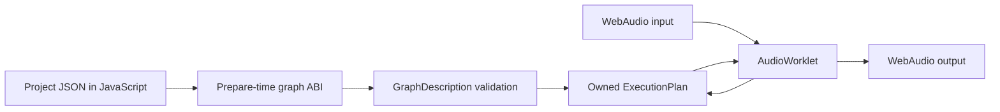

# Graph contract: first executable slice

The browser project descriptor now contains nodes, connections, and parameter targets. The AudioWorklet sends that description to the Wasm module **before** audio input is connected. Rust validates it and compiles an owned `ExecutionPlan`; the callback only copies planar stereo blocks and calls `process`. No Lua runs in v2. Legacy Lua remains a reference for behavior, parameters, and widget vocabulary.

`NodeId` is a stable integer. Each connection has a source node, destination node, and destination input port. The first ABI (version 2) accepts up to 64 nodes and 256 connections. Type codes currently cover raw input, monitor input, constant, Gain, two-input sum, linear blend, SVF, Crossfader, and output. JavaScript maps descriptor names to codes. Parameter descriptors retain public host IDs and point to a node and node-local parameter ID. The graph ABI can grow without putting a JSON parser in the audio callback. The additive `manifold_graph_initial_parameter` call sets a Crossfader's authored position, curve, or mix before compilation, so an initial value does not incorrectly ramp from a default.

Compilation checks IDs, node kinds, output count, port bounds, duplicate port occupation, cycles, and preparation bounds. It sorts the graph, prunes nodes that cannot reach Output, allocates each active node's stereo scratch buffer once, and creates the node's DSP state. An unconnected Output emits silence. `InputRaw` and `InputMonitor` are separate explicit source nodes; neither creates audible passthrough by itself. The browser has two interactive graphs: `InputRaw → SVF → Output` and `InputRaw → Crossfader A`, `InputRaw → SVF → Crossfader B`, `Crossfader → Output`. The latter gives the live Crossfader two different audible inputs; its deterministic C++ fixture instead uses a constant B signal.

Graph operations are deliberately named by semantics. `Gain` has the legacy 10 ms smoothing and mute behavior. `Crossfader` now matches the original node's stereo position, equal-power/linear curve blend, dry/wet mix, and 10 ms parameter smoothing in four C++ fixture cases. `Sum2` and `LinearBlend` remain small routing operators, **not** ports of the legacy `MixerNode` or substitutes for `Crossfader`: the old mixer has pan/master behavior and still needs its own C++ fixtures.

This slice prepares a graph at initialization. Graph editing while audio runs is still open: compile a replacement off the callback, publish it at a block boundary, and transfer state only where stable node IDs and explicit continuity rules permit. Parameter messages currently arrive at block granularity. Typed events and within-block offsets are required before MIDI and native host automation.
