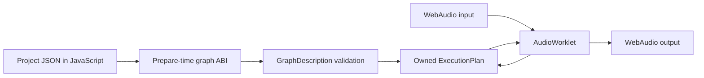

# Graph contract: first executable slice

The browser project descriptor now contains nodes, connections, and parameter targets. The AudioWorklet sends that description to the Wasm module **before** audio input is connected. Rust validates it and compiles an owned `ExecutionPlan`; the callback only copies planar stereo blocks and calls `process`. No Lua runs in v2. Legacy Lua remains a reference for behavior, parameters, and widget vocabulary.

`NodeId` is a stable integer. Each connection has a source node, destination node, and destination input port. The first ABI (version 2) accepts up to 64 nodes and 256 connections. Type codes currently cover raw input, monitor input, constant, Gain, two-input sum, linear blend, SVF, Crossfader, Mixer, VoiceSynth, Oscillator, ADSREnvelope, and output. JavaScript maps descriptor names to codes. Parameter descriptors retain public host IDs and point to a node and node-local parameter ID. The graph ABI can grow without putting a JSON parser in the audio callback. The additive `manifold_graph_initial_parameter` call sets authored Crossfader, Mixer, or Oscillator values before compilation, so an initial value does not incorrectly ramp from a default.

Compilation checks IDs, node kinds, output count, port bounds, duplicate port occupation, cycles, and preparation bounds. It sorts the graph, prunes nodes that cannot reach Output, allocates each active node's stereo scratch buffer once, and creates the node's DSP state. Prepared source tables are sized per node, including all 32 Mixer input ports. An unconnected Output emits silence. `InputRaw` and `InputMonitor` are separate explicit source nodes; neither creates audible passthrough by itself. The browser has six interactive graphs: raw input through SVF; raw and filtered branches feeding Crossfader or Mixer; VoiceSynth to Output; Oscillator to Output; and Oscillator through ADSREnvelope to Output. The live two-input views use distinguishable audio signals; their deterministic C++ fixtures use fixed constant signals for later inputs.

Graph operations are deliberately named by semantics. `Gain` has the legacy 10 ms smoothing and mute behavior. `Crossfader` matches the original node's stereo position, equal-power/linear curve blend, dry/wet mix, and 10 ms parameter smoothing in four C++ fixture cases. `Mixer` matches the original scalar node's 1–32 stereo buses, equal-power pan, per-bus gain, master gain, and 10 ms smoothing in four C++ fixture cases. Parameter IDs are 0 for master, 1–32 for bus gains, and 33–64 for bus pans; bus numbers in this API are one-based like the C++ API. `Sum2` and `LinearBlend` remain simpler routing operators.

This slice prepares a graph at initialization. Graph editing while audio runs is still open: compile a replacement off the callback, publish it at a block boundary, and transfer state only where stable node IDs and explicit continuity rules permit. Parameter messages currently arrive at block granularity. Typed note events now have within-block offsets in the Rust graph and Wasm ABI; browser keyboard events enter at offset zero of the next callback. See the [event contract](event-contract.md) for scope and remaining MIDI scheduling work.

`ADSREnvelope` accepts one stereo audio input and exposes attack, decay, sustain, release, and gate as node parameters 0–4. The Rust node follows the C++ scalar curves in normal gate cycles and releases from the current level during attack or decay. A gate change reaches the worklet at the next audio block; sample-offset gate events are not yet exposed.
