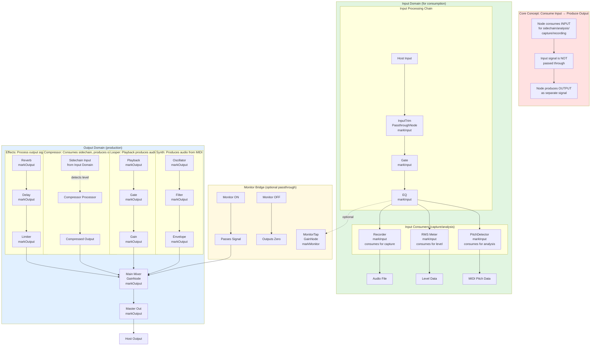

# Signal Domains Architecture

This document describes the signal domain architecture that separates **input capture/consumption** from **output production**, allowing nodes to do both without signal leakage.

## Core Concept

**A node can consume input (for capture/analysis/sidechain) AND produce output as a completely separate signal.**

The architecture enforces this via three domains:

1. **Input Domain** - Signal available for capture, analysis, sidechain
2. **Bridge** - Optional monitored path from Input to Output
3. **Output Domain** - Audible output signal (synths, processed audio, playback)

## The Key Insight

```
┌─────────────────────────────────────────────────────────────────┐
│  WRONG (leaks input to output):                                  │
│                                                                  │
│  Input ──▶ Compressor ──▶ Output                                 │
│            (sidechain + process)                                 │
│                                                                  │
│  Problem: Input signal flows through to output even when you     │
│           only wanted sidechain detection!                       │
└─────────────────────────────────────────────────────────────────┘

┌─────────────────────────────────────────────────────────────────┐
│  CORRECT (input consumed, separate output produced):             │
│                                                                  │
│  Input ──▶ Compressor.sidechain                                  │
│            (only analyzes input)                                 │
│                    │                                             │
│                    ▼                                             │
│            Compressor.output ──▶ Output                          │
│            (produces its own signal)                             │
│                                                                  │
│  Input is consumed for analysis, not passed through.             │
│  Output is whatever the node produces (could be silence,         │
│  could be synth audio, could be processed input via internal     │
│  routing that the node controls).                                │
└─────────────────────────────────────────────────────────────────┘
```

## ASCII Architecture Diagram

```
HOST INPUT
    │
    │ (always fed)
    ▼
┌─────────────────────────────────────────────────────────────────────┐
│                    INPUT DOMAIN                                      │
│           (Available for capture/consumption)                        │
│                                                                      │
│   ┌──────────┐    ┌──────────┐    ┌──────────┐                      │
│   │ HostInput│───▶│  Gate    │───▶│    EQ    │                      │
│   │(Passthru)│    │(Input)   │    │(Input)   │                      │
│   └──────────┘    └────┬─────┘    └────┬─────┘                      │
│        ▲               │               │                             │
│        │               │               │                             │
│        │               │               ▼                             │
│        │               │          ┌──────────┐                       │
│        │               │          │ PitchDet │──▶ MIDI pitch         │
│        │               │          │(Input)   │    (always works)     │
│        │               │          └──────────┘                       │
│        │               │                                             │
│        │               │          ┌──────────┐                       │
│        │               │          │  RMS     │──▶ Level data         │
│        │               │          │(Input)   │    (always works)     │
│        │               │          └──────────┘                       │
│        │               │                                             │
│        │               │          ┌──────────┐                       │
│        │               └─────────▶│ Recorder │──▶ Audio file          │
│        │                          │(Input)   │    (always records)   │
│        │                          └──────────┘                       │
│        │                                                             │
│        │          ANY NODE CAN "CONSUME" INPUT FOR:                  │
│        │          • Sidechain detection                             │
│        │          • Analysis (pitch, level, onset)                   │
│        │          • Recording/capture                               │
│        │          • Trigger detection                               │
│        │                                                             │
└────────┼─────────────────────────────────────────────────────────────┘
         │
         │  (Input signal itself never reaches output directly)
         │
         ▼
┌─────────────────────────────────────────────────────────────────────┐
│                    MONITOR BRIDGE (Optional)                         │
│              (Toggle-controlled path to output)                      │
│                                                                      │
│   ┌──────────────────────────────────────────────────────────────┐  │
│   │  MonitorTap (GainNode)                                        │  │
│   │                                                               │  │
│   │  Monitor OFF:  ○────────────────────┐                         │  │
│   │                (blocked)            │                         │  │
│   │                                     ▼                         │  │
│   │  Monitor ON:   ●─────────────────▶ (passthrough to output)   │  │
│   │                                                               │  │
│   └──────────────────────────────────────────────────────────────┘  │
└─────────────────────────────────────────────────────────────────────┘
         │
         │ (Monitor ON only)
         ▼
┌─────────────────────────────────────────────────────────────────────┐
│                    OUTPUT DOMAIN                                     │
│              (Always audible - completely separate)                  │
│                                                                      │
│   NODES HERE "PRODUCE" OUTPUT:                                       │
│                                                                      │
│   ┌─────────────────────────────────────────────────────────────┐   │
│   │  SYNTH VOICE (generates audio from MIDI, not from input)     │   │
│   │  ┌────────┐    ┌────────┐    ┌────────┐                    │   │
│   │  │  Osc   │───▶│ Filter │───▶│  Env   │───▶ synthAudio      │   │
│   │  │(Output)│    │(Output)│    │(Output)│                    │   │
│   │  └────────┘    └────────┘    └────────┘                    │   │
│   └─────────────────────────────────────────────────────────────┘   │
│                                                                      │
│   ┌─────────────────────────────────────────────────────────────┐   │
│   │  LOOPER PLAYBACK (plays recorded buffer, not live input)     │   │
│   │  ┌──────────┐    ┌──────────┐    ┌──────────┐              │   │
│   │  │ Playback │───▶│  Gate    │───▶│   Gain   │───▶ loopAudio │   │
│   │  │(Output)  │    │(Output)  │    │(Output)  │              │   │
│   │  └──────────┘    └──────────┘    └──────────┘              │   │
│   │       ▲                                                      │   │
│   │       │ (recorded from Input Domain, played in Output)       │   │
│   │       │                                                      │   │
│   │   [Input Recorder] ──────────────────────────────────────────┘   │
│   └─────────────────────────────────────────────────────────────┘   │
│                                                                      │
│   ┌─────────────────────────────────────────────────────────────┐   │
│   │  COMPRESSOR WITH SIDECHAIN                                   │   │
│   │  ┌──────────────────────────────────────────────────────┐  │   │
│   │  │ Sidechain Input ◀─────────────────────────────────────┤  │   │
│   │  │ (from Input Domain, for detection only)                │  │   │
│   │  └──────────────────────────────────────────────────────┘  │   │
│   │                         │                                    │   │
│   │                         ▼                                    │   │
│   │  ┌────────────┐    ┌──────────┐    ┌──────────┐            │   │
│   │  │  Detector  │───▶│   Gain   │───▶│  Makeup  │──▶ compOut │   │
│   │  │  (internal)│    │  (duck)  │    │  (gain)  │            │   │
│   │  └────────────┘    └──────────┘    └──────────┘            │   │
│   │       ▲                                                      │   │
│   │       │ (MAIN AUDIO INPUT - from Output Domain!)             │   │
│   │       │                                                      │   │
│   │   [Output Source] ◀──────────────────────────────────────────┘   │
│   │   (e.g., looper playback, synth, previous effect)                │
│   └─────────────────────────────────────────────────────────────┘   │
│                                                                      │
│   ┌─────────────────────────────────────────────────────────────┐   │
│   │  EFFECTS (process Output domain signal)                      │   │
│   │  ┌──────────┐    ┌──────────┐    ┌──────────┐              │   │
│   │  │  Reverb  │───▶│  Delay   │───▶│  Limiter │──▶ fxOut     │   │
│   │  │(Output)  │    │(Output)  │    │(Output)  │              │   │
│   │  └──────────┘    └──────────┘    └──────────┘              │   │
│   └─────────────────────────────────────────────────────────────┘   │
│                                                                      │
│   ┌─────────────────────────────────────────────────────────────┐   │
│   │  MAIN MIXER (combines all Output domain sources)             │   │
│   │                                                              │   │
│   │  Ch0: synthAudio  ───────────────────────────────────────┐  │   │
│   │  Ch1: loopAudio   ───────────────────────────────────────┤  │   │
│   │  Ch2: compOut     ───────────────────────────────────────┤  │   │
│   │  Ch3: fxOut       ───────────────────────────────────────┤  │   │
│   │  Ch4: monitorTap  ◀──(only if Monitor ON)────────────────┘  │   │
│   │                                                              │   │
│   │  Output: MIX ───▶ MASTER ───▶ HOST OUTPUT                    │   │
│   └─────────────────────────────────────────────────────────────┘   │
└─────────────────────────────────────────────────────────────────────┘
```

## Mermaid Diagram



## Node Roles Explained

### InputDSP (`markInput`) - Consumes Input

**Purpose**: Make input signal available for capture, analysis, or sidechain.

**Key Point**: These nodes **consume** input but do **NOT** automatically pass it to output.

```lua
-- These nodes can SEE the input signal:
local input = ctx.primitives.PassthroughNode.new(2)
ctx.graph.markInput(input)

local pitch = ctx.primitives.PitchDetectorNode.new()
ctx.graph.markInput(pitch)
ctx.graph.connect(input, pitch)
-- pitch analyzes input and outputs pitch data (not audio!)

local recorder = ctx.primitives.RecorderNode.new()
ctx.graph.markInput(recorder)
ctx.graph.connect(input, recorder)
-- recorder captures input to buffer/file

-- BUT: pitch and recorder do NOT pass input audio through!
-- Their outputs are analysis data, captured audio, etc.
```

### Monitor (`markMonitor`) - Optional Bridge

**Purpose**: Allow input to reach output **only when explicitly enabled**.

```lua
-- If you WANT input to be audible:
local monitorTap = ctx.primitives.GainNode.new(2)
ctx.graph.markMonitor(monitorTap)
ctx.graph.connect(input, monitorTap)
ctx.graph.connect(monitorTap, mainMixer)

-- Monitor OFF: input is NOT audible (monitorTap outputs silence)
-- Monitor ON: input IS audible (monitorTap passes signal)
```

### OutputDSP (`markOutput`) - Produces Output

**Purpose**: Generate or process the audible output signal.

```lua
-- These produce output audio:
local synth = ctx.primitives.SynthNode.new()
ctx.graph.markOutput(synth)
-- synth generates audio from MIDI - completely independent of input!

local playback = ctx.primitives.BufferPlayerNode.new()
ctx.graph.markOutput(playback)
-- playback plays recorded audio - separate from live input!

local reverb = ctx.primitives.ReverbNode.new()
ctx.graph.markOutput(reverb)
-- reverb processes whatever you send it (from Output domain)
```

## The Critical Pattern: Consume Input + Produce Output

### Example 1: Sidechain Compressor

```lua
-- Compressor that ducks based on input level but processes looper audio

-- 1. Input is available for sidechain detection (Input domain)
local input = ctx.primitives.PassthroughNode.new(2)
ctx.graph.markInput(input)

-- 2. Looper playback produces audio (Output domain)
local looperPlayback = ctx.primitives.BufferPlayerNode.new()
ctx.graph.markOutput(looperPlayback)

-- 3. Compressor consumes input for sidechain, produces compressed output
local compressor = ctx.primitives.CompressorNode.new()
ctx.graph.markOutput(compressor)

-- Connect sidechain input (from Input domain - for detection only)
ctx.graph.connect(input, compressor.sidechainInput)

-- Connect main audio input (from Output domain - the audio to compress)
ctx.graph.connect(looperPlayback, compressor.mainInput)

-- Compressor outputs compressed looper audio (Output domain)
ctx.graph.connect(compressor, mainMixer)
```

**What happens:**
- Input is analyzed by compressor for level detection
- Looper playback is the actual audio being processed
- Output is compressed looper audio
- Input signal itself never reaches the mixer!

### Example 2: Vocoder

```lua
-- Vocoder: analyzes input (modulator), synthesizes output (carrier)

-- Input provides modulator signal (voice)
local input = ctx.primitives.PassthroughNode.new(2)
ctx.graph.markInput(input)

-- Vocoder consumes input for analysis
local vocoder = ctx.primitives.VocoderNode.new()
ctx.graph.markOutput(vocoder)
ctx.graph.connect(input, vocoder.modulatorInput)

-- Vocoder generates carrier internally or from another source
-- Its OUTPUT is synthesized vocoded audio
ctx.graph.connect(vocoder, mainMixer)

-- Input voice is analyzed but NOT heard directly!
-- Output is synthesized based on analysis.
```

### Example 3: Triggered Synth

```lua
-- Input triggers synth, but synth output is separate

-- Input analyzed for onset detection
local input = ctx.primitives.PassthroughNode.new(2)
ctx.graph.markInput(input)

local onset = ctx.primitives.OnsetDetectorNode.new()
ctx.graph.markInput(onset)
ctx.graph.connect(input, onset)

-- Onset triggers synth (via MIDI or internal routing)
local synth = ctx.primitives.SynthNode.new()
ctx.graph.markOutput(synth)

-- Connect onset detection to trigger synth
-- (implementation depends on your system)
ctx.graph.connectTrigger(onset, synth.trigger)

-- Synth output goes to mixer
ctx.graph.connect(synth, mainMixer)

-- Result: Drum hit triggers synth note
-- You hear synth, not the drum (unless monitor is on)
```

### Example 4: Looper (Full Implementation)

```lua
-- Looper: captures input (Input domain), plays back (Output domain)

-- INPUT SIDE (always active)
local input = ctx.primitives.PassthroughNode.new(2)
ctx.graph.markInput(input)

local looperInput = ctx.primitives.GainNode.new(2)
ctx.graph.markInput(looperInput)
ctx.graph.connect(input, looperInput)

local recorder = ctx.primitives.LooperRecorderNode.new()
ctx.graph.markInput(recorder)
ctx.graph.connect(looperInput, recorder)
-- Recorder captures input when recording

-- OUTPUT SIDE (always audible)
local looperPlayback = ctx.primitives.LooperPlaybackNode.new()
ctx.graph.markOutput(looperPlayback)
-- Playback plays the recorded buffer

local looperGate = ctx.primitives.GateNode.new()
ctx.graph.markOutput(looperGate)
ctx.graph.connect(looperPlayback, looperGate)

local looperGain = ctx.primitives.GainNode.new(2)
ctx.graph.markOutput(looperGain)
ctx.graph.connect(looperGate, looperGain)

-- Looper output goes to main mix
ctx.graph.connect(looperGain, mainMixer)

-- Behavior:
-- - Recording: Input captured to buffer (Input domain working)
-- - Playback: Recorded audio played (Output domain)
-- - Monitor OFF: You hear looper playback, NOT live input
-- - Monitor ON: You hear both looper playback AND live input
```

## Signal Flow Rules

### Source Buffer Selection

When Node B receives from Node A, which domain buffer is read?

| Source Role | Buffer | Meaning |
|-------------|--------|---------|
| `InputDSP` | Input domain | Source consumes/produces Input signal |
| `Monitor` | Output domain | Source bridges to Output (or silence) |
| `OutputDSP` | Output domain | Source produces Output signal |

### Destination Buffer Selection

When Node A processes, where does it write?

| Node Role | Destination | Meaning |
|-----------|-------------|---------|
| `InputDSP` | Input domain | Signal available for consumption |
| `Monitor` | Output domain | Bridge to Output (gated) |
| `OutputDSP` | Output domain | Audible output signal |

### The Rule

**Input domain signal never mixes to host output.** Only Output domain signal does.

```
Input Domain ──▶ [Monitor Node] ──▶ Output Domain ──▶ Host Output
                    (gated)
                    
Input Domain ──▶ [Analysis] ──▶ Data (not audio)
Input Domain ──▶ [Recorder] ──▶ File/Buffer
Input Domain ──▶ [Sidechain] ──▶ Detection signal
```

## Common Misconceptions

### ❌ WRONG: "InputDSP nodes pass signal through"

```lua
-- WRONG mental model:
local eq = ctx.primitives.EQNode.new()
ctx.graph.markInput(eq)
ctx.graph.connect(eq, mainMixer)  -- This won't work!
-- eq outputs to Input domain, mainMixer reads Output domain
-- Signal is "trapped" in Input domain
```

### ✅ CORRECT: "InputDSP nodes make signal available for consumption"

```lua
-- CORRECT mental model:
local eq = ctx.primitives.EQNode.new()
ctx.graph.markInput(eq)
-- eq processes input and makes it available in Input domain

-- If you want it in output:
local monitor = ctx.primitives.GainNode.new(2)
ctx.graph.markMonitor(monitor)
ctx.graph.connect(eq, monitor)  -- eq output -> monitor
ctx.graph.connect(monitor, mainMixer)  -- monitor -> output
```

### ❌ WRONG: "OutputDSP nodes can't react to input"

```lua
-- WRONG: Thinking sidechain isn't possible
```

### ✅ CORRECT: "OutputDSP nodes can consume input for sidechain"

```lua
-- CORRECT: Sidechain works fine
local compressor = ctx.primitives.CompressorNode.new()
ctx.graph.markOutput(compressor)

-- Sidechain from Input domain (for detection)
ctx.graph.connect(input, compressor.sidechainInput)

-- Main audio from Output domain (to be processed)
ctx.graph.connect(someOutputSource, compressor.mainInput)
```

## Summary

| What you want | How to do it |
|---------------|--------------|
| Analyze input (pitch, level, etc.) | `markInput` analysis node |
| Record/capture input | `markInput` recorder node |
| Use input for sidechain | `markInput` sidechain input + `markOutput` processor |
| Hear input in output | `markInput` chain → `markMonitor` bridge → `markOutput` mixer |
| Generate audio (synth) | `markOutput` synth node |
| Play recorded audio | `markOutput` playback node |
| Process output audio | `markOutput` effect nodes |

**Remember**: 
- **Input domain** = for consumption/capture/analysis
- **Output domain** = for audible production
- **Monitor** = the only bridge between them, and it's gated!
