# Manifold Code Architecture Diagram

**Generated:** 2026-05-02 06:11:04
**Granularity:** module
**Source files scanned:** 688
**Dependency edges:** 758

*This diagram is procedurally constructed and provably correct:*
*every directed edge corresponds to a literal `#include`, `require`, or `import` statement*
*found in the source code. No heuristics, no assumptions, no AI.*

```mermaid
flowchart TD

    subgraph "PluginCore (4 files)"
    end

    subgraph "Engine (1 files)"
    end

    subgraph "DSPGraph (1 files)"
    end

    subgraph "DSPNodes (126 files)"
    end

    subgraph "DSPLua (36 files)"
    end

    subgraph "Control/OSC (15 files)"
    end

    subgraph "CorePrimitives (4 files)"
    end

    subgraph "DSPPrimitives (5 files)"
    end

    subgraph "MIDI (5 files)"
    end

    subgraph "ScriptingEngine (72 files)"
    end

    subgraph "Shaders (6 files)"
    end

    subgraph "Sources (4 files)"
    end

    subgraph "Sync (2 files)"
    end

    subgraph "UIPrimitives (7 files)"
    end

    subgraph "Video (10 files)"
    end

    subgraph "Composite (2 files)"
    end

    subgraph "ML (4 files)"
    end

    subgraph "Highway (2 files)"
    end

    subgraph "gRPC (2 files)"
    end

    subgraph "Headless (7 files)"
    end

    subgraph "LuaUI (64 files)"
    end

    subgraph "SystemScripts (3 files)"
    end

    subgraph "UserScripts (304 files)"
    end

    subgraph "WebRemote (2 files)"
    end

%% Subgraph styles
    style PluginCore_4_files fill:#4a90d930,stroke:#4a90d9,stroke-width:2px
    style Engine_1_files fill:#50c87830,stroke:#50c878,stroke-width:2px
    style DSPGraph_1_files fill:#e67e2230,stroke:#e67e22,stroke-width:2px
    style DSPNodes_126_files fill:#9b59b630,stroke:#9b59b6,stroke-width:2px
    style DSPLua_36_files fill:#1abc9c30,stroke:#1abc9c,stroke-width:2px
    style Control_OSC_15_files fill:#e74c3c30,stroke:#e74c3c,stroke-width:2px
    style CorePrimitives_4_files fill:#3498db30,stroke:#3498db,stroke-width:2px
    style DSPPrimitives_5_files fill:#2ecc7130,stroke:#2ecc71,stroke-width:2px
    style MIDI_5_files fill:#f39c1230,stroke:#f39c12,stroke-width:2px
    style ScriptingEngine_72_files fill:#2980b930,stroke:#2980b9,stroke-width:2px
    style Shaders_6_files fill:#27ae6030,stroke:#27ae60,stroke-width:2px
    style Sources_4_files fill:#d3540030,stroke:#d35400,stroke-width:2px
    style Sync_2_files fill:#8e44ad30,stroke:#8e44ad,stroke-width:2px
    style UIPrimitives_7_files fill:#16a08530,stroke:#16a085,stroke-width:2px
    style Video_10_files fill:#c0392b30,stroke:#c0392b,stroke-width:2px
    style Composite_2_files fill:#7f8c8d30,stroke:#7f8c8d,stroke-width:2px
    style ML_4_files fill:#2c3e5030,stroke:#2c3e50,stroke-width:2px
    style Highway_2_files fill:#f1c40f30,stroke:#f1c40f,stroke-width:2px
    style gRPC_2_files fill:#95a5a630,stroke:#95a5a6,stroke-width:2px
    style Headless_7_files fill:#34495e30,stroke:#34495e,stroke-width:2px
    style LuaUI_64_files fill:#e91e6330,stroke:#e91e63,stroke-width:2px
    style SystemScripts_3_files fill:#00bcd430,stroke:#00bcd4,stroke-width:2px
    style UserScripts_304_files fill:#ff572230,stroke:#ff5722,stroke-width:2px
    style WebRemote_2_files fill:#79554830,stroke:#795548,stroke-width:2px

    Composite_2_files --> Shaders_6_files
    Composite_2_files --> UIPrimitives_7_files
    Control_OSC_15_files --> CorePrimitives_4_files
    Control_OSC_15_files --> DSPPrimitives_5_files
    Control_OSC_15_files --> ScriptingEngine_72_files
    Control_OSC_15_files --> UIPrimitives_7_files
    DSPNodes_126_files --> DSPGraph_1_files
    DSPNodes_126_files --> Highway_2_files
    DSPNodes_126_files --> MIDI_5_files
    Engine_1_files --> DSPPrimitives_5_files
    Headless_7_files --> Control_OSC_15_files
    Headless_7_files --> DSPGraph_1_files
    Headless_7_files --> DSPNodes_126_files
    Headless_7_files --> DSPPrimitives_5_files
    Headless_7_files --> Engine_1_files
    Headless_7_files --> PluginCore_4_files
    Headless_7_files --> ScriptingEngine_72_files
    LuaUI_64_files --> Composite_2_files
    LuaUI_64_files --> ML_4_files
    LuaUI_64_files --> Shaders_6_files
    LuaUI_64_files --> Sources_4_files
    LuaUI_64_files --> UIPrimitives_7_files
    LuaUI_64_files --> Video_10_files
    ML_4_files --> UIPrimitives_7_files
    ML_4_files --> Video_10_files
    PluginCore_4_files --> Control_OSC_15_files
    PluginCore_4_files --> CorePrimitives_4_files
    PluginCore_4_files --> DSPPrimitives_5_files
    PluginCore_4_files --> LuaUI_64_files
    PluginCore_4_files --> MIDI_5_files
    PluginCore_4_files --> ScriptingEngine_72_files
    PluginCore_4_files --> Sync_2_files
    PluginCore_4_files --> UIPrimitives_7_files
    ScriptingEngine_72_files --> Control_OSC_15_files
    ScriptingEngine_72_files --> CorePrimitives_4_files
    ScriptingEngine_72_files --> DSPGraph_1_files
    ScriptingEngine_72_files --> DSPNodes_126_files
    ScriptingEngine_72_files --> LuaUI_64_files
    ScriptingEngine_72_files --> MIDI_5_files
    ScriptingEngine_72_files --> ML_4_files
    ScriptingEngine_72_files --> PluginCore_4_files
    ScriptingEngine_72_files --> Shaders_6_files
    ScriptingEngine_72_files --> Sources_4_files
    ScriptingEngine_72_files --> UIPrimitives_7_files
    ScriptingEngine_72_files --> Video_10_files
    Shaders_6_files --> Sources_4_files
    Shaders_6_files --> UIPrimitives_7_files
    Sources_4_files --> Shaders_6_files
    Sources_4_files --> UIPrimitives_7_files
    SystemScripts_3_files --> LuaUI_64_files
    UIPrimitives_7_files --> LuaUI_64_files
    UserScripts_304_files --> LuaUI_64_files
    Video_10_files --> UIPrimitives_7_files
    gRPC_2_files --> Control_OSC_15_files
    gRPC_2_files --> ScriptingEngine_72_files

    %% 55 dependency edges shown
```

### PluginCore — Internal Dependencies

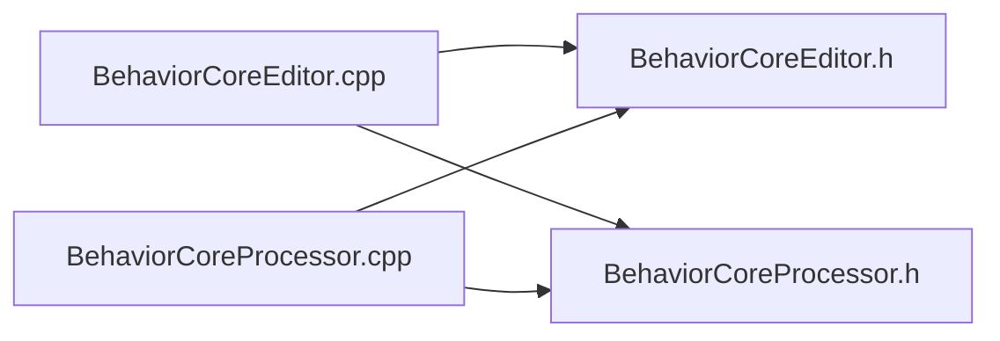


### DSPNodes — Internal Dependencies

```mermaid
flowchart LR
    dsp_core_nodes_ADSREnvelopeNode_cpp[ADSREnvelopeNode.cpp]
    dsp_core_nodes_ADSREnvelopeNode_h[ADSREnvelopeNode.h]
    dsp_core_nodes_ADSREnvelopeNode_Highway_h[ADSREnvelopeNode_Highway.h]
    dsp_core_nodes_AllpassNode_cpp[AllpassNode.cpp]
    dsp_core_nodes_AllpassNode_h[AllpassNode.h]
    dsp_core_nodes_AudioFmNode_cpp[AudioFmNode.cpp]
    dsp_core_nodes_AudioFmNode_h[AudioFmNode.h]
    dsp_core_nodes_AudioSyncNode_cpp[AudioSyncNode.cpp]
    dsp_core_nodes_AudioSyncNode_h[AudioSyncNode.h]
    dsp_core_nodes_BitCrusherNode_cpp[BitCrusherNode.cpp]
    dsp_core_nodes_BitCrusherNode_h[BitCrusherNode.h]
    dsp_core_nodes_BitCrusherNode_Highway_h[BitCrusherNode_Highway.h]
    dsp_core_nodes_ChorusNode_cpp[ChorusNode.cpp]
    dsp_core_nodes_ChorusNode_h[ChorusNode.h]
    dsp_core_nodes_CombNode_cpp[CombNode.cpp]
    dsp_core_nodes_CombNode_h[CombNode.h]
    dsp_core_nodes_CompressorNode_cpp[CompressorNode.cpp]
    dsp_core_nodes_CompressorNode_h[CompressorNode.h]
    dsp_core_nodes_ConstantSignalNode_cpp[ConstantSignalNode.cpp]
    dsp_core_nodes_ConstantSignalNode_h[ConstantSignalNode.h]
    dsp_core_nodes_CrossfaderNode_cpp[CrossfaderNode.cpp]
    dsp_core_nodes_CrossfaderNode_h[CrossfaderNode.h]
    dsp_core_nodes_DistortionNode_cpp[DistortionNode.cpp]
    dsp_core_nodes_DistortionNode_h[DistortionNode.h]
    dsp_core_nodes_EQ8Node_cpp[EQ8Node.cpp]
    dsp_core_nodes_EQ8Node_h[EQ8Node.h]
    dsp_core_nodes_EQNode_cpp[EQNode.cpp]
    dsp_core_nodes_EQNode_h[EQNode.h]
    dsp_core_nodes_EnvelopeFollowerNode_cpp[EnvelopeFollowerNode.cpp]
    dsp_core_nodes_EnvelopeFollowerNode_h[EnvelopeFollowerNode.h]
    dsp_core_nodes_FilterNode_cpp[FilterNode.cpp]
    dsp_core_nodes_FilterNode_h[FilterNode.h]
    dsp_core_nodes_FilterNode_Highway_h[FilterNode_Highway.h]
    dsp_core_nodes_FormantFilterNode_cpp[FormantFilterNode.cpp]
    dsp_core_nodes_FormantFilterNode_h[FormantFilterNode.h]
    dsp_core_nodes_ForwardCommitSchedulerNode_cpp[ForwardCommitSchedulerNode.cpp]
    dsp_core_nodes_ForwardCommitSchedulerNode_h[ForwardCommitSchedulerNode.h]
    dsp_core_nodes_FrequencyShiftNode_cpp[FrequencyShiftNode.cpp]
    dsp_core_nodes_FrequencyShiftNode_h[FrequencyShiftNode.h]
    dsp_core_nodes_GainNode_cpp[GainNode.cpp]
    dsp_core_nodes_GainNode_h[GainNode.h]
    dsp_core_nodes_GainNode_Highway_h[GainNode_Highway.h]
    dsp_core_nodes_GranulatorNode_cpp[GranulatorNode.cpp]
    dsp_core_nodes_GranulatorNode_h[GranulatorNode.h]
    dsp_core_nodes_LimiterNode_cpp[LimiterNode.cpp]
    dsp_core_nodes_LimiterNode_h[LimiterNode.h]
    dsp_core_nodes_LoopPlaybackNode_cpp[LoopPlaybackNode.cpp]
    dsp_core_nodes_LoopPlaybackNode_h[LoopPlaybackNode.h]
    dsp_core_nodes_MSEncoderNode_cpp[MSEncoderNode.cpp]
    dsp_core_nodes_MSEncoderNode_h[MSEncoderNode.h]
    dsp_core_nodes_MidiInputNode_cpp[MidiInputNode.cpp]
    dsp_core_nodes_MidiInputNode_h[MidiInputNode.h]
    dsp_core_nodes_MidiVoiceNode_cpp[MidiVoiceNode.cpp]
    dsp_core_nodes_MidiVoiceNode_h[MidiVoiceNode.h]
    dsp_core_nodes_MixerNode_cpp[MixerNode.cpp]
    dsp_core_nodes_MixerNode_h[MixerNode.h]
    dsp_core_nodes_MixerNode_Highway_h[MixerNode_Highway.h]
    dsp_core_nodes_MultitapDelayNode_cpp[MultitapDelayNode.cpp]
    dsp_core_nodes_MultitapDelayNode_h[MultitapDelayNode.h]
    dsp_core_nodes_NoiseGeneratorNode_cpp[NoiseGeneratorNode.cpp]
    dsp_core_nodes_NoiseGeneratorNode_h[NoiseGeneratorNode.h]
    dsp_core_nodes_OscillatorNode_cpp[OscillatorNode.cpp]
    dsp_core_nodes_OscillatorNode_h[OscillatorNode.h]
    dsp_core_nodes_OscillatorNode_Highway_h[OscillatorNode_Highway.h]
    dsp_core_nodes_PartialData_h[PartialData.h]
    dsp_core_nodes_PartialsExtractor_h[PartialsExtractor.h]
    dsp_core_nodes_PassthroughNode_cpp[PassthroughNode.cpp]
    dsp_core_nodes_PassthroughNode_h[PassthroughNode.h]
    dsp_core_nodes_PhaseVocoderNode_cpp[PhaseVocoderNode.cpp]
    dsp_core_nodes_PhaseVocoderNode_h[PhaseVocoderNode.h]
    dsp_core_nodes_PhaserNode_cpp[PhaserNode.cpp]
    dsp_core_nodes_PhaserNode_h[PhaserNode.h]
    dsp_core_nodes_PitchDetector_h[PitchDetector.h]
    dsp_core_nodes_PitchDetectorNode_cpp[PitchDetectorNode.cpp]
    dsp_core_nodes_PitchDetectorNode_h[PitchDetectorNode.h]
    dsp_core_nodes_PitchShifterNode_cpp[PitchShifterNode.cpp]
    dsp_core_nodes_PitchShifterNode_h[PitchShifterNode.h]
    dsp_core_nodes_PlaybackStateGateNode_cpp[PlaybackStateGateNode.cpp]
    dsp_core_nodes_PlaybackStateGateNode_h[PlaybackStateGateNode.h]
    dsp_core_nodes_PlayheadNode_cpp[PlayheadNode.cpp]
    dsp_core_nodes_PlayheadNode_h[PlayheadNode.h]
    dsp_core_nodes_PrimitiveNodes_h[PrimitiveNodes.h]
    dsp_core_nodes_QuantizerNode_cpp[QuantizerNode.cpp]
    dsp_core_nodes_QuantizerNode_h[QuantizerNode.h]
    dsp_core_nodes_RecordModePolicyNode_cpp[RecordModePolicyNode.cpp]
    dsp_core_nodes_RecordModePolicyNode_h[RecordModePolicyNode.h]
    dsp_core_nodes_RecordStateNode_cpp[RecordStateNode.cpp]
    dsp_core_nodes_RecordStateNode_h[RecordStateNode.h]
    dsp_core_nodes_ResonatorNode_cpp[ResonatorNode.cpp]
    dsp_core_nodes_ResonatorNode_h[ResonatorNode.h]
    dsp_core_nodes_RetrospectiveCaptureNode_cpp[RetrospectiveCaptureNode.cpp]
    dsp_core_nodes_RetrospectiveCaptureNode_h[RetrospectiveCaptureNode.h]
    dsp_core_nodes_ReverbNode_cpp[ReverbNode.cpp]
    dsp_core_nodes_ReverbNode_h[ReverbNode.h]
    dsp_core_nodes_ReverseDelayNode_cpp[ReverseDelayNode.cpp]
    dsp_core_nodes_ReverseDelayNode_h[ReverseDelayNode.h]
    dsp_core_nodes_RingModulatorNode_cpp[RingModulatorNode.cpp]
    dsp_core_nodes_RingModulatorNode_h[RingModulatorNode.h]
    dsp_core_nodes_SVFNode_cpp[SVFNode.cpp]
    dsp_core_nodes_SVFNode_h[SVFNode.h]
    dsp_core_nodes_SampleAnalysis_h[SampleAnalysis.h]
    dsp_core_nodes_SampleAnalyzer_h[SampleAnalyzer.h]
    dsp_core_nodes_SampleRegionPlaybackNode_cpp[SampleRegionPlaybackNode.cpp]
    dsp_core_nodes_SampleRegionPlaybackNode_h[SampleRegionPlaybackNode.h]
    dsp_core_nodes_ShimmerNode_cpp[ShimmerNode.cpp]
    dsp_core_nodes_ShimmerNode_h[ShimmerNode.h]
    dsp_core_nodes_SineBankNode_cpp[SineBankNode.cpp]
    dsp_core_nodes_SineBankNode_h[SineBankNode.h]
    dsp_core_nodes_SlewLimiterNode_cpp[SlewLimiterNode.cpp]
    dsp_core_nodes_SlewLimiterNode_h[SlewLimiterNode.h]
    dsp_core_nodes_SpectrumAnalyzerNode_cpp[SpectrumAnalyzerNode.cpp]
    dsp_core_nodes_SpectrumAnalyzerNode_h[SpectrumAnalyzerNode.h]
    dsp_core_nodes_StereoDelayNode_cpp[StereoDelayNode.cpp]
    dsp_core_nodes_StereoDelayNode_h[StereoDelayNode.h]
    dsp_core_nodes_StereoWidenerNode_cpp[StereoWidenerNode.cpp]
    dsp_core_nodes_StereoWidenerNode_h[StereoWidenerNode.h]
    dsp_core_nodes_StutterNode_cpp[StutterNode.cpp]
    dsp_core_nodes_StutterNode_h[StutterNode.h]
    dsp_core_nodes_TemporalPartialData_h[TemporalPartialData.h]
    dsp_core_nodes_TransientShaperNode_cpp[TransientShaperNode.cpp]
    dsp_core_nodes_TransientShaperNode_h[TransientShaperNode.h]
    dsp_core_nodes_TransportStateNode_cpp[TransportStateNode.cpp]
    dsp_core_nodes_TransportStateNode_h[TransportStateNode.h]
    dsp_core_nodes_WaveShaperNode_cpp[WaveShaperNode.cpp]
    dsp_core_nodes_WaveShaperNode_h[WaveShaperNode.h]
    dsp_core_nodes_WaveShaperNode_Highway_h[WaveShaperNode_Highway.h]

    dsp_core_nodes_ADSREnvelopeNode_cpp --> dsp_core_nodes_ADSREnvelopeNode_h
    dsp_core_nodes_ADSREnvelopeNode_cpp --> dsp_core_nodes_ADSREnvelopeNode_Highway_h
    dsp_core_nodes_AllpassNode_cpp --> dsp_core_nodes_AllpassNode_h
    dsp_core_nodes_AudioFmNode_cpp --> dsp_core_nodes_AudioFmNode_h
    dsp_core_nodes_AudioSyncNode_cpp --> dsp_core_nodes_AudioSyncNode_h
    dsp_core_nodes_BitCrusherNode_cpp --> dsp_core_nodes_BitCrusherNode_h
    dsp_core_nodes_BitCrusherNode_cpp --> dsp_core_nodes_BitCrusherNode_Highway_h
    dsp_core_nodes_ChorusNode_cpp --> dsp_core_nodes_ChorusNode_h
    dsp_core_nodes_CombNode_cpp --> dsp_core_nodes_CombNode_h
    dsp_core_nodes_CompressorNode_cpp --> dsp_core_nodes_CompressorNode_h
    dsp_core_nodes_ConstantSignalNode_cpp --> dsp_core_nodes_ConstantSignalNode_h
    dsp_core_nodes_CrossfaderNode_cpp --> dsp_core_nodes_CrossfaderNode_h
    dsp_core_nodes_DistortionNode_cpp --> dsp_core_nodes_DistortionNode_h
    dsp_core_nodes_EQ8Node_cpp --> dsp_core_nodes_EQ8Node_h
    dsp_core_nodes_EQNode_cpp --> dsp_core_nodes_EQNode_h
    dsp_core_nodes_EnvelopeFollowerNode_cpp --> dsp_core_nodes_EnvelopeFollowerNode_h
    dsp_core_nodes_FilterNode_cpp --> dsp_core_nodes_FilterNode_h
    dsp_core_nodes_FilterNode_cpp --> dsp_core_nodes_FilterNode_Highway_h
    dsp_core_nodes_FormantFilterNode_cpp --> dsp_core_nodes_FormantFilterNode_h
    dsp_core_nodes_ForwardCommitSchedulerNode_cpp --> dsp_core_nodes_ForwardCommitSchedulerNode_h
    dsp_core_nodes_FrequencyShiftNode_cpp --> dsp_core_nodes_FrequencyShiftNode_h
    dsp_core_nodes_GainNode_cpp --> dsp_core_nodes_GainNode_h
    dsp_core_nodes_GainNode_cpp --> dsp_core_nodes_GainNode_Highway_h
    dsp_core_nodes_GranulatorNode_cpp --> dsp_core_nodes_GranulatorNode_h
    dsp_core_nodes_LimiterNode_cpp --> dsp_core_nodes_LimiterNode_h
    dsp_core_nodes_LoopPlaybackNode_cpp --> dsp_core_nodes_LoopPlaybackNode_h
    dsp_core_nodes_MSEncoderNode_cpp --> dsp_core_nodes_MSEncoderNode_h
    dsp_core_nodes_MidiInputNode_cpp --> dsp_core_nodes_MidiInputNode_h
    dsp_core_nodes_MidiInputNode_cpp --> dsp_core_nodes_MidiVoiceNode_h
    dsp_core_nodes_MidiVoiceNode_cpp --> dsp_core_nodes_MidiVoiceNode_h
    dsp_core_nodes_MixerNode_cpp --> dsp_core_nodes_MixerNode_h
    dsp_core_nodes_MixerNode_cpp --> dsp_core_nodes_MixerNode_Highway_h
    dsp_core_nodes_MultitapDelayNode_cpp --> dsp_core_nodes_MultitapDelayNode_h
    dsp_core_nodes_NoiseGeneratorNode_cpp --> dsp_core_nodes_NoiseGeneratorNode_h
    dsp_core_nodes_OscillatorNode_cpp --> dsp_core_nodes_OscillatorNode_h
    dsp_core_nodes_OscillatorNode_cpp --> dsp_core_nodes_OscillatorNode_Highway_h
    dsp_core_nodes_OscillatorNode_h --> dsp_core_nodes_PartialData_h
    dsp_core_nodes_PartialsExtractor_h --> dsp_core_nodes_PartialData_h
    dsp_core_nodes_PartialsExtractor_h --> dsp_core_nodes_SampleAnalysis_h
    dsp_core_nodes_PartialsExtractor_h --> dsp_core_nodes_SampleAnalyzer_h
    dsp_core_nodes_PartialsExtractor_h --> dsp_core_nodes_TemporalPartialData_h
    dsp_core_nodes_PassthroughNode_cpp --> dsp_core_nodes_PassthroughNode_h
    dsp_core_nodes_PhaseVocoderNode_cpp --> dsp_core_nodes_PhaseVocoderNode_h
    dsp_core_nodes_PhaserNode_cpp --> dsp_core_nodes_PhaserNode_h
    dsp_core_nodes_PitchDetectorNode_cpp --> dsp_core_nodes_PitchDetectorNode_h
    dsp_core_nodes_PitchDetectorNode_h --> dsp_core_nodes_PitchDetector_h
    dsp_core_nodes_PitchShifterNode_cpp --> dsp_core_nodes_PitchShifterNode_h
    dsp_core_nodes_PlaybackStateGateNode_cpp --> dsp_core_nodes_PlaybackStateGateNode_h
    dsp_core_nodes_PlayheadNode_cpp --> dsp_core_nodes_PlayheadNode_h
    dsp_core_nodes_PrimitiveNodes_h --> dsp_core_nodes_ADSREnvelopeNode_h
    dsp_core_nodes_PrimitiveNodes_h --> dsp_core_nodes_AllpassNode_h
    dsp_core_nodes_PrimitiveNodes_h --> dsp_core_nodes_AudioFmNode_h
    dsp_core_nodes_PrimitiveNodes_h --> dsp_core_nodes_AudioSyncNode_h
    dsp_core_nodes_PrimitiveNodes_h --> dsp_core_nodes_BitCrusherNode_h
    dsp_core_nodes_PrimitiveNodes_h --> dsp_core_nodes_ChorusNode_h
    dsp_core_nodes_PrimitiveNodes_h --> dsp_core_nodes_CombNode_h
    dsp_core_nodes_PrimitiveNodes_h --> dsp_core_nodes_CompressorNode_h
    dsp_core_nodes_PrimitiveNodes_h --> dsp_core_nodes_ConstantSignalNode_h
    dsp_core_nodes_PrimitiveNodes_h --> dsp_core_nodes_CrossfaderNode_h
    dsp_core_nodes_PrimitiveNodes_h --> dsp_core_nodes_DistortionNode_h
    dsp_core_nodes_PrimitiveNodes_h --> dsp_core_nodes_EQ8Node_h
    dsp_core_nodes_PrimitiveNodes_h --> dsp_core_nodes_EQNode_h
    dsp_core_nodes_PrimitiveNodes_h --> dsp_core_nodes_EnvelopeFollowerNode_h
    dsp_core_nodes_PrimitiveNodes_h --> dsp_core_nodes_FilterNode_h
    dsp_core_nodes_PrimitiveNodes_h --> dsp_core_nodes_FormantFilterNode_h
    dsp_core_nodes_PrimitiveNodes_h --> dsp_core_nodes_ForwardCommitSchedulerNode_h
    dsp_core_nodes_PrimitiveNodes_h --> dsp_core_nodes_FrequencyShiftNode_h
    dsp_core_nodes_PrimitiveNodes_h --> dsp_core_nodes_GainNode_h
    dsp_core_nodes_PrimitiveNodes_h --> dsp_core_nodes_GranulatorNode_h
    dsp_core_nodes_PrimitiveNodes_h --> dsp_core_nodes_LimiterNode_h
    dsp_core_nodes_PrimitiveNodes_h --> dsp_core_nodes_LoopPlaybackNode_h
    dsp_core_nodes_PrimitiveNodes_h --> dsp_core_nodes_MSEncoderNode_h
    dsp_core_nodes_PrimitiveNodes_h --> dsp_core_nodes_MidiInputNode_h
    dsp_core_nodes_PrimitiveNodes_h --> dsp_core_nodes_MidiVoiceNode_h
    dsp_core_nodes_PrimitiveNodes_h --> dsp_core_nodes_MixerNode_h
    dsp_core_nodes_PrimitiveNodes_h --> dsp_core_nodes_MultitapDelayNode_h
    dsp_core_nodes_PrimitiveNodes_h --> dsp_core_nodes_NoiseGeneratorNode_h
    dsp_core_nodes_PrimitiveNodes_h --> dsp_core_nodes_OscillatorNode_h
    dsp_core_nodes_PrimitiveNodes_h --> dsp_core_nodes_PassthroughNode_h
    dsp_core_nodes_PrimitiveNodes_h --> dsp_core_nodes_PhaseVocoderNode_h
    dsp_core_nodes_PrimitiveNodes_h --> dsp_core_nodes_PhaserNode_h
    dsp_core_nodes_PrimitiveNodes_h --> dsp_core_nodes_PitchDetectorNode_h
    dsp_core_nodes_PrimitiveNodes_h --> dsp_core_nodes_PitchShifterNode_h
    dsp_core_nodes_PrimitiveNodes_h --> dsp_core_nodes_PlaybackStateGateNode_h
    dsp_core_nodes_PrimitiveNodes_h --> dsp_core_nodes_PlayheadNode_h
    dsp_core_nodes_PrimitiveNodes_h --> dsp_core_nodes_QuantizerNode_h
    dsp_core_nodes_PrimitiveNodes_h --> dsp_core_nodes_RecordModePolicyNode_h
    dsp_core_nodes_PrimitiveNodes_h --> dsp_core_nodes_RecordStateNode_h
    dsp_core_nodes_PrimitiveNodes_h --> dsp_core_nodes_ResonatorNode_h
    dsp_core_nodes_PrimitiveNodes_h --> dsp_core_nodes_RetrospectiveCaptureNode_h
    dsp_core_nodes_PrimitiveNodes_h --> dsp_core_nodes_ReverbNode_h
    dsp_core_nodes_PrimitiveNodes_h --> dsp_core_nodes_ReverseDelayNode_h
    dsp_core_nodes_PrimitiveNodes_h --> dsp_core_nodes_RingModulatorNode_h
    dsp_core_nodes_PrimitiveNodes_h --> dsp_core_nodes_SVFNode_h
    dsp_core_nodes_PrimitiveNodes_h --> dsp_core_nodes_SampleRegionPlaybackNode_h
    dsp_core_nodes_PrimitiveNodes_h --> dsp_core_nodes_ShimmerNode_h
    dsp_core_nodes_PrimitiveNodes_h --> dsp_core_nodes_SineBankNode_h
    dsp_core_nodes_PrimitiveNodes_h --> dsp_core_nodes_SlewLimiterNode_h
    dsp_core_nodes_PrimitiveNodes_h --> dsp_core_nodes_SpectrumAnalyzerNode_h
    dsp_core_nodes_PrimitiveNodes_h --> dsp_core_nodes_StereoDelayNode_h
    dsp_core_nodes_PrimitiveNodes_h --> dsp_core_nodes_StereoWidenerNode_h
    dsp_core_nodes_PrimitiveNodes_h --> dsp_core_nodes_StutterNode_h
    dsp_core_nodes_PrimitiveNodes_h --> dsp_core_nodes_TransientShaperNode_h
    dsp_core_nodes_PrimitiveNodes_h --> dsp_core_nodes_TransportStateNode_h
    dsp_core_nodes_PrimitiveNodes_h --> dsp_core_nodes_WaveShaperNode_h
    dsp_core_nodes_QuantizerNode_cpp --> dsp_core_nodes_QuantizerNode_h
    dsp_core_nodes_RecordModePolicyNode_cpp --> dsp_core_nodes_RecordModePolicyNode_h
    dsp_core_nodes_RecordStateNode_cpp --> dsp_core_nodes_RecordStateNode_h
    dsp_core_nodes_ResonatorNode_cpp --> dsp_core_nodes_ResonatorNode_h
    dsp_core_nodes_RetrospectiveCaptureNode_cpp --> dsp_core_nodes_RetrospectiveCaptureNode_h
    dsp_core_nodes_RetrospectiveCaptureNode_h --> dsp_core_nodes_GranulatorNode_h
    dsp_core_nodes_RetrospectiveCaptureNode_h --> dsp_core_nodes_LoopPlaybackNode_h
    dsp_core_nodes_RetrospectiveCaptureNode_h --> dsp_core_nodes_SampleRegionPlaybackNode_h
    dsp_core_nodes_ReverbNode_cpp --> dsp_core_nodes_ReverbNode_h
    dsp_core_nodes_ReverseDelayNode_cpp --> dsp_core_nodes_ReverseDelayNode_h
    dsp_core_nodes_RingModulatorNode_cpp --> dsp_core_nodes_RingModulatorNode_h
    dsp_core_nodes_SVFNode_cpp --> dsp_core_nodes_SVFNode_h
    dsp_core_nodes_SampleAnalyzer_h --> dsp_core_nodes_PitchDetector_h
    dsp_core_nodes_SampleAnalyzer_h --> dsp_core_nodes_SampleAnalysis_h
    dsp_core_nodes_SampleRegionPlaybackNode_cpp --> dsp_core_nodes_PartialsExtractor_h
    dsp_core_nodes_SampleRegionPlaybackNode_cpp --> dsp_core_nodes_SampleAnalyzer_h
    dsp_core_nodes_SampleRegionPlaybackNode_cpp --> dsp_core_nodes_SampleRegionPlaybackNode_h
    dsp_core_nodes_SampleRegionPlaybackNode_h --> dsp_core_nodes_PartialData_h
    dsp_core_nodes_SampleRegionPlaybackNode_h --> dsp_core_nodes_PitchDetector_h
    dsp_core_nodes_SampleRegionPlaybackNode_h --> dsp_core_nodes_SampleAnalysis_h
    dsp_core_nodes_SampleRegionPlaybackNode_h --> dsp_core_nodes_TemporalPartialData_h
    dsp_core_nodes_ShimmerNode_cpp --> dsp_core_nodes_ShimmerNode_h
    dsp_core_nodes_SineBankNode_cpp --> dsp_core_nodes_OscillatorNode_h
    dsp_core_nodes_SineBankNode_cpp --> dsp_core_nodes_SampleRegionPlaybackNode_h
    dsp_core_nodes_SineBankNode_cpp --> dsp_core_nodes_SineBankNode_h
    dsp_core_nodes_SineBankNode_h --> dsp_core_nodes_PartialData_h
    dsp_core_nodes_SlewLimiterNode_cpp --> dsp_core_nodes_SlewLimiterNode_h
    dsp_core_nodes_SpectrumAnalyzerNode_cpp --> dsp_core_nodes_SpectrumAnalyzerNode_h
    dsp_core_nodes_StereoDelayNode_cpp --> dsp_core_nodes_StereoDelayNode_h
    dsp_core_nodes_StereoWidenerNode_cpp --> dsp_core_nodes_StereoWidenerNode_h
    dsp_core_nodes_StutterNode_cpp --> dsp_core_nodes_StutterNode_h
    dsp_core_nodes_TemporalPartialData_h --> dsp_core_nodes_PartialData_h
    dsp_core_nodes_TransientShaperNode_cpp --> dsp_core_nodes_TransientShaperNode_h
    dsp_core_nodes_TransportStateNode_cpp --> dsp_core_nodes_TransportStateNode_h
    dsp_core_nodes_WaveShaperNode_cpp --> dsp_core_nodes_WaveShaperNode_h
```


### Control/OSC — Internal Dependencies

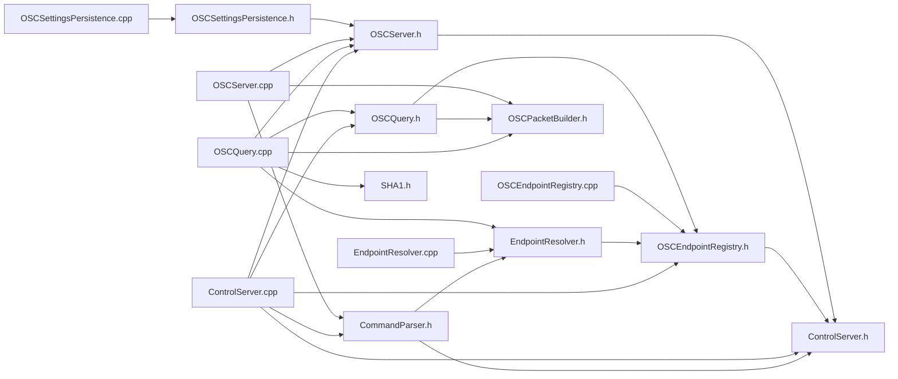


### CorePrimitives — Internal Dependencies

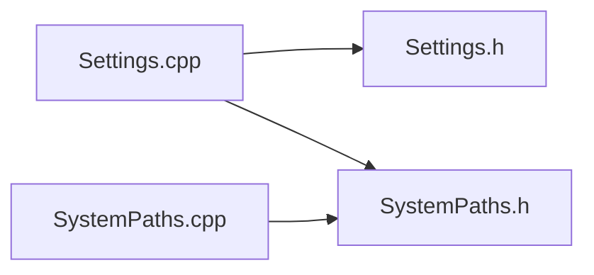


### DSPPrimitives — Internal Dependencies

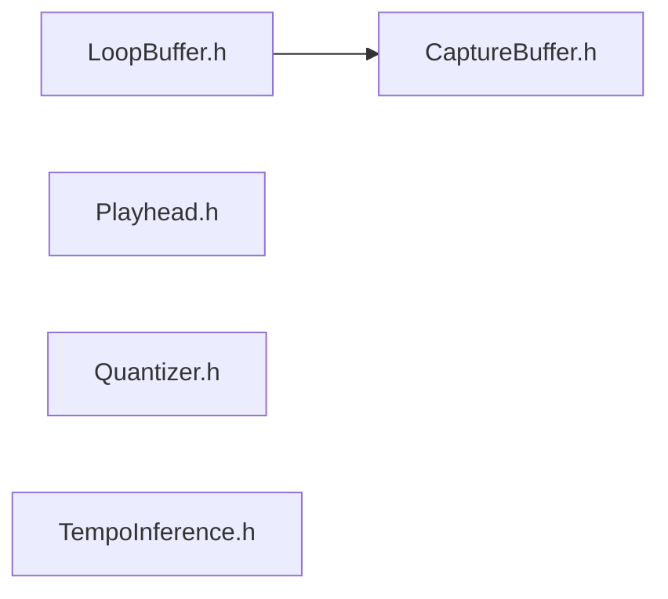


### MIDI — Internal Dependencies

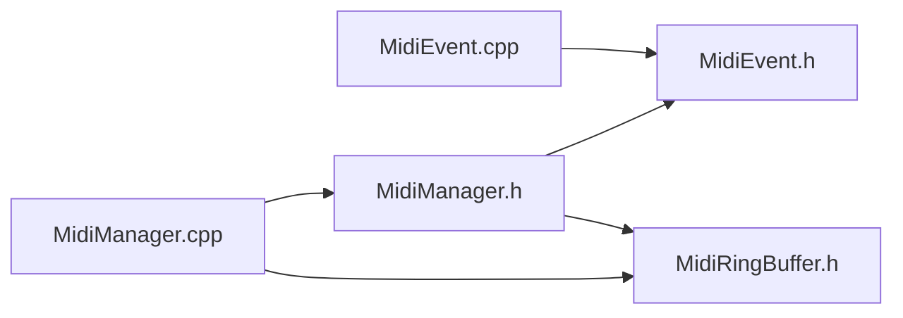


### ScriptingEngine — Internal Dependencies

```mermaid
flowchart LR
    manifold_primitives_scripting_DSPPluginScriptHost_cpp[DSPPluginScriptHost.cpp]
    manifold_primitives_scripting_DSPPluginScriptHost_h[DSPPluginScriptHost.h]
    manifold_primitives_scripting_DSPPrimitiveWrappers_h[DSPPrimitiveWrappers.h]
    manifold_primitives_scripting_GraphRuntime_cpp[GraphRuntime.cpp]
    manifold_primitives_scripting_GraphRuntime_h[GraphRuntime.h]
    manifold_primitives_scripting_ILuaControlState_h[ILuaControlState.h]
    manifold_primitives_scripting_IStateSerializer_h[IStateSerializer.h]
    manifold_primitives_scripting_LuaEngine_cpp[LuaEngine.cpp]
    manifold_primitives_scripting_LuaEngine_h[LuaEngine.h]
    manifold_primitives_scripting_PrimitiveGraph_cpp[PrimitiveGraph.cpp]
    manifold_primitives_scripting_PrimitiveGraph_h[PrimitiveGraph.h]
    manifold_primitives_scripting_ScriptPathResolver_cpp[ScriptPathResolver.cpp]
    manifold_primitives_scripting_ScriptPathResolver_h[ScriptPathResolver.h]
    manifold_primitives_scripting_ScriptableProcessor_cpp[ScriptableProcessor.cpp]
    manifold_primitives_scripting_ScriptableProcessor_h[ScriptableProcessor.h]
    manifold_primitives_scripting_ScriptingConfig_h[ScriptingConfig.h]
    manifold_primitives_scripting_bindings_LuaCanvasBindings_cpp[LuaCanvasBindings.cpp]
    manifold_primitives_scripting_bindings_LuaCanvasBindings_h[LuaCanvasBindings.h]
    manifold_primitives_scripting_bindings_LuaCommandBindings_cpp[LuaCommandBindings.cpp]
    manifold_primitives_scripting_bindings_LuaCommandBindings_h[LuaCommandBindings.h]
    manifold_primitives_scripting_bindings_LuaControlBindings_cpp[LuaControlBindings.cpp]
    manifold_primitives_scripting_bindings_LuaControlBindings_h[LuaControlBindings.h]
    manifold_primitives_scripting_bindings_LuaDspBindings_cpp[LuaDspBindings.cpp]
    manifold_primitives_scripting_bindings_LuaDspBindings_h[LuaDspBindings.h]
    manifold_primitives_scripting_bindings_LuaDspPrimitiveBindings_cpp[LuaDspPrimitiveBindings.cpp]
    manifold_primitives_scripting_bindings_LuaEventBindings_cpp[LuaEventBindings.cpp]
    manifold_primitives_scripting_bindings_LuaEventBindings_h[LuaEventBindings.h]
    manifold_primitives_scripting_bindings_LuaGraphBindings_cpp[LuaGraphBindings.cpp]
    manifold_primitives_scripting_bindings_LuaGraphBindings_h[LuaGraphBindings.h]
    manifold_primitives_scripting_bindings_LuaGraphicsBindings_cpp[LuaGraphicsBindings.cpp]
    manifold_primitives_scripting_bindings_LuaGraphicsBindings_h[LuaGraphicsBindings.h]
    manifold_primitives_scripting_bindings_LuaLinkBindings_cpp[LuaLinkBindings.cpp]
    manifold_primitives_scripting_bindings_LuaLinkBindings_h[LuaLinkBindings.h]
    manifold_primitives_scripting_bindings_LuaMidiBindings_cpp[LuaMidiBindings.cpp]
    manifold_primitives_scripting_bindings_LuaMidiBindings_h[LuaMidiBindings.h]
    manifold_primitives_scripting_bindings_LuaOSCBindings_cpp[LuaOSCBindings.cpp]
    manifold_primitives_scripting_bindings_LuaOSCBindings_h[LuaOSCBindings.h]
    manifold_primitives_scripting_bindings_LuaOpenGLBindings_cpp[LuaOpenGLBindings.cpp]
    manifold_primitives_scripting_bindings_LuaOpenGLBindings_h[LuaOpenGLBindings.h]
    manifold_primitives_scripting_bindings_LuaPrimitiveWrapperHelpers_cpp[LuaPrimitiveWrapperHelpers.cpp]
    manifold_primitives_scripting_bindings_LuaPrimitiveWrapperHelpers_h[LuaPrimitiveWrapperHelpers.h]
    manifold_primitives_scripting_bindings_LuaRuntimeNodeBindings_cpp[LuaRuntimeNodeBindings.cpp]
    manifold_primitives_scripting_bindings_LuaRuntimeNodeBindings_h[LuaRuntimeNodeBindings.h]
    manifold_primitives_scripting_bindings_LuaUIBindingHelpers_cpp[LuaUIBindingHelpers.cpp]
    manifold_primitives_scripting_bindings_LuaUIBindingHelpers_h[LuaUIBindingHelpers.h]
    manifold_primitives_scripting_bindings_LuaUIBindings_cpp[LuaUIBindings.cpp]
    manifold_primitives_scripting_bindings_LuaUIBindings_h[LuaUIBindings.h]
    manifold_primitives_scripting_bindings_LuaUIConstantsBindings_cpp[LuaUIConstantsBindings.cpp]
    manifold_primitives_scripting_bindings_LuaUIConstantsBindings_h[LuaUIConstantsBindings.h]
    manifold_primitives_scripting_bindings_LuaUtilityBindings_cpp[LuaUtilityBindings.cpp]
    manifold_primitives_scripting_bindings_LuaUtilityBindings_h[LuaUtilityBindings.h]
    manifold_primitives_scripting_bindings_LuaUtilityHelpers_cpp[LuaUtilityHelpers.cpp]
    manifold_primitives_scripting_bindings_LuaUtilityHelpers_h[LuaUtilityHelpers.h]
    manifold_primitives_scripting_bindings_LuaWaveformBindings_cpp[LuaWaveformBindings.cpp]
    manifold_primitives_scripting_bindings_LuaWaveformBindings_h[LuaWaveformBindings.h]
    manifold_primitives_scripting_bindings_LuaWaveformHelpers_cpp[LuaWaveformHelpers.cpp]
    manifold_primitives_scripting_bindings_LuaWaveformHelpers_h[LuaWaveformHelpers.h]
    manifold_primitives_scripting_core_LuaCoreEngine_cpp[LuaCoreEngine.cpp]
    manifold_primitives_scripting_core_LuaCoreEngine_h[LuaCoreEngine.h]
    manifold_primitives_scripting_dsp_host_DSPHostBindingsCore_cpp[DSPHostBindingsCore.cpp]
    manifold_primitives_scripting_dsp_host_DSPHostBindingsFx_cpp[DSPHostBindingsFx.cpp]
    manifold_primitives_scripting_dsp_host_DSPHostBindingsSynth_cpp[DSPHostBindingsSynth.cpp]
    manifold_primitives_scripting_dsp_host_DSPHostDeferredMutation_cpp[DSPHostDeferredMutation.cpp]
    manifold_primitives_scripting_dsp_host_DSPHostEndpointSync_cpp[DSPHostEndpointSync.cpp]
    manifold_primitives_scripting_dsp_host_DSPHostInternal_h[DSPHostInternal.h]
    manifold_primitives_scripting_dsp_host_DSPHostLoopLayerBundle_cpp[DSPHostLoopLayerBundle.cpp]
    manifold_primitives_scripting_dsp_host_DSPHostObjectResolver_cpp[DSPHostObjectResolver.cpp]
    manifold_primitives_scripting_dsp_host_DSPHostParamRegistry_cpp[DSPHostParamRegistry.cpp]
    manifold_primitives_scripting_dsp_host_DSPHostPathMapping_cpp[DSPHostPathMapping.cpp]
    manifold_primitives_scripting_dsp_host_DSPHostScriptBootstrap_cpp[DSPHostScriptBootstrap.cpp]
    manifold_primitives_scripting_dsp_host_DSPHostTelemetry_cpp[DSPHostTelemetry.cpp]
    manifold_primitives_scripting_dsp_host_DSPHostValueConverters_cpp[DSPHostValueConverters.cpp]

    manifold_primitives_scripting_DSPPluginScriptHost_cpp --> manifold_primitives_scripting_DSPPluginScriptHost_h
    manifold_primitives_scripting_DSPPluginScriptHost_cpp --> manifold_primitives_scripting_GraphRuntime_h
    manifold_primitives_scripting_DSPPluginScriptHost_cpp --> manifold_primitives_scripting_PrimitiveGraph_h
    manifold_primitives_scripting_DSPPluginScriptHost_cpp --> manifold_primitives_scripting_dsp_host_DSPHostInternal_h
    manifold_primitives_scripting_DSPPluginScriptHost_h --> manifold_primitives_scripting_ScriptableProcessor_h
    manifold_primitives_scripting_GraphRuntime_cpp --> manifold_primitives_scripting_GraphRuntime_h
    manifold_primitives_scripting_GraphRuntime_h --> manifold_primitives_scripting_PrimitiveGraph_h
    manifold_primitives_scripting_LuaEngine_cpp --> manifold_primitives_scripting_LuaEngine_h
    manifold_primitives_scripting_LuaEngine_cpp --> manifold_primitives_scripting_PrimitiveGraph_h
    manifold_primitives_scripting_LuaEngine_cpp --> manifold_primitives_scripting_ScriptPathResolver_h
    manifold_primitives_scripting_LuaEngine_cpp --> manifold_primitives_scripting_ScriptableProcessor_h
    manifold_primitives_scripting_LuaEngine_cpp --> manifold_primitives_scripting_bindings_LuaControlBindings_h
    manifold_primitives_scripting_LuaEngine_cpp --> manifold_primitives_scripting_bindings_LuaRuntimeNodeBindings_h
    manifold_primitives_scripting_LuaEngine_cpp --> manifold_primitives_scripting_bindings_LuaUIBindings_h
    manifold_primitives_scripting_LuaEngine_h --> manifold_primitives_scripting_DSPPrimitiveWrappers_h
    manifold_primitives_scripting_LuaEngine_h --> manifold_primitives_scripting_ILuaControlState_h
    manifold_primitives_scripting_LuaEngine_h --> manifold_primitives_scripting_core_LuaCoreEngine_h
    manifold_primitives_scripting_PrimitiveGraph_cpp --> manifold_primitives_scripting_GraphRuntime_h
    manifold_primitives_scripting_PrimitiveGraph_cpp --> manifold_primitives_scripting_PrimitiveGraph_h
    manifold_primitives_scripting_PrimitiveGraph_h --> manifold_primitives_scripting_ScriptingConfig_h
    manifold_primitives_scripting_ScriptPathResolver_cpp --> manifold_primitives_scripting_ScriptPathResolver_h
    manifold_primitives_scripting_ScriptableProcessor_cpp --> manifold_primitives_scripting_ScriptableProcessor_h
    manifold_primitives_scripting_ScriptableProcessor_h --> manifold_primitives_scripting_GraphRuntime_h
    manifold_primitives_scripting_ScriptableProcessor_h --> manifold_primitives_scripting_IStateSerializer_h
    manifold_primitives_scripting_ScriptableProcessor_h --> manifold_primitives_scripting_ScriptingConfig_h
    manifold_primitives_scripting_bindings_LuaCanvasBindings_cpp --> manifold_primitives_scripting_bindings_LuaCanvasBindings_h
    manifold_primitives_scripting_bindings_LuaCanvasBindings_cpp --> manifold_primitives_scripting_bindings_LuaUIBindingHelpers_h
    manifold_primitives_scripting_bindings_LuaCanvasBindings_cpp --> manifold_primitives_scripting_core_LuaCoreEngine_h
    manifold_primitives_scripting_bindings_LuaCommandBindings_cpp --> manifold_primitives_scripting_ILuaControlState_h
    manifold_primitives_scripting_bindings_LuaCommandBindings_cpp --> manifold_primitives_scripting_ScriptableProcessor_h
    manifold_primitives_scripting_bindings_LuaCommandBindings_cpp --> manifold_primitives_scripting_bindings_LuaCommandBindings_h
    manifold_primitives_scripting_bindings_LuaControlBindings_cpp --> manifold_primitives_scripting_ScriptableProcessor_h
    manifold_primitives_scripting_bindings_LuaControlBindings_cpp --> manifold_primitives_scripting_bindings_LuaCommandBindings_h
    manifold_primitives_scripting_bindings_LuaControlBindings_cpp --> manifold_primitives_scripting_bindings_LuaControlBindings_h
    manifold_primitives_scripting_bindings_LuaControlBindings_cpp --> manifold_primitives_scripting_bindings_LuaDspBindings_h
    manifold_primitives_scripting_bindings_LuaControlBindings_cpp --> manifold_primitives_scripting_bindings_LuaEventBindings_h
    manifold_primitives_scripting_bindings_LuaControlBindings_cpp --> manifold_primitives_scripting_bindings_LuaGraphBindings_h
    manifold_primitives_scripting_bindings_LuaControlBindings_cpp --> manifold_primitives_scripting_bindings_LuaLinkBindings_h
    manifold_primitives_scripting_bindings_LuaControlBindings_cpp --> manifold_primitives_scripting_bindings_LuaMidiBindings_h
    manifold_primitives_scripting_bindings_LuaControlBindings_cpp --> manifold_primitives_scripting_bindings_LuaOSCBindings_h
    manifold_primitives_scripting_bindings_LuaControlBindings_cpp --> manifold_primitives_scripting_bindings_LuaUtilityBindings_h
    manifold_primitives_scripting_bindings_LuaControlBindings_cpp --> manifold_primitives_scripting_bindings_LuaWaveformBindings_h
    manifold_primitives_scripting_bindings_LuaControlBindings_h --> manifold_primitives_scripting_ILuaControlState_h
    manifold_primitives_scripting_bindings_LuaControlBindings_h --> manifold_primitives_scripting_core_LuaCoreEngine_h
    manifold_primitives_scripting_bindings_LuaDspBindings_cpp --> manifold_primitives_scripting_ILuaControlState_h
    manifold_primitives_scripting_bindings_LuaDspBindings_cpp --> manifold_primitives_scripting_ScriptableProcessor_h
    manifold_primitives_scripting_bindings_LuaDspBindings_cpp --> manifold_primitives_scripting_bindings_LuaDspBindings_h
    manifold_primitives_scripting_bindings_LuaDspPrimitiveBindings_cpp --> manifold_primitives_scripting_DSPPrimitiveWrappers_h
    manifold_primitives_scripting_bindings_LuaEventBindings_cpp --> manifold_primitives_scripting_ILuaControlState_h
    manifold_primitives_scripting_bindings_LuaEventBindings_cpp --> manifold_primitives_scripting_bindings_LuaEventBindings_h
    manifold_primitives_scripting_bindings_LuaGraphBindings_cpp --> manifold_primitives_scripting_DSPPrimitiveWrappers_h
    manifold_primitives_scripting_bindings_LuaGraphBindings_cpp --> manifold_primitives_scripting_ILuaControlState_h
    manifold_primitives_scripting_bindings_LuaGraphBindings_cpp --> manifold_primitives_scripting_PrimitiveGraph_h
    manifold_primitives_scripting_bindings_LuaGraphBindings_cpp --> manifold_primitives_scripting_ScriptableProcessor_h
    manifold_primitives_scripting_bindings_LuaGraphBindings_cpp --> manifold_primitives_scripting_bindings_LuaGraphBindings_h
    manifold_primitives_scripting_bindings_LuaGraphBindings_cpp --> manifold_primitives_scripting_bindings_LuaPrimitiveWrapperHelpers_h
    manifold_primitives_scripting_bindings_LuaGraphicsBindings_cpp --> manifold_primitives_scripting_bindings_LuaGraphicsBindings_h
    manifold_primitives_scripting_bindings_LuaGraphicsBindings_cpp --> manifold_primitives_scripting_bindings_LuaUIBindingHelpers_h
    manifold_primitives_scripting_bindings_LuaLinkBindings_cpp --> manifold_primitives_scripting_ILuaControlState_h
    manifold_primitives_scripting_bindings_LuaLinkBindings_cpp --> manifold_primitives_scripting_ScriptableProcessor_h
    manifold_primitives_scripting_bindings_LuaLinkBindings_cpp --> manifold_primitives_scripting_bindings_LuaLinkBindings_h
    manifold_primitives_scripting_bindings_LuaMidiBindings_cpp --> manifold_primitives_scripting_ILuaControlState_h
    manifold_primitives_scripting_bindings_LuaMidiBindings_cpp --> manifold_primitives_scripting_ScriptableProcessor_h
    manifold_primitives_scripting_bindings_LuaMidiBindings_cpp --> manifold_primitives_scripting_bindings_LuaMidiBindings_h
    manifold_primitives_scripting_bindings_LuaOSCBindings_cpp --> manifold_primitives_scripting_ILuaControlState_h
    manifold_primitives_scripting_bindings_LuaOSCBindings_cpp --> manifold_primitives_scripting_ScriptableProcessor_h
    manifold_primitives_scripting_bindings_LuaOSCBindings_cpp --> manifold_primitives_scripting_bindings_LuaOSCBindings_h
    manifold_primitives_scripting_bindings_LuaOpenGLBindings_cpp --> manifold_primitives_scripting_bindings_LuaOpenGLBindings_h
    manifold_primitives_scripting_bindings_LuaOpenGLBindings_cpp --> manifold_primitives_scripting_core_LuaCoreEngine_h
    manifold_primitives_scripting_bindings_LuaPrimitiveWrapperHelpers_cpp --> manifold_primitives_scripting_DSPPrimitiveWrappers_h
    manifold_primitives_scripting_bindings_LuaPrimitiveWrapperHelpers_cpp --> manifold_primitives_scripting_bindings_LuaPrimitiveWrapperHelpers_h
    manifold_primitives_scripting_bindings_LuaRuntimeNodeBindings_cpp --> manifold_primitives_scripting_bindings_LuaRuntimeNodeBindings_h
    manifold_primitives_scripting_bindings_LuaRuntimeNodeBindings_cpp --> manifold_primitives_scripting_bindings_LuaUIBindings_h
    manifold_primitives_scripting_bindings_LuaRuntimeNodeBindings_h --> manifold_primitives_scripting_core_LuaCoreEngine_h
    manifold_primitives_scripting_bindings_LuaUIBindingHelpers_cpp --> manifold_primitives_scripting_bindings_LuaUIBindingHelpers_h
    manifold_primitives_scripting_bindings_LuaUIBindings_cpp --> manifold_primitives_scripting_bindings_LuaCanvasBindings_h
    manifold_primitives_scripting_bindings_LuaUIBindings_cpp --> manifold_primitives_scripting_bindings_LuaGraphicsBindings_h
    manifold_primitives_scripting_bindings_LuaUIBindings_cpp --> manifold_primitives_scripting_bindings_LuaOpenGLBindings_h
    manifold_primitives_scripting_bindings_LuaUIBindings_cpp --> manifold_primitives_scripting_bindings_LuaUIBindingHelpers_h
    manifold_primitives_scripting_bindings_LuaUIBindings_cpp --> manifold_primitives_scripting_bindings_LuaUIBindings_h
    manifold_primitives_scripting_bindings_LuaUIBindings_cpp --> manifold_primitives_scripting_bindings_LuaUIConstantsBindings_h
    manifold_primitives_scripting_bindings_LuaUIBindings_h --> manifold_primitives_scripting_core_LuaCoreEngine_h
    manifold_primitives_scripting_bindings_LuaUIConstantsBindings_cpp --> manifold_primitives_scripting_bindings_LuaUIConstantsBindings_h
    manifold_primitives_scripting_bindings_LuaUtilityBindings_cpp --> manifold_primitives_scripting_ILuaControlState_h
    manifold_primitives_scripting_bindings_LuaUtilityBindings_cpp --> manifold_primitives_scripting_ScriptableProcessor_h
    manifold_primitives_scripting_bindings_LuaUtilityBindings_cpp --> manifold_primitives_scripting_bindings_LuaUtilityBindings_h
    manifold_primitives_scripting_bindings_LuaUtilityBindings_cpp --> manifold_primitives_scripting_bindings_LuaUtilityHelpers_h
    manifold_primitives_scripting_bindings_LuaUtilityHelpers_cpp --> manifold_primitives_scripting_bindings_LuaUtilityHelpers_h
    manifold_primitives_scripting_bindings_LuaWaveformBindings_cpp --> manifold_primitives_scripting_ILuaControlState_h
    manifold_primitives_scripting_bindings_LuaWaveformBindings_cpp --> manifold_primitives_scripting_PrimitiveGraph_h
    manifold_primitives_scripting_bindings_LuaWaveformBindings_cpp --> manifold_primitives_scripting_ScriptableProcessor_h
    manifold_primitives_scripting_bindings_LuaWaveformBindings_cpp --> manifold_primitives_scripting_bindings_LuaUtilityHelpers_h
    manifold_primitives_scripting_bindings_LuaWaveformBindings_cpp --> manifold_primitives_scripting_bindings_LuaWaveformBindings_h
    manifold_primitives_scripting_bindings_LuaWaveformBindings_cpp --> manifold_primitives_scripting_bindings_LuaWaveformHelpers_h
    manifold_primitives_scripting_bindings_LuaWaveformHelpers_cpp --> manifold_primitives_scripting_bindings_LuaWaveformHelpers_h
    manifold_primitives_scripting_core_LuaCoreEngine_cpp --> manifold_primitives_scripting_core_LuaCoreEngine_h
    manifold_primitives_scripting_dsp_host_DSPHostBindingsCore_cpp --> manifold_primitives_scripting_PrimitiveGraph_h
    manifold_primitives_scripting_dsp_host_DSPHostBindingsCore_cpp --> manifold_primitives_scripting_dsp_host_DSPHostInternal_h
    manifold_primitives_scripting_dsp_host_DSPHostBindingsFx_cpp --> manifold_primitives_scripting_PrimitiveGraph_h
    manifold_primitives_scripting_dsp_host_DSPHostBindingsFx_cpp --> manifold_primitives_scripting_dsp_host_DSPHostInternal_h
    manifold_primitives_scripting_dsp_host_DSPHostBindingsSynth_cpp --> manifold_primitives_scripting_PrimitiveGraph_h
    manifold_primitives_scripting_dsp_host_DSPHostBindingsSynth_cpp --> manifold_primitives_scripting_dsp_host_DSPHostInternal_h
    manifold_primitives_scripting_dsp_host_DSPHostDeferredMutation_cpp --> manifold_primitives_scripting_GraphRuntime_h
    manifold_primitives_scripting_dsp_host_DSPHostDeferredMutation_cpp --> manifold_primitives_scripting_PrimitiveGraph_h
    manifold_primitives_scripting_dsp_host_DSPHostDeferredMutation_cpp --> manifold_primitives_scripting_dsp_host_DSPHostInternal_h
    manifold_primitives_scripting_dsp_host_DSPHostEndpointSync_cpp --> manifold_primitives_scripting_ScriptableProcessor_h
    manifold_primitives_scripting_dsp_host_DSPHostEndpointSync_cpp --> manifold_primitives_scripting_dsp_host_DSPHostInternal_h
    manifold_primitives_scripting_dsp_host_DSPHostInternal_h --> manifold_primitives_scripting_DSPPluginScriptHost_h
    manifold_primitives_scripting_dsp_host_DSPHostLoopLayerBundle_cpp --> manifold_primitives_scripting_PrimitiveGraph_h
    manifold_primitives_scripting_dsp_host_DSPHostLoopLayerBundle_cpp --> manifold_primitives_scripting_dsp_host_DSPHostInternal_h
    manifold_primitives_scripting_dsp_host_DSPHostObjectResolver_cpp --> manifold_primitives_scripting_dsp_host_DSPHostInternal_h
    manifold_primitives_scripting_dsp_host_DSPHostParamRegistry_cpp --> manifold_primitives_scripting_dsp_host_DSPHostInternal_h
    manifold_primitives_scripting_dsp_host_DSPHostPathMapping_cpp --> manifold_primitives_scripting_dsp_host_DSPHostInternal_h
    manifold_primitives_scripting_dsp_host_DSPHostScriptBootstrap_cpp --> manifold_primitives_scripting_PrimitiveGraph_h
    manifold_primitives_scripting_dsp_host_DSPHostScriptBootstrap_cpp --> manifold_primitives_scripting_dsp_host_DSPHostInternal_h
    manifold_primitives_scripting_dsp_host_DSPHostTelemetry_cpp --> manifold_primitives_scripting_dsp_host_DSPHostInternal_h
    manifold_primitives_scripting_dsp_host_DSPHostValueConverters_cpp --> manifold_primitives_scripting_dsp_host_DSPHostInternal_h
```


### Shaders — Internal Dependencies

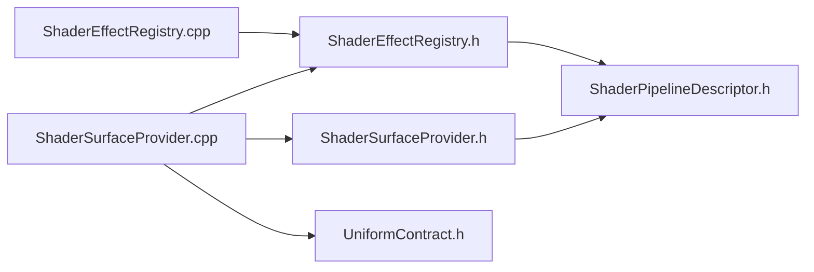


### Sources — Internal Dependencies


### Sync — Internal Dependencies


### UIPrimitives — Internal Dependencies

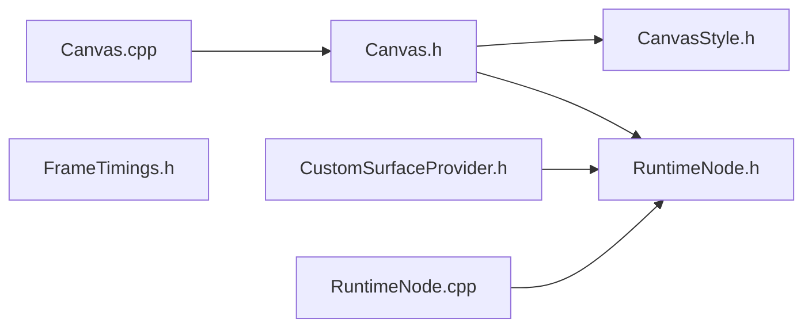


### Video — Internal Dependencies

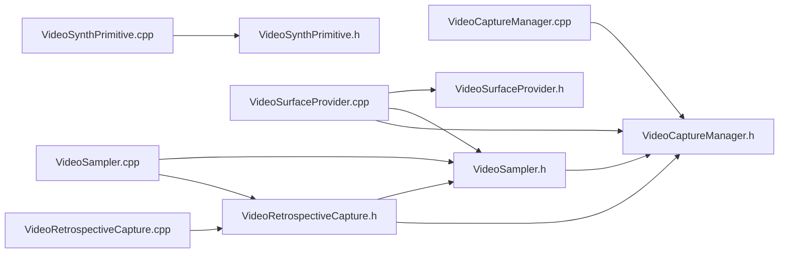


### Composite — Internal Dependencies


### ML — Internal Dependencies

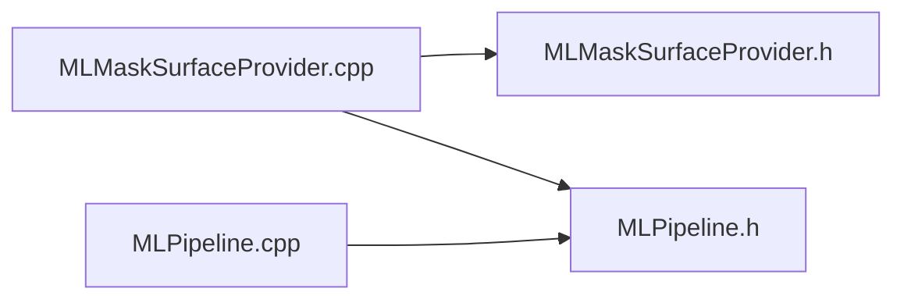


### gRPC — Internal Dependencies


### LuaUI — Internal Dependencies

```mermaid
flowchart LR
    manifold_ui_editor_core_lua[editor_core.lua]
    manifold_ui_empty_launcher_lua[empty_launcher.lua]
    manifold_ui_imgui_ImGuiDirectHost_cpp[ImGuiDirectHost.cpp]
    manifold_ui_imgui_ImGuiDirectHost_h[ImGuiDirectHost.h]
    manifold_ui_imgui_ImGuiHierarchyHost_cpp[ImGuiHierarchyHost.cpp]
    manifold_ui_imgui_ImGuiHierarchyHost_h[ImGuiHierarchyHost.h]
    manifold_ui_imgui_ImGuiHost_cpp[ImGuiHost.cpp]
    manifold_ui_imgui_ImGuiHost_h[ImGuiHost.h]
    manifold_ui_imgui_ImGuiInspectorHost_cpp[ImGuiInspectorHost.cpp]
    manifold_ui_imgui_ImGuiInspectorHost_h[ImGuiInspectorHost.h]
    manifold_ui_imgui_ImGuiOpenGLBackend_cpp[ImGuiOpenGLBackend.cpp]
    manifold_ui_imgui_ImGuiPerfOverlayHost_cpp[ImGuiPerfOverlayHost.cpp]
    manifold_ui_imgui_ImGuiPerfOverlayHost_h[ImGuiPerfOverlayHost.h]
    manifold_ui_imgui_ImGuiRuntimeNodeHost_cpp[ImGuiRuntimeNodeHost.cpp]
    manifold_ui_imgui_ImGuiRuntimeNodeHost_h[ImGuiRuntimeNodeHost.h]
    manifold_ui_imgui_ImGuiScriptListHost_cpp[ImGuiScriptListHost.cpp]
    manifold_ui_imgui_ImGuiScriptListHost_h[ImGuiScriptListHost.h]
    manifold_ui_imgui_ManifoldImGuiConfig_h[ManifoldImGuiConfig.h]
    manifold_ui_imgui_ManifoldImGuiGlobals_cpp[ManifoldImGuiGlobals.cpp]
    manifold_ui_imgui_RuntimeNodeRenderer_cpp[RuntimeNodeRenderer.cpp]
    manifold_ui_imgui_RuntimeNodeRenderer_h[RuntimeNodeRenderer.h]
    manifold_ui_imgui_Theme_cpp[Theme.cpp]
    manifold_ui_imgui_Theme_h[Theme.h]
    manifold_ui_imgui_ToolComponents_cpp[ToolComponents.cpp]
    manifold_ui_imgui_ToolComponents_h[ToolComponents.h]
    manifold_ui_imgui_WidgetPrimitives_cpp[WidgetPrimitives.cpp]
    manifold_ui_imgui_WidgetPrimitives_h[WidgetPrimitives.h]
    manifold_ui_layout_engine_lua[layout_engine.lua]
    manifold_ui_midi_settings_lua[midi_settings.lua]
    manifold_ui_midi_tab_lua[midi_tab.lua]
    manifold_ui_project_loader_lua[project_loader.lua]
    manifold_ui_shell_base_utils_lua[base_utils.lua]
    manifold_ui_shell_bindings_lua[bindings.lua]
    manifold_ui_shell_inspector_utils_lua[inspector_utils.lua]
    manifold_ui_shell_methods_core_lua[methods_core.lua]
    manifold_ui_shell_methods_layout_lua[methods_layout.lua]
    manifold_ui_shell_runtime_script_utils_lua[runtime_script_utils.lua]
    manifold_ui_shell_script_editor_utils_lua[script_editor_utils.lua]
    manifold_ui_shell_settings_panel_lua[settings_panel.lua]
    manifold_ui_ui_shell_lua[ui_shell.lua]
    manifold_ui_ui_widgets_lua[ui_widgets.lua]
    manifold_ui_widgets_base_lua[base.lua]
    manifold_ui_widgets_button_lua[button.lua]
    manifold_ui_widgets_curve_lua[curve.lua]
    manifold_ui_widgets_donut_lua[donut.lua]
    manifold_ui_widgets_dropdown_lua[dropdown.lua]
    manifold_ui_widgets_gl_surface_lua[gl_surface.lua]
    manifold_ui_widgets_glsl_lua[glsl.lua]
    manifold_ui_widgets_knob_lua[knob.lua]
    manifold_ui_widgets_label_lua[label.lua]
    manifold_ui_widgets_meter_lua[meter.lua]
    manifold_ui_widgets_numberbox_lua[numberbox.lua]
    manifold_ui_widgets_panel_lua[panel.lua]
    manifold_ui_widgets_project_tabhost_lua[project_tabhost.lua]
    manifold_ui_widgets_radio_lua[radio.lua]
    manifold_ui_widgets_schema_lua[schema.lua]
    manifold_ui_widgets_segmented_lua[segmented.lua]
    manifold_ui_widgets_slider_lua[slider.lua]
    manifold_ui_widgets_tabhost_lua[tabhost.lua]
    manifold_ui_widgets_tabpage_lua[tabpage.lua]
    manifold_ui_widgets_toggle_lua[toggle.lua]
    manifold_ui_widgets_utils_lua[utils.lua]
    manifold_ui_widgets_waveform_lua[waveform.lua]
    manifold_ui_widgets_xypad_lua[xypad.lua]

    manifold_ui_editor_core_lua --> manifold_ui_ui_widgets_lua
    manifold_ui_empty_launcher_lua --> manifold_ui_ui_widgets_lua
    manifold_ui_imgui_ImGuiDirectHost_cpp --> manifold_ui_imgui_ImGuiDirectHost_h
    manifold_ui_imgui_ImGuiDirectHost_cpp --> manifold_ui_imgui_Theme_h
    manifold_ui_imgui_ImGuiDirectHost_h --> manifold_ui_imgui_RuntimeNodeRenderer_h
    manifold_ui_imgui_ImGuiHierarchyHost_cpp --> manifold_ui_imgui_ImGuiHierarchyHost_h
    manifold_ui_imgui_ImGuiHierarchyHost_cpp --> manifold_ui_imgui_Theme_h
    manifold_ui_imgui_ImGuiHierarchyHost_cpp --> manifold_ui_imgui_WidgetPrimitives_h
    manifold_ui_imgui_ImGuiHost_cpp --> manifold_ui_imgui_ImGuiHost_h
    manifold_ui_imgui_ImGuiInspectorHost_cpp --> manifold_ui_imgui_ImGuiInspectorHost_h
    manifold_ui_imgui_ImGuiInspectorHost_cpp --> manifold_ui_imgui_Theme_h
    manifold_ui_imgui_ImGuiInspectorHost_cpp --> manifold_ui_imgui_ToolComponents_h
    manifold_ui_imgui_ImGuiInspectorHost_cpp --> manifold_ui_imgui_WidgetPrimitives_h
    manifold_ui_imgui_ImGuiPerfOverlayHost_cpp --> manifold_ui_imgui_ImGuiPerfOverlayHost_h
    manifold_ui_imgui_ImGuiPerfOverlayHost_cpp --> manifold_ui_imgui_Theme_h
    manifold_ui_imgui_ImGuiRuntimeNodeHost_cpp --> manifold_ui_imgui_ImGuiRuntimeNodeHost_h
    manifold_ui_imgui_ImGuiRuntimeNodeHost_cpp --> manifold_ui_imgui_Theme_h
    manifold_ui_imgui_ImGuiRuntimeNodeHost_h --> manifold_ui_imgui_RuntimeNodeRenderer_h
    manifold_ui_imgui_ImGuiScriptListHost_cpp --> manifold_ui_imgui_ImGuiScriptListHost_h
    manifold_ui_imgui_ImGuiScriptListHost_cpp --> manifold_ui_imgui_Theme_h
    manifold_ui_imgui_ImGuiScriptListHost_cpp --> manifold_ui_imgui_WidgetPrimitives_h
    manifold_ui_imgui_ManifoldImGuiGlobals_cpp --> manifold_ui_imgui_ManifoldImGuiConfig_h
    manifold_ui_imgui_RuntimeNodeRenderer_cpp --> manifold_ui_imgui_RuntimeNodeRenderer_h
    manifold_ui_imgui_Theme_cpp --> manifold_ui_imgui_Theme_h
    manifold_ui_imgui_ToolComponents_cpp --> manifold_ui_imgui_Theme_h
    manifold_ui_imgui_ToolComponents_cpp --> manifold_ui_imgui_ToolComponents_h
    manifold_ui_imgui_ToolComponents_cpp --> manifold_ui_imgui_WidgetPrimitives_h
    manifold_ui_imgui_ToolComponents_h --> manifold_ui_imgui_ImGuiInspectorHost_h
    manifold_ui_imgui_WidgetPrimitives_cpp --> manifold_ui_imgui_WidgetPrimitives_h
    manifold_ui_imgui_WidgetPrimitives_h --> manifold_ui_imgui_Theme_h
    manifold_ui_midi_tab_lua --> manifold_ui_ui_widgets_lua
    manifold_ui_project_loader_lua --> manifold_ui_layout_engine_lua
    manifold_ui_project_loader_lua --> manifold_ui_ui_widgets_lua
    manifold_ui_shell_bindings_lua --> manifold_ui_shell_base_utils_lua
    manifold_ui_shell_bindings_lua --> manifold_ui_shell_inspector_utils_lua
    manifold_ui_shell_bindings_lua --> manifold_ui_shell_runtime_script_utils_lua
    manifold_ui_shell_bindings_lua --> manifold_ui_shell_script_editor_utils_lua
    manifold_ui_shell_bindings_lua --> manifold_ui_ui_widgets_lua
    manifold_ui_shell_inspector_utils_lua --> manifold_ui_shell_base_utils_lua
    manifold_ui_shell_methods_core_lua --> manifold_ui_shell_base_utils_lua
    manifold_ui_shell_methods_core_lua --> manifold_ui_shell_inspector_utils_lua
    manifold_ui_shell_methods_core_lua --> manifold_ui_shell_runtime_script_utils_lua
    manifold_ui_shell_methods_core_lua --> manifold_ui_shell_script_editor_utils_lua
    manifold_ui_shell_methods_core_lua --> manifold_ui_ui_widgets_lua
    manifold_ui_shell_methods_layout_lua --> manifold_ui_shell_base_utils_lua
    manifold_ui_shell_methods_layout_lua --> manifold_ui_shell_inspector_utils_lua
    manifold_ui_shell_methods_layout_lua --> manifold_ui_shell_runtime_script_utils_lua
    manifold_ui_shell_methods_layout_lua --> manifold_ui_shell_script_editor_utils_lua
    manifold_ui_shell_methods_layout_lua --> manifold_ui_ui_widgets_lua
    manifold_ui_shell_runtime_script_utils_lua --> manifold_ui_shell_base_utils_lua
    manifold_ui_shell_runtime_script_utils_lua --> manifold_ui_ui_widgets_lua
    manifold_ui_shell_script_editor_utils_lua --> manifold_ui_shell_base_utils_lua
    manifold_ui_shell_settings_panel_lua --> manifold_ui_project_loader_lua
    manifold_ui_shell_settings_panel_lua --> manifold_ui_ui_widgets_lua
    manifold_ui_ui_shell_lua --> manifold_ui_shell_base_utils_lua
    manifold_ui_ui_shell_lua --> manifold_ui_shell_base_utils_lua
    manifold_ui_ui_shell_lua --> manifold_ui_shell_bindings_lua
    manifold_ui_ui_shell_lua --> manifold_ui_shell_inspector_utils_lua
    manifold_ui_ui_shell_lua --> manifold_ui_shell_methods_core_lua
    manifold_ui_ui_shell_lua --> manifold_ui_shell_methods_layout_lua
    manifold_ui_ui_shell_lua --> manifold_ui_shell_runtime_script_utils_lua
    manifold_ui_ui_shell_lua --> manifold_ui_shell_script_editor_utils_lua
    manifold_ui_ui_shell_lua --> manifold_ui_shell_settings_panel_lua
    manifold_ui_ui_shell_lua --> manifold_ui_ui_widgets_lua
    manifold_ui_ui_widgets_lua --> manifold_ui_widgets_base_lua
    manifold_ui_ui_widgets_lua --> manifold_ui_widgets_button_lua
    manifold_ui_ui_widgets_lua --> manifold_ui_widgets_curve_lua
    manifold_ui_ui_widgets_lua --> manifold_ui_widgets_donut_lua
    manifold_ui_ui_widgets_lua --> manifold_ui_widgets_dropdown_lua
    manifold_ui_ui_widgets_lua --> manifold_ui_widgets_gl_surface_lua
    manifold_ui_ui_widgets_lua --> manifold_ui_widgets_glsl_lua
    manifold_ui_ui_widgets_lua --> manifold_ui_widgets_knob_lua
    manifold_ui_ui_widgets_lua --> manifold_ui_widgets_label_lua
    manifold_ui_ui_widgets_lua --> manifold_ui_widgets_meter_lua
    manifold_ui_ui_widgets_lua --> manifold_ui_widgets_numberbox_lua
    manifold_ui_ui_widgets_lua --> manifold_ui_widgets_panel_lua
    manifold_ui_ui_widgets_lua --> manifold_ui_widgets_project_tabhost_lua
    manifold_ui_ui_widgets_lua --> manifold_ui_widgets_radio_lua
    manifold_ui_ui_widgets_lua --> manifold_ui_widgets_segmented_lua
    manifold_ui_ui_widgets_lua --> manifold_ui_widgets_slider_lua
    manifold_ui_ui_widgets_lua --> manifold_ui_widgets_tabhost_lua
    manifold_ui_ui_widgets_lua --> manifold_ui_widgets_tabpage_lua
    manifold_ui_ui_widgets_lua --> manifold_ui_widgets_toggle_lua
    manifold_ui_ui_widgets_lua --> manifold_ui_widgets_waveform_lua
    manifold_ui_ui_widgets_lua --> manifold_ui_widgets_xypad_lua
    manifold_ui_widgets_base_lua --> manifold_ui_widgets_utils_lua
    manifold_ui_widgets_button_lua --> manifold_ui_widgets_base_lua
    manifold_ui_widgets_button_lua --> manifold_ui_widgets_schema_lua
    manifold_ui_widgets_button_lua --> manifold_ui_widgets_utils_lua
    manifold_ui_widgets_curve_lua --> manifold_ui_widgets_base_lua
    manifold_ui_widgets_curve_lua --> manifold_ui_widgets_schema_lua
    manifold_ui_widgets_curve_lua --> manifold_ui_widgets_utils_lua
    manifold_ui_widgets_donut_lua --> manifold_ui_widgets_base_lua
    manifold_ui_widgets_donut_lua --> manifold_ui_widgets_utils_lua
    manifold_ui_widgets_dropdown_lua --> manifold_ui_widgets_base_lua
    manifold_ui_widgets_dropdown_lua --> manifold_ui_widgets_schema_lua
    manifold_ui_widgets_dropdown_lua --> manifold_ui_widgets_utils_lua
    manifold_ui_widgets_gl_surface_lua --> manifold_ui_widgets_base_lua
    manifold_ui_widgets_gl_surface_lua --> manifold_ui_widgets_schema_lua
    manifold_ui_widgets_glsl_lua --> manifold_ui_widgets_base_lua
    manifold_ui_widgets_knob_lua --> manifold_ui_widgets_base_lua
    manifold_ui_widgets_knob_lua --> manifold_ui_widgets_schema_lua
    manifold_ui_widgets_knob_lua --> manifold_ui_widgets_utils_lua
    manifold_ui_widgets_label_lua --> manifold_ui_widgets_base_lua
    manifold_ui_widgets_label_lua --> manifold_ui_widgets_schema_lua
    manifold_ui_widgets_label_lua --> manifold_ui_widgets_utils_lua
    manifold_ui_widgets_meter_lua --> manifold_ui_widgets_base_lua
    manifold_ui_widgets_meter_lua --> manifold_ui_widgets_schema_lua
    manifold_ui_widgets_meter_lua --> manifold_ui_widgets_utils_lua
    manifold_ui_widgets_numberbox_lua --> manifold_ui_widgets_base_lua
    manifold_ui_widgets_numberbox_lua --> manifold_ui_widgets_schema_lua
    manifold_ui_widgets_numberbox_lua --> manifold_ui_widgets_utils_lua
    manifold_ui_widgets_panel_lua --> manifold_ui_widgets_base_lua
    manifold_ui_widgets_panel_lua --> manifold_ui_widgets_schema_lua
    manifold_ui_widgets_panel_lua --> manifold_ui_widgets_utils_lua
    manifold_ui_widgets_project_tabhost_lua --> manifold_ui_widgets_schema_lua
    manifold_ui_widgets_project_tabhost_lua --> manifold_ui_widgets_tabhost_lua
    manifold_ui_widgets_project_tabhost_lua --> manifold_ui_widgets_utils_lua
    manifold_ui_widgets_radio_lua --> manifold_ui_widgets_base_lua
    manifold_ui_widgets_radio_lua --> manifold_ui_widgets_schema_lua
    manifold_ui_widgets_radio_lua --> manifold_ui_widgets_utils_lua
    manifold_ui_widgets_schema_lua --> manifold_ui_widgets_utils_lua
    manifold_ui_widgets_segmented_lua --> manifold_ui_widgets_base_lua
    manifold_ui_widgets_segmented_lua --> manifold_ui_widgets_schema_lua
    manifold_ui_widgets_segmented_lua --> manifold_ui_widgets_utils_lua
    manifold_ui_widgets_slider_lua --> manifold_ui_widgets_base_lua
    manifold_ui_widgets_slider_lua --> manifold_ui_widgets_schema_lua
    manifold_ui_widgets_slider_lua --> manifold_ui_widgets_utils_lua
    manifold_ui_widgets_tabhost_lua --> manifold_ui_widgets_base_lua
    manifold_ui_widgets_tabhost_lua --> manifold_ui_widgets_schema_lua
    manifold_ui_widgets_tabhost_lua --> manifold_ui_widgets_utils_lua
    manifold_ui_widgets_tabpage_lua --> manifold_ui_widgets_panel_lua
    manifold_ui_widgets_tabpage_lua --> manifold_ui_widgets_schema_lua
    manifold_ui_widgets_toggle_lua --> manifold_ui_widgets_base_lua
    manifold_ui_widgets_toggle_lua --> manifold_ui_widgets_schema_lua
    manifold_ui_widgets_toggle_lua --> manifold_ui_widgets_utils_lua
    manifold_ui_widgets_waveform_lua --> manifold_ui_widgets_base_lua
    manifold_ui_widgets_waveform_lua --> manifold_ui_widgets_schema_lua
    manifold_ui_widgets_waveform_lua --> manifold_ui_widgets_utils_lua
    manifold_ui_widgets_xypad_lua --> manifold_ui_widgets_base_lua
    manifold_ui_widgets_xypad_lua --> manifold_ui_widgets_utils_lua
```


### UserScripts — Internal Dependencies

```mermaid
flowchart LR
    UserScripts_DSP_test_user_dsp_lua[test_user_dsp.lua]
    UserScripts_projects_AVSampler_dsp_default_dsp_lua[default_dsp.lua]
    UserScripts_projects_AVSampler_ui_behaviors_main_lua[main.lua]
    UserScripts_projects_AVSampler_ui_main_ui_lua[main.ui.lua]
    UserScripts_projects_AVSamplerLab_dsp_default_dsp_lua[default_dsp.lua]
    UserScripts_projects_AVSamplerLab_ui_behaviors_main_lua[main.lua]
    UserScripts_projects_AVSamplerLab_ui_main_ui_lua[main.ui.lua]
    UserScripts_projects_BappEventLab_dsp_default_dsp_lua[default_dsp.lua]
    UserScripts_projects_BappEventLab_dsp_lib_max_event_runtime_lua[max_event_runtime.lua]
    UserScripts_projects_BappEventLab_ui_behaviors_main_lua[main.lua]
    UserScripts_projects_BappEventLab_ui_main_ui_lua[main.ui.lua]
    UserScripts_projects_BappFxChain_dsp_default_dsp_lua[default_dsp.lua]
    UserScripts_projects_BappFxChain_ui_behaviors_main_lua[main.lua]
    UserScripts_projects_BappFxChain_ui_main_ui_lua[main.ui.lua]
    UserScripts_projects_BappInstrument_dsp_default_dsp_full_attempt_lua[default_dsp.full_attempt.lua]
    UserScripts_projects_BappInstrument_dsp_default_dsp_lua[default_dsp.lua]
    UserScripts_projects_BappInstrument_ui_behaviors_adsr_lua[adsr.lua]
    UserScripts_projects_BappInstrument_ui_behaviors_main_lua[main.lua]
    UserScripts_projects_BappInstrument_ui_components_adsr_ui_lua[adsr.ui.lua]
    UserScripts_projects_BappInstrument_ui_main_ui_lua[main.ui.lua]
    UserScripts_projects_BappNoiseLab_dsp_default_dsp_lua[default_dsp.lua]
    UserScripts_projects_BappNoiseLab_ui_behaviors_main_lua[main.lua]
    UserScripts_projects_BappNoiseLab_ui_main_ui_lua[main.ui.lua]
    UserScripts_projects_BappPrimitiveLab_dsp_default_dsp_lua[default_dsp.lua]
    UserScripts_projects_BappPrimitiveLab_themes_dark_lua[dark.lua]
    UserScripts_projects_BappPrimitiveLab_ui_behaviors_main_lua[main.lua]
    UserScripts_projects_BappPrimitiveLab_ui_components_main_ui_lua[main.ui.lua]
    UserScripts_projects_BappPrimitiveLab_ui_main_ui_lua[main.ui.lua]
    UserScripts_projects_BappSampleTopper_dsp_default_dsp_lua[default_dsp.lua]
    UserScripts_projects_BappSampleTopper_ui_behaviors_main_lua[main.lua]
    UserScripts_projects_BappSampleTopper_ui_main_ui_lua[main.ui.lua]
    UserScripts_projects_BappSourceLayerLab_dsp_default_dsp_lua[default_dsp.lua]
    UserScripts_projects_BappSourceLayerLab_dsp_default_dsp_clap_wip_lua[default_dsp_clap_wip.lua]
    UserScripts_projects_BappSourceLayerLab_ui_behaviors_main_lua[main.lua]
    UserScripts_projects_BappSourceLayerLab_ui_main_ui_lua[main.ui.lua]
    UserScripts_projects_BappSourceLayerLab_ui_main_clap_wip_ui_lua[main_clap_wip.ui.lua]
    UserScripts_projects_DspLiveScripting_dsp_default_dsp_lua[default_dsp.lua]
    UserScripts_projects_DspLiveScripting_dsp_fx_slot_swap_harness_lua[fx_slot_swap_harness.lua]
    UserScripts_projects_DspLiveScripting_themes_dark_lua[dark.lua]
    UserScripts_projects_DspLiveScripting_ui_behaviors_main_lua[main.lua]
    UserScripts_projects_DspLiveScripting_ui_main_ui_lua[main.ui.lua]
    UserScripts_projects_ExperimentalUI_ui_behaviors_main_lua[main.lua]
    UserScripts_projects_ExperimentalUI_ui_legacy_experimental_legacy_lua[experimental_legacy.lua]
    UserScripts_projects_ExperimentalUI_ui_main_ui_lua[main.ui.lua]
    UserScripts_projects_ExperimentalUI_ui_widgets_eq_visualizer_lua[eq_visualizer.lua]
    UserScripts_projects_ExperimentalUI_ui_widgets_kaleidoscope_lua[kaleidoscope.lua]
    UserScripts_projects_ExperimentalUI_ui_widgets_matrix_rain_lua[matrix_rain.lua]
    UserScripts_projects_ExperimentalUI_ui_widgets_particle_emitter_lua[particle_emitter.lua]
    UserScripts_projects_ExperimentalUI_ui_widgets_vector_field_lua[vector_field.lua]
    UserScripts_projects_ExperimentalUI_ui_widgets_visual_utils_lua[visual_utils.lua]
    UserScripts_projects_ExperimentalUI_ui_widgets_waveform_ring_lua[waveform_ring.lua]
    UserScripts_projects_ExperimentalUI_ui_widgets_xy_trails_lua[xy_trails.lua]
    UserScripts_projects_GranularLab_dsp_default_dsp_lua[default_dsp.lua]
    UserScripts_projects_GranularLab_ui_behaviors_main_lua[main.lua]
    UserScripts_projects_GranularLab_ui_main_ui_lua[main.ui.lua]
    UserScripts_projects_Imported_BAPP_dsp_default_dsp_lua[default_dsp.lua]
    UserScripts_projects_Imported_BAPP_ui_behaviors_main_lua[main.lua]
    UserScripts_projects_Imported_BAPP_ui_main_ui_lua[main.ui.lua]
    UserScripts_projects_KarplusStrongLab_dsp_default_dsp_lua[default_dsp.lua]
    UserScripts_projects_KarplusStrongLab_ui_behaviors_main_lua[main.lua]
    UserScripts_projects_KarplusStrongLab_ui_main_ui_lua[main.ui.lua]
    UserScripts_projects_LayoutModeDemo_ui_main_ui_lua[main.ui.lua]
    UserScripts_projects_MLLab_ui_behaviors_main_lua[main.lua]
    UserScripts_projects_MLLab_ui_main_ui_lua[main.ui.lua]
    UserScripts_projects_Main_dsp_looper_baseline_lua[looper_baseline.lua]
    UserScripts_projects_Main_dsp_main_lua[main.lua]
    UserScripts_projects_Main_dsp_midisynth_integration_lua[midisynth_integration.lua]
    UserScripts_projects_Main_editor_runtime_state_lua[runtime_state.lua]
    UserScripts_projects_Main_lib_adsr_runtime_lua[adsr_runtime.lua]
    UserScripts_projects_Main_lib_arp_runtime_lua[arp_runtime.lua]
    UserScripts_projects_Main_lib_attenuverter_bias_runtime_lua[attenuverter_bias_runtime.lua]
    UserScripts_projects_Main_lib_compare_runtime_lua[compare_runtime.lua]
    UserScripts_projects_Main_lib_cv_mix_runtime_lua[cv_mix_runtime.lua]
    UserScripts_projects_Main_lib_export_midi_effect_scaffold_lua[export_midi_effect_scaffold.lua]
    UserScripts_projects_Main_lib_export_midi_effects_arp_lua[arp.lua]
    UserScripts_projects_Main_lib_export_midi_effects_note_filter_lua[note_filter.lua]
    UserScripts_projects_Main_lib_export_midi_effects_scale_quantizer_lua[scale_quantizer.lua]
    UserScripts_projects_Main_lib_export_midi_effects_transpose_lua[transpose.lua]
    UserScripts_projects_Main_lib_export_midi_effects_velocity_mapper_lua[velocity_mapper.lua]
    UserScripts_projects_Main_lib_export_midi_effects_voice_transform_lua[voice_transform.lua]
    UserScripts_projects_Main_lib_export_plugin_scaffold_lua[export_plugin_scaffold.lua]
    UserScripts_projects_Main_lib_export_plugin_shell_lua[export_plugin_shell.lua]
    UserScripts_projects_Main_lib_fx_definitions_lua[fx_definitions.lua]
    UserScripts_projects_Main_lib_fx_slot_lua[fx_slot.lua]
    UserScripts_projects_Main_lib_lfo_runtime_lua[lfo_runtime.lua]
    UserScripts_projects_Main_lib_modulation_endpoint_registry_lua[endpoint_registry.lua]
    UserScripts_projects_Main_lib_modulation_providers_midi_sources_lua[midi_sources.lua]
    UserScripts_projects_Main_lib_modulation_providers_parameter_targets_lua[parameter_targets.lua]
    UserScripts_projects_Main_lib_modulation_providers_rack_sources_lua[rack_sources.lua]
    UserScripts_projects_Main_lib_modulation_rack_control_router_lua[rack_control_router.lua]
    UserScripts_projects_Main_lib_modulation_route_compiler_lua[route_compiler.lua]
    UserScripts_projects_Main_lib_modulation_runtime_lua[runtime.lua]
    UserScripts_projects_Main_lib_note_filter_runtime_lua[note_filter_runtime.lua]
    UserScripts_projects_Main_lib_parameter_binder_lua[parameter_binder.lua]
    UserScripts_projects_Main_lib_rack_audio_router_lua[rack_audio_router.lua]
    UserScripts_projects_Main_lib_rack_module_host_runtime_lua[rack_module_host_runtime.lua]
    UserScripts_projects_Main_lib_rack_modules_blend_simple_lua[blend_simple.lua]
    UserScripts_projects_Main_lib_rack_modules_eq_lua[eq.lua]
    UserScripts_projects_Main_lib_rack_modules_filter_lua[filter.lua]
    UserScripts_projects_Main_lib_rack_modules_fx_lua[fx.lua]
    UserScripts_projects_Main_lib_rack_modules_oscillator_lua[oscillator.lua]
    UserScripts_projects_Main_lib_rack_modules_sample_lua[sample.lua]
    UserScripts_projects_Main_lib_range_mapper_runtime_lua[range_mapper_runtime.lua]
    UserScripts_projects_Main_lib_sample_capture_sources_lua[sample_capture_sources.lua]
    UserScripts_projects_Main_lib_sample_hold_runtime_lua[sample_hold_runtime.lua]
    UserScripts_projects_Main_lib_sample_synth_lua[sample_synth.lua]
    UserScripts_projects_Main_lib_scale_quantizer_runtime_lua[scale_quantizer_runtime.lua]
    UserScripts_projects_Main_lib_slew_runtime_lua[slew_runtime.lua]
    UserScripts_projects_Main_lib_transpose_runtime_lua[transpose_runtime.lua]
    UserScripts_projects_Main_lib_ui_canonical_layout_lua[canonical_layout.lua]
    UserScripts_projects_Main_lib_ui_dynamic_module_graphs_lua[dynamic_module_graphs.lua]
    UserScripts_projects_Main_lib_ui_dynamic_module_ui_lua[dynamic_module_ui.lua]
    UserScripts_projects_Main_lib_ui_fx_slot_panel_lua[fx_slot_panel.lua]
    UserScripts_projects_Main_lib_ui_init_bindings_lua[init_bindings.lua]
    UserScripts_projects_Main_lib_ui_init_controls_lua[init_controls.lua]
    UserScripts_projects_Main_lib_ui_midi_devices_lua[midi_devices.lua]
    UserScripts_projects_Main_lib_ui_midi_param_rack_lua[midi_param_rack.lua]
    UserScripts_projects_Main_lib_ui_modulation_widget_sync_lua[modulation_widget_sync.lua]
    UserScripts_projects_Main_lib_ui_oscillator_preview_lua[oscillator_preview.lua]
    UserScripts_projects_Main_lib_ui_patchbay_generator_lua[patchbay_generator.lua]
    UserScripts_projects_Main_lib_ui_patchbay_runtime_lua[patchbay_runtime.lua]
    UserScripts_projects_Main_lib_ui_rack_controller_lua[rack_controller.lua]
    UserScripts_projects_Main_lib_ui_rack_layout_manager_lua[rack_layout_manager.lua]
    UserScripts_projects_Main_lib_ui_rack_mod_popover_lua[rack_mod_popover.lua]
    UserScripts_projects_Main_lib_ui_rack_module_factory_lua[rack_module_factory.lua]
    UserScripts_projects_Main_lib_ui_scoped_widget_lua[scoped_widget.lua]
    UserScripts_projects_Main_lib_ui_update_sync_lua[update_sync.lua]
    UserScripts_projects_Main_lib_ui_widget_sync_lua[widget_sync.lua]
    UserScripts_projects_Main_lib_utils_lua[utils.lua]
    UserScripts_projects_Main_lib_velocity_mapper_runtime_lua[velocity_mapper_runtime.lua]
    UserScripts_projects_Main_lib_voice_pool_lua[voice_pool.lua]
    UserScripts_projects_Main_themes_dark_lua[dark.lua]
    UserScripts_projects_Main_ui_behaviors_arp_lua[arp.lua]
    UserScripts_projects_Main_ui_behaviors_attenuverter_bias_lua[attenuverter_bias.lua]
    UserScripts_projects_Main_ui_behaviors_compare_lua[compare.lua]
    UserScripts_projects_Main_ui_behaviors_cv_mix_lua[cv_mix.lua]
    UserScripts_projects_Main_ui_behaviors_dynamic_module_binding_lua[dynamic_module_binding.lua]
    UserScripts_projects_Main_ui_behaviors_envelope_lua[envelope.lua]
    UserScripts_projects_Main_ui_behaviors_eq_lua[eq.lua]
    UserScripts_projects_Main_ui_behaviors_export_perf_overlay_lua[export_perf_overlay.lua]
    UserScripts_projects_Main_ui_behaviors_export_settings_panel_lua[export_settings_panel.lua]
    UserScripts_projects_Main_ui_behaviors_export_shell_lua[export_shell.lua]
    UserScripts_projects_Main_ui_behaviors_filter_lua[filter.lua]
    UserScripts_projects_Main_ui_behaviors_fx_slot_lua[fx_slot.lua]
    UserScripts_projects_Main_ui_behaviors_keyboard_lua[keyboard.lua]
    UserScripts_projects_Main_ui_behaviors_keyboard_input_lua[keyboard_input.lua]
    UserScripts_projects_Main_ui_behaviors_lfo_lua[lfo.lua]
    UserScripts_projects_Main_ui_behaviors_looper_capture_plane_lua[looper_capture_plane.lua]
    UserScripts_projects_Main_ui_behaviors_looper_layer_strip_lua[looper_layer_strip.lua]
    UserScripts_projects_Main_ui_behaviors_looper_shared_state_lua[looper_shared_state.lua]
    UserScripts_projects_Main_ui_behaviors_looper_transport_lua[looper_transport.lua]
    UserScripts_projects_Main_ui_behaviors_looper_view_lua[looper_view.lua]
    UserScripts_projects_Main_ui_behaviors_main_lua[main.lua]
    UserScripts_projects_Main_ui_behaviors_midi_monitor_lua[midi_monitor.lua]
    UserScripts_projects_Main_ui_behaviors_midisynth_lua[midisynth.lua]
    UserScripts_projects_Main_ui_behaviors_modulation_router_lua[modulation_router.lua]
    UserScripts_projects_Main_ui_behaviors_note_filter_lua[note_filter.lua]
    UserScripts_projects_Main_ui_behaviors_oscillator_lua[oscillator.lua]
    UserScripts_projects_Main_ui_behaviors_palette_browser_lua[palette_browser.lua]
    UserScripts_projects_Main_ui_behaviors_patch_connector_lua[patch_connector.lua]
    UserScripts_projects_Main_ui_behaviors_patchbay_binding_lua[patchbay_binding.lua]
    UserScripts_projects_Main_ui_behaviors_rack_blend_simple_lua[rack_blend_simple.lua]
    UserScripts_projects_Main_ui_behaviors_rack_layout_lua[rack_layout.lua]
    UserScripts_projects_Main_ui_behaviors_rack_layout_engine_lua[rack_layout_engine.lua]
    UserScripts_projects_Main_ui_behaviors_rack_midisynth_specs_lua[rack_midisynth_specs.lua]
    UserScripts_projects_Main_ui_behaviors_rack_mutation_runtime_lua[rack_mutation_runtime.lua]
    UserScripts_projects_Main_ui_behaviors_rack_node_shell_lua[rack_node_shell.lua]
    UserScripts_projects_Main_ui_behaviors_rack_oscillator_lua[rack_oscillator.lua]
    UserScripts_projects_Main_ui_behaviors_rack_sample_lua[rack_sample.lua]
    UserScripts_projects_Main_ui_behaviors_rack_wire_layer_lua[rack_wire_layer.lua]
    UserScripts_projects_Main_ui_behaviors_range_mapper_lua[range_mapper.lua]
    UserScripts_projects_Main_ui_behaviors_sample_hold_lua[sample_hold.lua]
    UserScripts_projects_Main_ui_behaviors_scale_quantizer_lua[scale_quantizer.lua]
    UserScripts_projects_Main_ui_behaviors_shared_capture_plane_lua[shared_capture_plane.lua]
    UserScripts_projects_Main_ui_behaviors_shared_transport_lua[shared_transport.lua]
    UserScripts_projects_Main_ui_behaviors_slew_lua[slew.lua]
    UserScripts_projects_Main_ui_behaviors_source_panel_lua[source_panel.lua]
    UserScripts_projects_Main_ui_behaviors_state_manager_lua[state_manager.lua]
    UserScripts_projects_Main_ui_behaviors_transpose_lua[transpose.lua]
    UserScripts_projects_Main_ui_behaviors_velocity_mapper_lua[velocity_mapper.lua]
    UserScripts_projects_Main_ui_behaviors_voice_manager_lua[voice_manager.lua]
    UserScripts_projects_Main_ui_components_arp_ui_lua[arp.ui.lua]
    UserScripts_projects_Main_ui_components_attenuverter_bias_ui_lua[attenuverter_bias.ui.lua]
    UserScripts_projects_Main_ui_components_compare_ui_lua[compare.ui.lua]
    UserScripts_projects_Main_ui_components_cv_mix_ui_lua[cv_mix.ui.lua]
    UserScripts_projects_Main_ui_components_effects_ui_lua[effects.ui.lua]
    UserScripts_projects_Main_ui_components_envelope_ui_lua[envelope.ui.lua]
    UserScripts_projects_Main_ui_components_eq_ui_lua[eq.ui.lua]
    UserScripts_projects_Main_ui_components_export_fx_slot_ui_lua[export_fx_slot.ui.lua]
    UserScripts_projects_Main_ui_components_export_perf_overlay_ui_lua[export_perf_overlay.ui.lua]
    UserScripts_projects_Main_ui_components_export_settings_panel_ui_lua[export_settings_panel.ui.lua]
    UserScripts_projects_Main_ui_components_filter_ui_lua[filter.ui.lua]
    UserScripts_projects_Main_ui_components_fx_slot_ui_lua[fx_slot.ui.lua]
    UserScripts_projects_Main_ui_components_header_ui_lua[header.ui.lua]
    UserScripts_projects_Main_ui_components_keyboard_ui_lua[keyboard.ui.lua]
    UserScripts_projects_Main_ui_components_lfo_ui_lua[lfo.ui.lua]
    UserScripts_projects_Main_ui_components_looper_capture_plane_ui_lua[looper_capture_plane.ui.lua]
    UserScripts_projects_Main_ui_components_looper_layer_strip_ui_lua[looper_layer_strip.ui.lua]
    UserScripts_projects_Main_ui_components_looper_transport_ui_lua[looper_transport.ui.lua]
    UserScripts_projects_Main_ui_components_looper_view_ui_lua[looper_view.ui.lua]
    UserScripts_projects_Main_ui_components_midi_monitor_ui_lua[midi_monitor.ui.lua]
    UserScripts_projects_Main_ui_components_midisynth_view_ui_lua[midisynth_view.ui.lua]
    UserScripts_projects_Main_ui_components_note_filter_ui_lua[note_filter.ui.lua]
    UserScripts_projects_Main_ui_components_oscillator_ui_lua[oscillator.ui.lua]
    UserScripts_projects_Main_ui_components_pagination_dots_lua[pagination_dots.lua]
    UserScripts_projects_Main_ui_components_patch_connector_ui_lua[patch_connector.ui.lua]
    UserScripts_projects_Main_ui_components_patchbay_panel_lua[patchbay_panel.lua]
    UserScripts_projects_Main_ui_components_placeholder_ui_lua[placeholder.ui.lua]
    UserScripts_projects_Main_ui_components_placeholder_knob_ui_lua[placeholder_knob.ui.lua]
    UserScripts_projects_Main_ui_components_presets_ui_lua[presets.ui.lua]
    UserScripts_projects_Main_ui_components_rack_blend_simple_ui_lua[rack_blend_simple.ui.lua]
    UserScripts_projects_Main_ui_components_rack_container_lua[rack_container.lua]
    UserScripts_projects_Main_ui_components_rack_module_shell_lua[rack_module_shell.lua]
    UserScripts_projects_Main_ui_components_rack_module_shell_ui_lua[rack_module_shell.ui.lua]
    UserScripts_projects_Main_ui_components_rack_oscillator_ui_lua[rack_oscillator.ui.lua]
    UserScripts_projects_Main_ui_components_rack_sample_ui_lua[rack_sample.ui.lua]
    UserScripts_projects_Main_ui_components_range_mapper_ui_lua[range_mapper.ui.lua]
    UserScripts_projects_Main_ui_components_sample_hold_ui_lua[sample_hold.ui.lua]
    UserScripts_projects_Main_ui_components_scale_quantizer_ui_lua[scale_quantizer.ui.lua]
    UserScripts_projects_Main_ui_components_shared_capture_plane_ui_lua[shared_capture_plane.ui.lua]
    UserScripts_projects_Main_ui_components_shared_transport_ui_lua[shared_transport.ui.lua]
    UserScripts_projects_Main_ui_components_slew_ui_lua[slew.ui.lua]
    UserScripts_projects_Main_ui_components_source_panel_ui_lua[source_panel.ui.lua]
    UserScripts_projects_Main_ui_components_spectrum_ui_lua[spectrum.ui.lua]
    UserScripts_projects_Main_ui_components_transpose_ui_lua[transpose.ui.lua]
    UserScripts_projects_Main_ui_components_velocity_mapper_ui_lua[velocity_mapper.ui.lua]
    UserScripts_projects_Main_ui_main_ui_lua[main.ui.lua]
    UserScripts_projects_ModalLab_dsp_default_dsp_lua[default_dsp.lua]
    UserScripts_projects_ModalLab_ui_behaviors_main_lua[main.lua]
    UserScripts_projects_ModalLab_ui_main_ui_lua[main.ui.lua]
    UserScripts_projects_RackModuleHost_dsp_main_lua[main.lua]
    UserScripts_projects_RackModuleHost_lib_module_host_registry_lua[module_host_registry.lua]
    UserScripts_projects_RackModuleHost_ui_behaviors_main_lua[main.lua]
    UserScripts_projects_RackModuleHost_ui_main_ui_lua[main.ui.lua]
    UserScripts_projects_RackModuleHost_ui_midi_devices_lua[midi_devices.lua]
    UserScripts_projects_RuntimeBenchmark_ui_behaviors_main_lua[main.lua]
    UserScripts_projects_RuntimeBenchmark_ui_main_ui_lua[main.ui.lua]
    UserScripts_projects_StandaloneOsc_ui_standalone_osc_ui_lua[standalone_osc.ui.lua]
    UserScripts_projects_Standalone_Arp_dsp_main_lua[main.lua]
    UserScripts_projects_Standalone_Arp_ui_main_ui_lua[main.ui.lua]
    UserScripts_projects_Standalone_Eq_dsp_main_lua[main.lua]
    UserScripts_projects_Standalone_Eq_ui_behaviors_main_lua[main.lua]
    UserScripts_projects_Standalone_Eq_ui_behaviors_perf_overlay_lua[perf_overlay.lua]
    UserScripts_projects_Standalone_Eq_ui_behaviors_settings_panel_lua[settings_panel.lua]
    UserScripts_projects_Standalone_Eq_ui_components_perf_overlay_ui_lua[perf_overlay.ui.lua]
    UserScripts_projects_Standalone_Eq_ui_components_settings_panel_ui_lua[settings_panel.ui.lua]
    UserScripts_projects_Standalone_Eq_ui_main_ui_lua[main.ui.lua]
    UserScripts_projects_Standalone_FX_dsp_main_lua[main.lua]
    UserScripts_projects_Standalone_FX_ui_main_ui_lua[main.ui.lua]
    UserScripts_projects_Standalone_Filter_dsp_main_lua[main.lua]
    UserScripts_projects_Standalone_Filter_ui_behaviors_main_lua[main.lua]
    UserScripts_projects_Standalone_Filter_ui_behaviors_perf_overlay_lua[perf_overlay.lua]
    UserScripts_projects_Standalone_Filter_ui_behaviors_settings_panel_lua[settings_panel.lua]
    UserScripts_projects_Standalone_Filter_ui_components_perf_overlay_ui_lua[perf_overlay.ui.lua]
    UserScripts_projects_Standalone_Filter_ui_components_settings_panel_ui_lua[settings_panel.ui.lua]
    UserScripts_projects_Standalone_Filter_ui_main_ui_lua[main.ui.lua]
    UserScripts_projects_Standalone_NoteFilter_dsp_main_lua[main.lua]
    UserScripts_projects_Standalone_NoteFilter_ui_main_ui_lua[main.ui.lua]
    UserScripts_projects_Standalone_Sample_dsp_main_lua[main.lua]
    UserScripts_projects_Standalone_Sample_ui_behaviors_standalone_sample_lua[standalone_sample.lua]
    UserScripts_projects_Standalone_Sample_ui_components_standalone_sample_ui_lua[standalone_sample.ui.lua]
    UserScripts_projects_Standalone_Sample_ui_main_ui_lua[main.ui.lua]
    UserScripts_projects_Standalone_ScaleQuantizer_dsp_main_lua[main.lua]
    UserScripts_projects_Standalone_ScaleQuantizer_ui_main_ui_lua[main.ui.lua]
    UserScripts_projects_Standalone_Transpose_dsp_main_lua[main.lua]
    UserScripts_projects_Standalone_Transpose_ui_main_ui_lua[main.ui.lua]
    UserScripts_projects_Standalone_VelocityMapper_dsp_main_lua[main.lua]
    UserScripts_projects_Standalone_VelocityMapper_ui_main_ui_lua[main.ui.lua]
    UserScripts_projects_VectorSynth_dsp_default_dsp_lua[default_dsp.lua]
    UserScripts_projects_VectorSynth_ui_behaviors_main_lua[main.lua]
    UserScripts_projects_VectorSynth_ui_main_ui_lua[main.ui.lua]
    UserScripts_projects_VideoPolySamplerLab_dsp_default_dsp_lua[default_dsp.lua]
    UserScripts_projects_VideoPolySamplerLab_ui_behaviors_main_lua[main.lua]
    UserScripts_projects_VideoPolySamplerLab_ui_main_ui_lua[main.ui.lua]
    UserScripts_projects_VideoSamplerLab_dsp_default_dsp_lua[default_dsp.lua]
    UserScripts_projects_VideoSamplerLab_ui_behaviors_main_lua[main.lua]
    UserScripts_projects_VideoSamplerLab_ui_main_ui_lua[main.ui.lua]
    UserScripts_projects_VideoSliceRackLab_dsp_default_dsp_lua[default_dsp.lua]
    UserScripts_projects_VideoSliceRackLab_ui_behaviors_main_lua[main.lua]
    UserScripts_projects_VideoSliceRackLab_ui_main_ui_lua[main.ui.lua]
    UserScripts_projects_WebcamViewer_ui_behaviors_main_lua[main.lua]
    UserScripts_projects_WebcamViewer_ui_main_ui_lua[main.ui.lua]
    UserScripts_projects_avsamplerDOCKING_dsp_default_dsp_lua[default_dsp.lua]
    UserScripts_projects_avsamplerDOCKING_ui_behaviors_core_compositor_lua[compositor.lua]
    UserScripts_projects_avsamplerDOCKING_ui_behaviors_core_constants_lua[constants.lua]
    UserScripts_projects_avsamplerDOCKING_ui_behaviors_core_embeds_lua[embeds.lua]
    UserScripts_projects_avsamplerDOCKING_ui_behaviors_core_grid_lua[grid.lua]
    UserScripts_projects_avsamplerDOCKING_ui_behaviors_core_initflow_lua[initflow.lua]
    UserScripts_projects_avsamplerDOCKING_ui_behaviors_core_layout_lua[layout.lua]
    UserScripts_projects_avsamplerDOCKING_ui_behaviors_core_mapping_lua[mapping.lua]
    UserScripts_projects_avsamplerDOCKING_ui_behaviors_core_midi_lua[midi.lua]
    UserScripts_projects_avsamplerDOCKING_ui_behaviors_core_ml_lua[ml.lua]
    UserScripts_projects_avsamplerDOCKING_ui_behaviors_core_params_lua[params.lua]
    UserScripts_projects_avsamplerDOCKING_ui_behaviors_core_profiler_lua[profiler.lua]
    UserScripts_projects_avsamplerDOCKING_ui_behaviors_core_runtime_lua[runtime.lua]
    UserScripts_projects_avsamplerDOCKING_ui_behaviors_core_sampler_lua[sampler.lua]
    UserScripts_projects_avsamplerDOCKING_ui_behaviors_core_shaders_lua[shaders.lua]
    UserScripts_projects_avsamplerDOCKING_ui_behaviors_core_sources_lua[sources.lua]
    UserScripts_projects_avsamplerDOCKING_ui_behaviors_core_state_lua[state.lua]
    UserScripts_projects_avsamplerDOCKING_ui_behaviors_core_testhooks_lua[testhooks.lua]
    UserScripts_projects_avsamplerDOCKING_ui_behaviors_core_util_lua[util.lua]
    UserScripts_projects_avsamplerDOCKING_ui_behaviors_main_lua[main.lua]
    UserScripts_projects_avsamplerDOCKING_ui_main_ui_lua[main.ui.lua]
    UserScripts_test_midi_lua[test_midi.lua]

    UserScripts_projects_Main_lib_adsr_runtime_lua --> UserScripts_projects_Main_lib_arp_runtime_lua
    UserScripts_projects_Main_lib_adsr_runtime_lua --> UserScripts_projects_Main_lib_transpose_runtime_lua
    UserScripts_projects_Main_lib_arp_runtime_lua --> UserScripts_projects_Main_lib_adsr_runtime_lua
    UserScripts_projects_Main_lib_arp_runtime_lua --> UserScripts_projects_Main_lib_transpose_runtime_lua
    UserScripts_projects_Main_lib_export_midi_effect_scaffold_lua --> UserScripts_projects_Main_lib_parameter_binder_lua
    UserScripts_projects_Main_lib_export_plugin_scaffold_lua --> UserScripts_projects_Main_lib_parameter_binder_lua
    UserScripts_projects_Main_lib_export_plugin_scaffold_lua --> UserScripts_projects_Main_lib_utils_lua
    UserScripts_projects_Main_lib_fx_definitions_lua --> UserScripts_projects_Main_lib_utils_lua
    UserScripts_projects_Main_lib_fx_slot_lua --> UserScripts_projects_Main_lib_utils_lua
    UserScripts_projects_Main_lib_note_filter_runtime_lua --> UserScripts_projects_Main_lib_adsr_runtime_lua
    UserScripts_projects_Main_lib_note_filter_runtime_lua --> UserScripts_projects_Main_lib_arp_runtime_lua
    UserScripts_projects_Main_lib_note_filter_runtime_lua --> UserScripts_projects_Main_lib_transpose_runtime_lua
    UserScripts_projects_Main_lib_parameter_binder_lua --> UserScripts_projects_Main_lib_rack_audio_router_lua
    UserScripts_projects_Main_lib_rack_module_host_runtime_lua --> UserScripts_projects_Main_lib_fx_definitions_lua
    UserScripts_projects_Main_lib_rack_module_host_runtime_lua --> UserScripts_projects_Main_lib_fx_slot_lua
    UserScripts_projects_Main_lib_rack_module_host_runtime_lua --> UserScripts_projects_Main_lib_parameter_binder_lua
    UserScripts_projects_Main_lib_rack_module_host_runtime_lua --> UserScripts_projects_Main_lib_rack_modules_blend_simple_lua
    UserScripts_projects_Main_lib_rack_module_host_runtime_lua --> UserScripts_projects_Main_lib_rack_modules_eq_lua
    UserScripts_projects_Main_lib_rack_module_host_runtime_lua --> UserScripts_projects_Main_lib_rack_modules_filter_lua
    UserScripts_projects_Main_lib_rack_module_host_runtime_lua --> UserScripts_projects_Main_lib_rack_modules_fx_lua
    UserScripts_projects_Main_lib_rack_module_host_runtime_lua --> UserScripts_projects_Main_lib_rack_modules_oscillator_lua
    UserScripts_projects_Main_lib_rack_module_host_runtime_lua --> UserScripts_projects_Main_lib_rack_modules_sample_lua
    UserScripts_projects_Main_lib_rack_module_host_runtime_lua --> UserScripts_projects_Main_lib_sample_synth_lua
    UserScripts_projects_Main_lib_rack_module_host_runtime_lua --> UserScripts_projects_Main_lib_utils_lua
    UserScripts_projects_Main_lib_sample_synth_lua --> UserScripts_projects_Main_lib_utils_lua
    UserScripts_projects_Main_lib_scale_quantizer_runtime_lua --> UserScripts_projects_Main_lib_adsr_runtime_lua
    UserScripts_projects_Main_lib_scale_quantizer_runtime_lua --> UserScripts_projects_Main_lib_arp_runtime_lua
    UserScripts_projects_Main_lib_transpose_runtime_lua --> UserScripts_projects_Main_lib_adsr_runtime_lua
    UserScripts_projects_Main_lib_transpose_runtime_lua --> UserScripts_projects_Main_lib_arp_runtime_lua
    UserScripts_projects_Main_lib_velocity_mapper_runtime_lua --> UserScripts_projects_Main_lib_adsr_runtime_lua
    UserScripts_projects_Main_lib_velocity_mapper_runtime_lua --> UserScripts_projects_Main_lib_arp_runtime_lua
    UserScripts_projects_Main_lib_velocity_mapper_runtime_lua --> UserScripts_projects_Main_lib_transpose_runtime_lua
```


## Architecture Graph Statistics

| Metric | Value |
|--------|-------:|
| Total source files scanned | 688 |
| Code files analyzed (cpp/lua/ts) | 688 |
| Header files | 160 |
| File-level dependency edges found | 758 |
| Module-level nodes | 24 |
| Module-level edges | 55 |
| External library dependencies (skipped) | 27 |
| Modules with internal edges shown in detail | 22 |

### External Libraries (excluded from diagram)

| Library | Include count |
|---------|--------------:|
| C++ Standard Library | 782 |
| JUCE | 91 |
| sol2 (Lua binding) | 26 |
| Other (lauxlib.h) | 7 |
| Other (lua.h) | 7 |
| Other (lualib.h) | 7 |
| grpcpp/... | 6 |
| sys/... | 6 |
| hwy/... | 4 |
| Other (unistd.h) | 3 |
| Other (poll.h) | 3 |
| Other (fcntl.h) | 3 |
| Ableton Link | 3 |
| Other (malloc.h) | 2 |
| grpc/... | 2 |
| Other (signal.h) | 1 |
| Other (onnxruntime_cxx_api.h) | 1 |
| linux/... | 1 |
| EGL/OpenGL | 1 |

**Notable project-scoped externals (shown as unique paths):**

- `EGL/egl.h`
- `ableton/Link.hpp`
- `ableton/platforms/Config.hpp`
- `fcntl.h`
- `grpc/grpc.h`
- `grpcpp/security/server_credentials.h`
- `grpcpp/server.h`
- `grpcpp/server_builder.h`
- `grpcpp/server_context.h`
- `hwy/aligned_allocator.h`
- `hwy/cache_control.h`
- `hwy/foreach_target.h`
- `hwy/highway.h`
- `lauxlib.h`
- `linux/videodev2.h`
- `lua.h`
- `lualib.h`
- `malloc.h`
- `onnxruntime_cxx_api.h`
- `poll.h`
- `signal.h`
- `sol/sol.hpp`
- `sys/ioctl.h`
- `sys/mman.h`
- `sys/socket.h`
- `sys/un.h`
- `unistd.h`


---
*Diagram deterministic key: `module` / `max-nodes=None` / `dsp-links=False`*
