# Manifold Code Architecture Diagram

**Generated:** 2026-05-02 06:04:48
**Granularity:** module
**Source files scanned:** 688
**Dependency edges:** 758

*This diagram is procedurally constructed and provably correct:*
*every directed edge corresponds to a literal `#include`, `require`, or `import` statement*
*found in the source code. No heuristics, no assumptions, no AI.*

```mermaid
flowchart TD

    subgraph "PluginCore (4 files)"
    end

    subgraph "Engine (1 files)"
    end

    subgraph "DSPGraph (1 files)"
    end

    subgraph "DSPNodes (126 files)"
    end

    subgraph "DSPLua (36 files)"
    end

    subgraph "Control/OSC (15 files)"
    end

    subgraph "CorePrimitives (4 files)"
    end

    subgraph "DSPPrimitives (5 files)"
    end

    subgraph "MIDI (5 files)"
    end

    subgraph "ScriptingEngine (72 files)"
    end

    subgraph "Shaders (6 files)"
    end

    subgraph "Sources (4 files)"
    end

    subgraph "Sync (2 files)"
    end

    subgraph "UIPrimitives (7 files)"
    end

    subgraph "Video (10 files)"
    end

    subgraph "Composite (2 files)"
    end

    subgraph "ML (4 files)"
    end

    subgraph "Highway (2 files)"
    end

    subgraph "gRPC (2 files)"
    end

    subgraph "Headless (7 files)"
    end

    subgraph "LuaUI (64 files)"
    end

    subgraph "SystemScripts (3 files)"
    end

    subgraph "UserScripts (304 files)"
    end

    subgraph "WebRemote (2 files)"
    end

%% Subgraph styles
    style PluginCore_4_files fill:#4a90d930,stroke:#4a90d9,stroke-width:2px
    style Engine_1_files fill:#50c87830,stroke:#50c878,stroke-width:2px
    style DSPGraph_1_files fill:#e67e2230,stroke:#e67e22,stroke-width:2px
    style DSPNodes_126_files fill:#9b59b630,stroke:#9b59b6,stroke-width:2px
    style DSPLua_36_files fill:#1abc9c30,stroke:#1abc9c,stroke-width:2px
    style Control_OSC_15_files fill:#e74c3c30,stroke:#e74c3c,stroke-width:2px
    style CorePrimitives_4_files fill:#3498db30,stroke:#3498db,stroke-width:2px
    style DSPPrimitives_5_files fill:#2ecc7130,stroke:#2ecc71,stroke-width:2px
    style MIDI_5_files fill:#f39c1230,stroke:#f39c12,stroke-width:2px
    style ScriptingEngine_72_files fill:#2980b930,stroke:#2980b9,stroke-width:2px
    style Shaders_6_files fill:#27ae6030,stroke:#27ae60,stroke-width:2px
    style Sources_4_files fill:#d3540030,stroke:#d35400,stroke-width:2px
    style Sync_2_files fill:#8e44ad30,stroke:#8e44ad,stroke-width:2px
    style UIPrimitives_7_files fill:#16a08530,stroke:#16a085,stroke-width:2px
    style Video_10_files fill:#c0392b30,stroke:#c0392b,stroke-width:2px
    style Composite_2_files fill:#7f8c8d30,stroke:#7f8c8d,stroke-width:2px
    style ML_4_files fill:#2c3e5030,stroke:#2c3e50,stroke-width:2px
    style Highway_2_files fill:#f1c40f30,stroke:#f1c40f,stroke-width:2px
    style gRPC_2_files fill:#95a5a630,stroke:#95a5a6,stroke-width:2px
    style Headless_7_files fill:#34495e30,stroke:#34495e,stroke-width:2px
    style LuaUI_64_files fill:#e91e6330,stroke:#e91e63,stroke-width:2px
    style SystemScripts_3_files fill:#00bcd430,stroke:#00bcd4,stroke-width:2px
    style UserScripts_304_files fill:#ff572230,stroke:#ff5722,stroke-width:2px
    style WebRemote_2_files fill:#79554830,stroke:#795548,stroke-width:2px

    Composite_2_files --> Shaders_6_files
    Composite_2_files --> UIPrimitives_7_files
    Control_OSC_15_files --> CorePrimitives_4_files
    Control_OSC_15_files --> DSPPrimitives_5_files
    Control_OSC_15_files --> ScriptingEngine_72_files
    Control_OSC_15_files --> UIPrimitives_7_files
    DSPNodes_126_files --> DSPGraph_1_files
    DSPNodes_126_files --> Highway_2_files
    DSPNodes_126_files --> MIDI_5_files
    Engine_1_files --> DSPPrimitives_5_files
    Headless_7_files --> Control_OSC_15_files
    Headless_7_files --> DSPGraph_1_files
    Headless_7_files --> DSPNodes_126_files
    Headless_7_files --> DSPPrimitives_5_files
    Headless_7_files --> Engine_1_files
    Headless_7_files --> PluginCore_4_files
    Headless_7_files --> ScriptingEngine_72_files
    LuaUI_64_files --> Composite_2_files
    LuaUI_64_files --> ML_4_files
    LuaUI_64_files --> Shaders_6_files
    LuaUI_64_files --> Sources_4_files
    LuaUI_64_files --> UIPrimitives_7_files
    LuaUI_64_files --> Video_10_files
    ML_4_files --> UIPrimitives_7_files
    ML_4_files --> Video_10_files
    PluginCore_4_files --> Control_OSC_15_files
    PluginCore_4_files --> CorePrimitives_4_files
    PluginCore_4_files --> DSPPrimitives_5_files
    PluginCore_4_files --> LuaUI_64_files
    PluginCore_4_files --> MIDI_5_files
    PluginCore_4_files --> ScriptingEngine_72_files
    PluginCore_4_files --> Sync_2_files
    PluginCore_4_files --> UIPrimitives_7_files
    ScriptingEngine_72_files --> Control_OSC_15_files
    ScriptingEngine_72_files --> CorePrimitives_4_files
    ScriptingEngine_72_files --> DSPGraph_1_files
    ScriptingEngine_72_files --> DSPNodes_126_files
    ScriptingEngine_72_files --> LuaUI_64_files
    ScriptingEngine_72_files --> MIDI_5_files
    ScriptingEngine_72_files --> ML_4_files
    ScriptingEngine_72_files --> PluginCore_4_files
    ScriptingEngine_72_files --> Shaders_6_files
    ScriptingEngine_72_files --> Sources_4_files
    ScriptingEngine_72_files --> UIPrimitives_7_files
    ScriptingEngine_72_files --> Video_10_files
    Shaders_6_files --> Sources_4_files
    Shaders_6_files --> UIPrimitives_7_files
    Sources_4_files --> Shaders_6_files
    Sources_4_files --> UIPrimitives_7_files
    SystemScripts_3_files --> LuaUI_64_files
    UIPrimitives_7_files --> LuaUI_64_files
    UserScripts_304_files --> LuaUI_64_files
    Video_10_files --> UIPrimitives_7_files
    gRPC_2_files --> Control_OSC_15_files
    gRPC_2_files --> ScriptingEngine_72_files

    %% 55 dependency edges shown
```

## Architecture Graph Statistics

| Metric | Value |
|--------|-------:|
| Total source files scanned | 688 |
| Code files analyzed (cpp/lua/ts) | 688 |
| Header files | 160 |
| File-level dependency edges found | 758 |
| Module-level nodes | 24 |
| Module-level edges | 55 |
| External library dependencies (skipped) | 27 |
| Modules with internal edges shown in detail | 22 |

### External Libraries (excluded from diagram)

| Library | Include count |
|---------|--------------:|
| C++ Standard Library | 782 |
| JUCE | 91 |
| sol2 (Lua binding) | 26 |
| Other (lauxlib.h) | 7 |
| Other (lua.h) | 7 |
| Other (lualib.h) | 7 |
| grpcpp/... | 6 |
| sys/... | 6 |
| hwy/... | 4 |
| Other (unistd.h) | 3 |
| Other (poll.h) | 3 |
| Other (fcntl.h) | 3 |
| Ableton Link | 3 |
| Other (malloc.h) | 2 |
| grpc/... | 2 |
| Other (signal.h) | 1 |
| Other (onnxruntime_cxx_api.h) | 1 |
| linux/... | 1 |
| EGL/OpenGL | 1 |

**Notable project-scoped externals (shown as unique paths):**

- `EGL/egl.h`
- `ableton/Link.hpp`
- `ableton/platforms/Config.hpp`
- `fcntl.h`
- `grpc/grpc.h`
- `grpcpp/security/server_credentials.h`
- `grpcpp/server.h`
- `grpcpp/server_builder.h`
- `grpcpp/server_context.h`
- `hwy/aligned_allocator.h`
- `hwy/cache_control.h`
- `hwy/foreach_target.h`
- `hwy/highway.h`
- `lauxlib.h`
- `linux/videodev2.h`
- `lua.h`
- `lualib.h`
- `malloc.h`
- `onnxruntime_cxx_api.h`
- `poll.h`
- `signal.h`
- `sol/sol.hpp`
- `sys/ioctl.h`
- `sys/mman.h`
- `sys/socket.h`
- `sys/un.h`
- `unistd.h`

---
*Diagram deterministic key: `module` / `max-nodes=None` / `dsp-links=False`*
